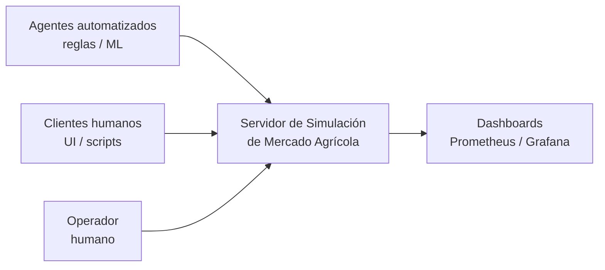
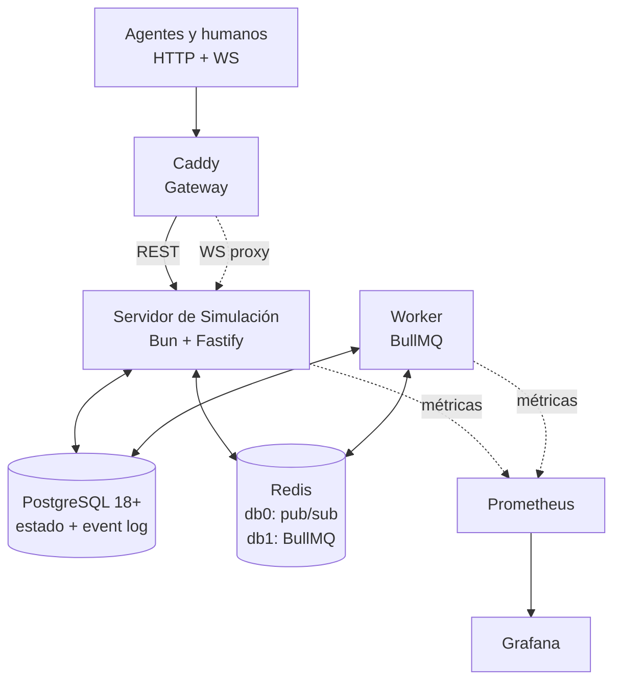
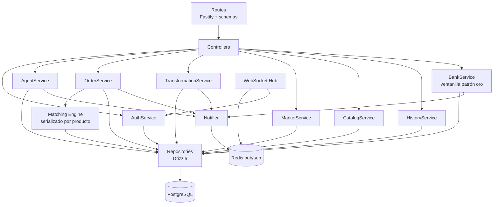
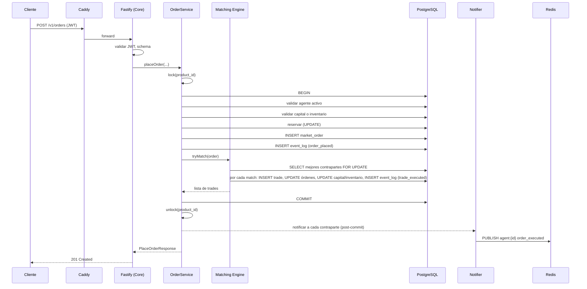
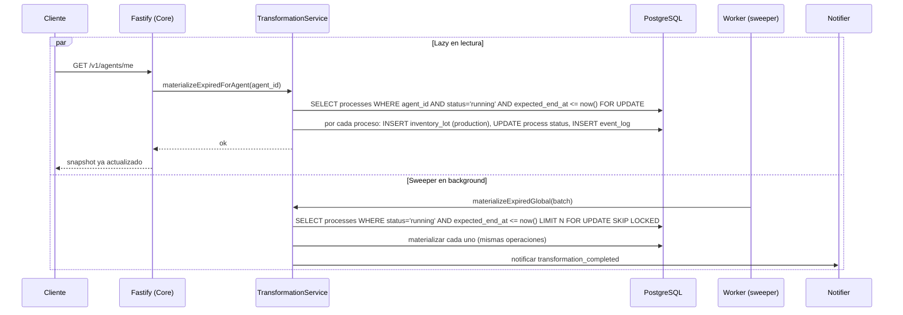

# Arquitectura del Proyecto – Simulación de Mercado Agrícola

## 1. Información General

**Proyecto:** Simulación de Mercado Agrícola

**Versión del Documento:** 0.2.0 (actualizado con patrón oro, frontend, panel de administración y escala 10K bots)

**Fecha:** 2026-07-13 (original: 2026-05-26)

**Responsables:** Equipo de Simulación de Mercado

**Descripción General**
Este documento describe la arquitectura técnica del proyecto **Simulación de Mercado Agrícola**, un servidor autoritativo de estado que simula un mercado de productos agrícolas con hasta ~10.000 agentes concurrentes (transformadores —el único rol productivo, ADR-022—, traders y ciudades —la única demanda final, ADR-025—) operando sobre un libro de órdenes con casado precio-tiempo, procesos de transformación con recetas, trazabilidad FIFO por lotes de inventario y un **patrón oro** (banco central con ventanilla acuñadora y emisión respaldada). Recoge las decisiones de diseño, la estructura de componentes, los flujos principales y los estándares de desarrollo. Su propósito es servir como referencia técnica para los equipos de implementación y para auditorías posteriores.

Este documento se apoya en artefactos previos que se consideran fuente de verdad de sus respectivos dominios:

- `diseno_mercado_agricola.md` — diseño conceptual del dominio (reglas de negocio, invariantes, ciclos de vida, patrón oro).
- `specs/schema.sql` — DDL canónico de PostgreSQL (espejado en `backend/src/db/schema.ts`).
- `openapi.yaml` — contrato REST + descripción del canal WebSocket.
- `funcionamiento_bots.md` — arquitectura y estrategias de los agentes automatizados (`bots-v1` + `go-sdk`).
- `patron_oro_sistema_bancario.md` — banco central, ventanilla acuñadora, emisión respaldada y yacimiento finito.

---

## 2. Alcance del Documento

Este documento cubre:

- Arquitectura de software a nivel sistema (C4 niveles 1, 2 y 3).
- Principales decisiones arquitectónicas (registradas como ADRs).
- Estructura del proyecto, convenciones de código y de API.
- Patrones de diseño y principios técnicos aplicados a este sistema en particular (matching engine, materialización lazy, reservas en disponible/reservado, FIFO por lotes).
- Estrategia de testing y observabilidad.

Fuera de alcance:

- Detalles de implementación de bajo nivel (firmas concretas de funciones, esquemas internos de módulos).
- Manuales de operación, runbooks o procedimientos de despliegue paso a paso.
- Diseño detallado de los agentes cliente (humanos o automatizados); este documento solo define el contrato de servidor.
- Diseño del UI humano que pueda construirse sobre la API.

---

## 3. Contexto del Sistema (C4 – Nivel 1)

### 3.1 Descripción

El sistema es un **servidor autoritativo único** que expone una API REST y un canal WebSocket. Sus usuarios son **agentes** —procesos cliente que pueden ser bots con reglas simples, agentes de ML o clientes humanos a través de algún UI— que se conectan al servidor y operan en el mercado simulado. El servidor es la única fuente de verdad sobre capital, inventarios, órdenes, procesos de transformación, conversiones de oro e historial.

En la práctica los clientes actuales son: el **enjambre de bots heurísticos** (`bots-v1`, un binario Go que lanza hasta 10.000 agentes en goroutines; ver `funcionamiento_bots.md`) y el **frontend web** (`frontend/`, React servido por nginx) que incluye un **panel de administración** para el operador.

No hay sistemas externos en el sentido tradicional: el sistema es cerrado y autocontenido. Los únicos actores son los agentes que se conectan a la API y un eventual operador humano que arranca la corrida, dispara snapshots manuales y consulta dashboards de observabilidad.

### 3.2 Diagrama de Contexto



Notas:

- Agentes automatizados y humanos consumen **exactamente la misma API**. El sistema no los distingue.
- El operador interactúa con el sistema vía herramientas administrativas (CLI/scripts) y consume métricas en Grafana.
- No hay integraciones con sistemas de terceros (pasarelas de pago, ERPs, etc.).

---

## 4. Contenedores del Sistema (C4 – Nivel 2)

### 4.1 Descripción de Contenedores

| Contenedor | Tecnología | Responsabilidad |
|-----------|------------|-----------------|
| API Gateway | Caddy | TLS termination, ruteo, CORS, load balancing y proxy de WebSocket. Sin lógica de autenticación de dominio. |
| Servidor de Simulación (Core) | Bun + TypeScript + Fastify | Servidor autoritativo: API REST, autenticación JWT, matching engine, ciclo de vida de órdenes y procesos, ventanilla del banco central (patrón oro), validación de invariantes, emisión de notificaciones. Puede correr con **N réplicas** (ADR-019); el matching se serializa por producto con advisory locks de Postgres. |
| Worker de Background Jobs | Bun + TypeScript + BullMQ | Sweeper de procesos de transformación vencidos, expirador de órdenes con TTL vencido, generador de snapshots agregados, limpieza periódica de refresh tokens expirados. |
| Seed | Bun + TypeScript (`seed.ts`, `seed-admin.ts`) | Contenedores one-shot: siembran catálogo/recetas/capacidades desde `infra/seed-config.json`, crean el banco central, sortean el yacimiento de oro y fijan la paridad; `seed-admin` crea el usuario del panel de administración. |
| Frontend Web | React + nginx | UI humana (dashboard, mercado, órdenes, transformaciones, historial) y **panel de administración** del operador. Consume la misma API que los bots. |
| Base de Datos | PostgreSQL 18+ | Única fuente de verdad: estado vivo + event log append-only + snapshots agregados. |
| Redis (instancia única, DBs lógicas separadas) | Redis 8+ | DB `0`: pub/sub para notificaciones push WebSocket. DB `1`: cola de jobs y delayed jobs de BullMQ. |
| Stack de Observabilidad | Prometheus + Grafana | Recolección de métricas del Core y del Worker; dashboards de operación. |

Los **bots** (`bots-v1`) no son un contenedor: se compilan y corren en el host como un único binario Go con una goroutine por bot, contra el gateway (`make run-bots` para los bots del YAML, `make run-swarm` para el enjambre de 10.000 con jitter de arranque). Ver `funcionamiento_bots.md`.

### 4.2 Diagrama de Contenedores



### 4.3 Notas sobre cada contenedor

**Caddy (gateway delgado).**
Caddy es la única puerta de entrada externa. Termina TLS, aplica CORS, balanceo (preparado para múltiples instancias del Core en v2) y rutea peticiones HTTP a Fastify. Adicionalmente sirve como proxy WebSocket transparente (`/v1/ws`), sin validar el JWT —la validación del handshake la hace Fastify. Caddy **no** valida JWT de la API REST: esa responsabilidad vive en Fastify, para mantener en un solo lugar la lógica de revocación (quiebra, cambio de contraseña). Esta elección está registrada en ADR-006.

**Servidor de Simulación (Core).**
Un proceso Bun ejecutando Fastify. Contiene todo lo crítico del dominio: matching engine, validación atómica de operaciones, emisión de notificaciones, gestión de tokens. Puede correr con **N réplicas** tras PgBouncer (ADR-019, actualiza ADR-004). El matching se serializa por producto en dos capas: un mutex in-process (contención intra-proceso) más un advisory lock de Postgres transaction-scoped que coordina cluster-wide entre réplicas.

**Worker de Background Jobs.**
Proceso Bun separado que consume colas de BullMQ. Encapsula tres responsabilidades de fondo:

- *Sweeper de transformaciones:* recorre `transformation_process` con `status = 'running' AND expected_end_at <= now()` y materializa los procesos vencidos. Frecuencia configurable (por defecto cada 30 segundos reales).
- *Expirador de órdenes:* recorre `market_order` con `status IN ('active','partial') AND expires_at <= now()` y las marca como `expired`, liberando reservas. Frecuencia configurable.
- *Generador de snapshots manuales:* cuando el operador encola un job `take_snapshot`, el worker calcula los agregados (capital total, masa monetaria, bid/ask, inventario por producto) y los persiste en `market_snapshot*`.
- *Limpieza de refresh tokens expirados:* job recurrente diario.

El Worker comparte el código de dominio con el Core (mismo monorepo) pero arranca un entrypoint distinto. Esto evita duplicar lógica de materialización y mantiene un único lugar donde se aplican las reglas de negocio.

**PostgreSQL.**
Versión 18+ por `uuidv7()` nativo. Todas las decisiones de modelado y los índices están en `schema.sql` y `documentacion_base_datos.md`. El Core y el Worker se conectan al mismo cluster.

**Redis.**
Una sola instancia con dos bases lógicas (ADR-009): db `0` para el pub/sub de notificaciones WebSocket (canales `agent:{agent_id}` para mensajes personales, `product:{product_id}` para el tape por producto —fan-out selectivo de `trade_printed`, suscripción declarada por el cliente— y un canal global solo para broadcasts raros) y db `1` para BullMQ.

**Prometheus + Grafana.**
El Core y el Worker exponen `/metrics` en endpoints internos no proxeados por Caddy. Prometheus hace scraping. Grafana se conecta a Prometheus y queda accesible para el operador.

Los gauges de negocio (`observability/business-metrics.ts`) se calculan **en scrape-time** contra la DB y se importan **solo desde el Core**; los contadores (`observability/metrics.ts`) los incrementa el proceso que hace el trabajo (p. ej. el `city-income-sweeper` corre en el Worker, así que su contador se scrapea del job `worker`, no del `core`).

> **Agregación en Grafana: `max` para gauges, `sum` para contadores.** Prometheus descubre **una serie por réplica del Core** (`dns_sd` sobre el nombre de servicio `core`, ADR-019) y las N réplicas calculan el **mismo agregado global** contra la misma DB. Sumar un gauge entre réplicas lo multiplica por N: con las 4 del compose, `sum(market_active_agents)` daba 260 donde había 65. La forma correcta es colapsar primero las réplicas por etiqueta y agregar después — `sum(max by (role) (market_active_agents))`, `max by (product) (market_inventory_units)` —, y reservar `sum` para los contadores, donde cada proceso cuenta **sus propios** eventos y la suma sí es el total.

Métricas del **flujo circular de ingreso** (ADR-020), en el dashboard *Negocio*:

| Métrica | Proceso | Para qué sirve |
|---------|---------|----------------|
| `market_total_capital_cents{role="city"}` | Core | **Salud del modelo**: si el capital de las ciudades baja de forma sostenida, la demanda se está drenando y la economía va camino de apagarse. Sale gratis porque `city` es rol de mercado. |
| `city_income_distributed_cents_total` | Worker | Contador; su `rate()` es el **caudal del ciclo** firmas→hogares. A 0 con actividad viva ⇒ sweeper parado o sin ciudades activas. |
| `city_income_payouts_total` | Worker | Acreditaciones individuales; con el anterior da el ticket medio por ciudad. |
| `market_city_income_pending_cents{source}` | Core | Dinero **en tránsito** (debitado al pagador, sin repartir) desglosado en `wage` / `tax`. Debe oscilar cerca de 0; si crece sin parar, el sweeper no da abasto. |
| `market_conservation_delta_cents` | Core | Invariante monetario: cualquier valor ≠ 0 es un bug de contabilidad. |

Métricas de la **cadena de suministro** (ADR-022), en el dashboard *Cadena de suministro*:

| Métrica | Proceso | Para qué sirve |
|---------|---------|----------------|
| `inputs_consumed_units_total{product}` | Core | Cara de DEMANDA de cada eslabón. Contra `production_units_total` del mismo producto da el balance; el par de `agua` es el indicador de si la economía se estrangula en la raíz. |
| `domain_errors_total{code,route}` | Core | **Por qué no se produce.** Un 422 en `http_request_duration_seconds` no lo dice: esto separa `insufficient_inputs` (falta suministro) de `recipe_capacity_saturated` (falta nivel instalado) de `insufficient_capital` (falta caja). |
| `market_installations_level{installation_type}` | Core | Techo de procesos concurrentes del tipo en todo el mercado. `pozo_agua` debería rondar el 10-15% del total. |
| `market_installations_count{installation_type}` | Core | Cuántos agentes han comprado cada tipo; con el anterior da el nivel medio. |

### 4.4 Tabla resumen puertos

| Servicio | Puerto interno | Expuesto externamente |
|----------|---------------|----------------------|
| Caddy | 9080 (HTTP), 9443 (HTTPS) | Sí (vía Docker) |
| Core (Fastify) | 8000 | No (solo Caddy) |
| Core métricas | 8001 | No |
| Worker métricas | 8002 | No |
| PostgreSQL | 5432 | No |
| Redis | 6379 | No |
| Prometheus | 9090 | Solo a operador |
| Grafana | 3000 | Solo a operador |

---

## 5. Componentes Principales (C4 – Nivel 3)

### 5.1 Organización Lógica del Core

El Core sigue una arquitectura por capas estricta. Cada capa solo conoce a la inmediatamente inferior. La regla es: **toda mutación de estado pasa por un Service, que ejecuta una transacción atómica que valida invariantes, persiste el cambio y registra el evento en el `event_log` antes de hacer commit**.

| Capa | Responsabilidad | Notas específicas |
|------|----------------|-------------------|
| Routes | Definición declarativa de rutas Fastify, validación de schemas de entrada/salida con Zod. | Cada ruta del `openapi.yaml` corresponde a un handler. |
| Controllers | Orquestación: extraer parámetros del request, llamar al Service apropiado, mapear el resultado al schema de respuesta, mapear errores de dominio a Problem+JSON RFC 7807. | Sin lógica de negocio. |
| Services | Lógica de dominio: validación de invariantes, transacciones atómicas, llamadas al matching engine, emisión de eventos al `event_log` y de notificaciones al Notifier. | Cada operación del diseño conceptual tiene su Service: `OrderService`, `TransformationService`, `AgentService`, `AuthService`, `MarketService`, `CatalogService`, `HistoryService`, `BankService` (ventanilla del patrón oro: `GET /bank`, `POST /bank/convert`; serializada con `gold_standard FOR UPDATE`). |
| Matching Engine | Componente especializado del dominio que recibe una orden recién insertada y ejecuta el algoritmo de casado precio-tiempo contra el libro vigente. Aplicado como subcomponente de `OrderService`. | Serializado por producto en dos capas: mutex in-process + advisory lock de Postgres cluster-wide (ADR-019). |
| Repositories | Acceso a datos vía Drizzle. Queries tipadas, transacciones, locking explícito (`FOR UPDATE`) donde sea necesario. | Sin lógica de negocio; solo persistencia. |
| Notifier | Publica mensajes en Redis pub/sub para que el componente WebSocket los entregue a los clientes conectados. | Único punto donde se construye el envelope de notificación. |
| WebSocket Hub | Gestiona conexiones WS de agentes, hace handshake con validación de JWT, se suscribe a Redis y reenvía mensajes al cliente correspondiente. | Misma instancia del Core; sin conexión bidireccional (servidor → cliente only). |
| Integrations | Reservado para futuras integraciones externas. Vacío en v1. | — |

### 5.2 Diagrama de Componentes (Core)



### 5.3 Componentes del Worker

El Worker es un proceso independiente con su propio entrypoint que reutiliza los Services y Repositories del Core. Sus componentes:

| Componente | Responsabilidad |
|-----------|----------------|
| Queue Bootstrap | Inicializa BullMQ workers para cada cola (`transformation-sweep`, `order-expiry-sweep`, `snapshot`, `refresh-token-cleanup`). |
| TransformationSweeper | Job recurrente: invoca `TransformationService.materializeExpired()` que procesa todos los procesos vencidos en batches. |
| OrderExpirySweeper | Job recurrente: invoca `OrderService.expireOverdue()` que marca como `expired` órdenes vencidas y libera reservas. |
| SnapshotRunner | Job on-demand: calcula y persiste un `market_snapshot` y sus tablas hijas. |
| RefreshTokenCleaner | Job recurrente diario: borra refresh tokens con `expires_at < now() - 30d`. |

Las operaciones del Worker emiten los mismos eventos al `event_log` que las operaciones síncronas del Core (p. ej. `order_expired`, `process_completed`).

### 5.4 Flujo crítico: colocación y matching de una orden



Notas críticas:

- El `lock(product_id)` serializa toda la operación de matching de ese producto en **dos capas** (ADR-019): un mutex in-process (`lib/locks.ts`) que ordena dentro de un proceso, más un **advisory lock de Postgres transaction-scoped** (`pg_advisory_xact_lock(hashtext(product_id))`, primer statement de la tx) que serializa cluster-wide entre las N réplicas del Core. Sin esto, dos órdenes simultáneas del mismo producto podrían producir ejecuciones inconsistentes.
- La transacción de base de datos abarca **toda** la operación: validación, reservas, inserción de la orden, matching completo, registro en `event_log`. Si algo falla, todo revierte.
- Las notificaciones se publican en Redis **después** del commit. Si la transacción falla, no se notifica nada falso.
- Las contrapartes notificadas pueden estar desconectadas; el mensaje se publica igual, y al reconectarse el agente verá el estado actualizado en `GET /agents/me`.
- **Patrón oro (ADR-019):** dentro de la misma transacción del matching, los fees de los trades ejecutados se **anotan en `fee_ledger`** (append-only) en vez de escribir la fila del banco — así N réplicas no contienden por una fila caliente global. Un sweeper del Worker (`fee-ledger-sweeper`) los pliega al capital del banco; los lectores del saldo suman los pendientes. La fila del banco ya no la escribe el matching.

### 5.5 Flujo crítico: materialización lazy + sweeper



Notas:

- El uso de `FOR UPDATE SKIP LOCKED` en el sweeper permite que el Worker procese en batches sin chocar con materializaciones lazy concurrentes disparadas por el Core. El que llegue primero materializa; el otro hace no-op.
- Tras materializar, se calcula el `unit_cost_cents` del lote producido sumando los costos de los insumos consumidos (registrados al iniciar el proceso en `transformation_lot_consumption`) más el salario pagado, dividido entre la cantidad producida total.

---

## 6. Stack Tecnológico

### 6.1 Tecnologías Principales

- **Runtime:** Bun (última versión LTS al momento del setup).
- **Lenguaje:** TypeScript en modo `strict`.
- **Framework HTTP:** Fastify.
- **Validación de schemas:** Zod. Los schemas Zod son la fuente única en TypeScript para validación de entrada/salida en Fastify y para derivar tipos del dominio expuestos por la API. El mantenimiento del `openapi.yaml` se hace **a mano**: cualquier cambio en un endpoint requiere actualizar tanto el schema Zod (runtime) como el OpenAPI (contrato documental). Se recomienda un test de CI que valide que los ejemplos del OpenAPI pasan por los schemas Zod equivalentes.
- **Acceso a Base de Datos:** Drizzle ORM (query builder tipado).
- **Migraciones:** no se usan (ADR-018). El esquema canónico vive en `specs/schema.sql` y el schema Drizzle (`backend/src/db/schema.ts`) lo reproduce exactamente; los cambios de esquema recrean la BD desde cero (`make clean-docker` + re-seed).
- **Persistencia:** PostgreSQL 18+ (requerido por `uuidv7()` nativo, ver `documentacion_base_datos.md`).
- **Cache / Cola / Pub/Sub:** Redis 8+ (una sola instancia, dos DBs lógicas).
- **Background Jobs:** BullMQ.
- **Gateway:** Caddy (configuración declarativa vía Caddyfile).
- **Cliente Redis:** `ioredis` (compatible con BullMQ y con pub/sub directo).
- **WebSocket:** `@fastify/websocket`.
- **JWT:** `@fastify/jwt` para emisión y verificación; `argon2` para hash de contraseñas.

### 6.2 Herramientas de Soporte

- **Testing:**
  - Unitario: `bun test` (runner nativo de Bun).
  - Integración: `bun test` + `testcontainers` para PostgreSQL y Redis efímeros.
  - End-to-end del contrato: tests contra el OpenAPI usando un cliente HTTP real contra el Core levantado en Docker Compose.
- **Linting / Formatting:** ESLint v10 + Prettier. Configuración basada en `@typescript-eslint` para reglas específicas de TypeScript; Prettier para formato. Se integran en pre-commit hooks y en CI.
- **Observabilidad:**
  - Métricas: `prom-client` (Prometheus client para Node/Bun) expuesto en `/metrics`.
  - Logs estructurados: `pino` (integrado con Fastify por defecto), en JSON.
  - Tracing: opcional en v1; se puede instrumentar con OpenTelemetry si se requiere más adelante.
- **Documentación de API:** el `openapi.yaml` se mantiene **a mano** en `docs/` como contrato versionado. **No se monta Swagger UI** ni se genera el OpenAPI desde código. Consecuencia operativa: cualquier cambio en endpoints debe modificar tanto el código (schema Zod, route, controller, service) como el `openapi.yaml`, en el mismo PR. Para consultar el contrato, los desarrolladores y consumidores abren el YAML directamente o lo cargan localmente en cualquier visor de OpenAPI (Stoplight, Redocly, Swagger Editor externo, etc.).
- **Gestión de configuración:** archivos `.env` cargados al arrancar. Validación del shape con Zod al boot; si falta una variable obligatoria, el proceso muere temprano.

### 6.3 Métricas que el Core y el Worker deben exponer

Como guía mínima para Prometheus:

- **Core (Fastify):** latencia y tasa de cada endpoint, conteo de errores por status code, número de conexiones WebSocket activas, tamaño de las colas in-process de matching por producto (primera capa del lock), reintentos por deadlock (`40P01`), duración de transacciones de matching. Con N réplicas, Prometheus las descubre por DNS.
- **Worker:** conteo de jobs procesados y fallidos por tipo de cola, latencia de procesamiento, profundidad de cola en Redis, número de procesos de transformación materializados por intervalo, número de órdenes expiradas por intervalo.
- **Negocio (ambos pueden contribuir):** número de agentes activos, masa monetaria total, número de órdenes vivas por producto, número de procesos en curso.

---

## 7. Estructura del Proyecto

Monorepo único; el Core y el Worker comparten código de dominio dentro de `backend/`.

```
Market-Simulator/
├── backend/                         # Core + Worker (Bun + TypeScript)
│   ├── src/
│   │   ├── routes/                  # rutas Fastify, una por recurso (auth, orders, bank, ...)
│   │   ├── controllers/             # handlers que orquestan y mapean a Problem+JSON
│   │   ├── services/                # lógica de dominio (OrderService, BankService, ...)
│   │   ├── repositories/            # capa Drizzle: queries tipadas, transacciones
│   │   ├── db/
│   │   │   └── schema.ts            # schema Drizzle (espejo de specs/schema.sql; sin migraciones)
│   │   ├── notifier/                # publicación a Redis pub/sub
│   │   ├── websocket/               # handshake JWT, suscripción a Redis, fanout a clientes
│   │   ├── workers/                 # handlers de BullMQ (sweepers, snapshots, limpieza)
│   │   ├── auth/                    # emisión y verificación de JWT, hashing de password
│   │   ├── schemas/                 # schemas Zod, tipos derivados del dominio
│   │   ├── config/                  # carga y validación de .env con Zod
│   │   ├── observability/           # prom-client setup, logger pino
│   │   ├── seed.ts                  # seed de catálogo, banco central y yacimiento
│   │   ├── seed-admin.ts            # usuario del panel de administración
│   │   ├── app.ts / server.ts       # arranque del Core (Fastify)
│   │   └── worker.ts                # arranque del Worker (BullMQ)
│   └── tests/
├── frontend/                        # UI web React (dashboard, mercado, admin) servida por nginx
├── bots-v1/                         # bots heurísticos en Go (ver funcionamiento_bots.md)
├── go-sdk/                          # SDK Go reutilizable para agentes (engine, auth, client, ws)
├── market-client/                   # cliente Python auxiliar
├── infra/
│   ├── docker-compose.yml           # postgres, redis, core, worker, seed, seed-admin, caddy, frontend, prometheus, grafana
│   ├── seed-config.json             # catálogo: productos, recetas y capacidades por rol
│   ├── caddy/ prometheus/ grafana/
│   └── Dockerfile
├── specs/
│   └── schema.sql                   # DDL canónico de PostgreSQL
├── docs/                            # este documento y el resto de la documentación
└── Makefile                         # build, run, seed, build-bots, run-bots, run-swarm, clean-docker
```

Convenciones de archivos:

- Un Service por agregado de dominio. Un Repository por agregado (o por tabla principal del agregado).
- Los schemas Zod viven en `src/schemas/` y se comparten entre routes (validación de entrada/salida) y tests (generación de fixtures). Cuando un schema cambie, el `openapi.yaml` debe actualizarse en el mismo commit.
- Las transacciones siempre se inician en el Service, nunca en el Repository (los Repositories reciben el cliente transaccional como parámetro).

---

## 8. Convenciones de API

### 8.1 Convención de URLs

El prefijo de versión es **`/v1`** (ver `openapi.yaml`).

```
/v1/{recurso}/{id?}
```

Los recursos y sub-recursos siguen la jerarquía definida en el OpenAPI: `/v1/auth/*`, `/v1/catalog/*`, `/v1/agents/*`, `/v1/orders/*`, `/v1/transformations/*`, `/v1/market/*`, `/v1/bank` + `/v1/bank/convert` (ventanilla del patrón oro), `/v1/history/*`, `/v1/ws`.

Reglas adicionales:

- Identificadores en path como UUIDv7 (`product_id`, `order_id`, etc.).
- Filtros y paginación en query string. Cursor opaco basado en el `event_id` o `id` del último resultado (los UUIDv7 son ordenables temporalmente).
- Verbos HTTP: `GET` lectura, `POST` creación de recursos, `DELETE` cancelación. No se usa `PUT` ni `PATCH` en v1 (no hay updates parciales en el dominio externo).

### 8.2 Estructura de Respuestas

El contrato de respuesta está definido en `openapi.yaml` por cada endpoint. A diferencia del wrapper genérico `{ data, meta }` de la plantilla original, este sistema usa **payloads directos** porque:

- Las respuestas tipadas con Zod son más limpias sin wrapper.
- Las páginas usan un objeto con `items` y `next_cursor` (ver `OrderPage`, `TradePage`, `TransformationPage`, `EventPage` en el OpenAPI).

**Respuesta exitosa (ejemplo paginado):**

```json
{
  "items": [ { /* recurso */ } ],
  "next_cursor": "01HV..."
}
```

**Respuesta exitosa (recurso único):**

```json
{ "order_id": "...", "agent_id": "...", "...": "..." }
```

**Respuesta de error:** RFC 7807 `application/problem+json`, con extensión `errors[]` para errores múltiples (típico en validaciones de dominio).

```json
{
  "type": "https://errors.mercado-agricola/insufficient-capital",
  "title": "Capital insuficiente",
  "status": 422,
  "detail": "El agente no tiene capital disponible para reservar la orden.",
  "errors": [
    { "code": "insufficient_capital", "field": "qty_cent", "message": "Se requieren 25000 cents, disponibles 18200." }
  ]
}
```

### 8.3 Idempotencia

`POST /v1/orders` acepta `client_order_id` opcional. Reenvíos con el mismo `client_order_id` dentro de una ventana corta devuelven la orden previamente creada. Se implementa con una tabla (o un cache en Redis con TTL corto) que mapea `(agent_id, client_order_id) → order_id`.

### 8.4 Versionado

Versionado en URL (`/v1/...`). Cambios incompatibles requieren `/v2/...`. Cambios aditivos (nuevos campos opcionales, nuevos endpoints) se hacen en `/v1`.

---

## 9. Seguridad

### 9.1 Autenticación

Esquema: **usuario/contraseña + JWT**.

- Contraseñas hasheadas con **argon2id** (parámetros conservadores: `memoryCost ≥ 19 MiB`, `timeCost ≥ 2`, `parallelism = 1`).
- Tokens JWT firmados con **HS256** o **RS256** (recomendado RS256 para facilitar la rotación de claves sin invalidar tokens vivos).
- Access token: vida corta sugerida 15 minutos, stateless.
- Refresh token: vida sugerida 7 días, persistido en `agent_refresh_token` con hash, **nunca en claro**. Rotación en cada uso.

### 9.2 Autorización

No hay roles administrativos en v1 al nivel del API público: todos los agentes tienen los mismos permisos sobre sus propios recursos. La autorización es de **ownership**: cada endpoint que opera sobre un recurso identificable (`/v1/orders/{order_id}`, `/v1/transformations/{process_id}`) verifica en el Service que el recurso pertenece al `agent_id` del JWT, devolviendo `403` si no.

Endpoints que **no** requieren autenticación: `POST /v1/auth/register`, `POST /v1/auth/login`, `POST /v1/auth/refresh`, y los `GET /v1/catalog/*`. Todo lo demás requiere `Authorization: Bearer <access_token>`.

Reglas adicionales aplicadas en cada operación autenticada:

- Si el agente está en estado `bankrupt`, todas las operaciones de escritura (place_order, cancel_order, start_transformation, cancel_transformation) devuelven `403` con código `agent_bankrupt`.
- Las lecturas siguen permitidas para que el agente pueda inspeccionar su estado final, salvo `POST /v1/auth/login` que también rechaza con `403`.

### 9.3 Revocación

- `POST /v1/auth/logout` revoca el refresh token recibido.
- Cambiar contraseña revoca todos los refresh tokens del agente.
- Marcar un agente como `bankrupt` revoca todos sus refresh tokens activos.

Los access tokens, al ser stateless, siguen válidos hasta su expiración natural; su vida corta limita la ventana de exposición.

### 9.4 WebSocket

El handshake del WS valida el access token JWT. Caddy hace proxy transparente al puerto del Core sin validar; Fastify valida en el upgrade. Si el token es inválido o expirado, el upgrade se rechaza. Durante la vida de la conexión no se re-valida el token; al expirar, el cliente debe reconectar con un token fresco.

### 9.5 Principio de mínimo privilegio

- El usuario de PostgreSQL del Core y del Worker solo tienen permisos sobre el schema `public` del proyecto. No tienen privilegios de superuser.
- Redis no se expone fuera de la red Docker.
- Caddy es el único contenedor con puertos publicados al host.

### 9.6 Rate limiting

En esta configuración de simulación local, Caddy se ejecuta libre de límites de tasa (rate limiting) en el gateway, facilitando la fluidez del tráfico de prueba.

---

## 10. Manejo de Errores

| Código | Significado | Cuándo se devuelve |
|--------|-------------|--------------------|
| 200 | OK | Lectura exitosa o cancelación idempotente sobre recurso ya terminal. |
| 201 | Created | Registro de agente, orden colocada, transformación iniciada. |
| 204 | No Content | Cancelación exitosa, logout exitoso. |
| 400 | Bad Request | JSON inválido, schema de entrada incumplido sintácticamente. |
| 401 | Unauthorized | Falta el token, o el token es inválido, expirado o revocado. |
| 403 | Forbidden | Token válido pero sin permisos: recurso de otro agente, agente en quiebra. |
| 404 | Not Found | Recurso inexistente. |
| 409 | Conflict | Estado del recurso impide la operación (ej. cancelar un proceso ya terminal, username ya en uso). |
| 422 | Unprocessable Entity | Sintaxis válida, semántica rechazada por dominio (capital insuficiente, inventario insuficiente, TTL fuera de rango, capacidad saturada, etc.). |
| 429 | Too Many Requests | Rate limit excedido. |
| 500 | Internal Server Error | Bug del servidor. Se loguea con stack y trace id; se devuelve un Problem+JSON sin detalles internos. |
| 503 | Service Unavailable | Postgres o Redis no disponibles. |

Todos los errores responden con `application/problem+json` siguiendo RFC 7807. Cuando hay múltiples causas (típico en `422`), se enumeran en el array `errors[]` con `code`, `field` opcional y `message`. Los `code` son strings estables documentados (`insufficient_capital`, `insufficient_inventory`, `insufficient_capacity`, `agent_bankrupt`, `ttl_out_of_range`, `unknown_recipe`, `unknown_product`, `unknown_order`, `unknown_process`, `not_owner`, `recipe_capacity_saturated`, `client_order_id_replay`).

Cada respuesta de error incluye un `instance` con el path del request y, en logs internos, un trace id propagado en el header `x-request-id`.

---

## 11. Principios Arquitectónicos

Aplicados a este sistema en particular:

- **Servidor autoritativo único.** Toda decisión de estado se toma en el servidor. Los agentes no mantienen estado autoritativo. Esto elimina problemas de consistencia bajo concurrencia y reconexión.
- **Separación disponible/reservado en capital e inventario.** Invariantes locales baratas: validar capital disponible no requiere escanear órdenes activas. Decisión heredada del diseño conceptual y ratificada aquí.
- **Atomicidad en cada operación de dominio.** Toda mutación se ejecuta en una transacción PostgreSQL que valida invariantes, persiste el cambio y registra el evento en `event_log` antes de hacer commit. Si algo falla, todo revierte.
- **Serialización por producto en el matching.** El matching engine procesa órdenes de un producto en orden estricto mediante dos capas (ADR-019): un mutex in-process y un advisory lock de Postgres transaction-scoped que serializa cluster-wide entre réplicas. Esto evita race conditions permitiendo escalar el Core horizontalmente.
- **Materialización lazy + sweeper.** Los procesos de transformación se "completan" cuando alguien observa el estado del agente, o cuando el sweeper los procesa. Evita un scheduler complejo y mantiene la consistencia: el estado siempre está actualizado en el momento de la lectura.
- **Inventario por lotes con FIFO.** Cada adquisición o producción crea un lote con costo unitario. Las ventas y consumos descuentan FIFO. Da trazabilidad de COGS por trade y costo real de producción por proceso.
- **Event log append-only.** Toda mutación genera un evento persistido en la misma transacción. El estado es derivable reproduciendo eventos; sirve tanto a análisis post-mortem como a entrenamiento de agentes de ML.
- **Configuración estática por corrida.** La semilla maestra, factor de tiempo, fees y rangos de capital se cargan desde `.env` al arranque y son inmutables durante la corrida. Esto se persiste en el repositorio (con el `.env` versionado del deploy), no en la BD.
- **Mismo contrato para humanos y bots.** La API no distingue entre clientes; cualquier UI humana se construye encima de la misma API.
- **Observabilidad desde el diseño.** Tanto el Core como el Worker exponen `/metrics` desde el día 1; los logs son JSON estructurado; cada request lleva trace id.
- **Seguridad por defecto.** Argon2id para passwords, JWT con vida corta + refresh con rotación, rate limiting en el gateway, ownership checks en cada endpoint protegido.

---

## 12. Architecture Decision Records (ADR)

### 12.1 Formato ADR

| Campo | Descripción |
|-------|-------------|
| ID | ADR-XXX |
| Fecha | YYYY-MM-DD |
| Estado | Propuesto / Aceptado / Deprecado |
| Contexto | Situación que motiva la decisión |
| Decisión | Decisión tomada |
| Consecuencias | Impactos positivos y negativos |

### 12.2 Registro de ADRs

| ID | Fecha | Estado | Decisión |
|----|-------|--------|----------|
| ADR-001 | 2026-05-26 | Aceptado | PostgreSQL 18+ como única fuente de verdad, con event log append-only embebido. |
| ADR-002 | 2026-05-26 | Aceptado | Bun + TypeScript + Fastify como runtime, lenguaje y framework HTTP. |
| ADR-003 | 2026-05-26 | Aceptado | Drizzle + drizzle-kit como capa de acceso a datos y migraciones. |
| ADR-004 | 2026-05-26 | Matizado por ADR-019 | Una sola instancia del Core en v1 (sin replicación ni sharding). |
| ADR-005 | 2026-05-26 | Superado por ADR-019 | Matching engine directo contra Postgres, serializado por producto con locks in-process. |
| ADR-006 | 2026-05-26 | Aceptado | Caddy como gateway delgado: TLS, ruteo, CORS, load balancing y WS proxy sin autenticación. JWT lo valida Fastify. |
| ADR-007 | 2026-05-26 | Aceptado | BullMQ para todos los jobs de fondo (sweeper, expirador, snapshot, limpieza). |
| ADR-008 | 2026-05-26 | Aceptado | Worker como proceso separado del Core, compartiendo código de dominio en monorepo. |
| ADR-009 | 2026-05-26 | Aceptado | Una sola instancia de Redis con DBs lógicas separadas (db 0 pub/sub, db 1 BullMQ). |
| ADR-010 | 2026-05-26 | Aceptado | JWT (access stateless + refresh persistido con rotación) y argon2id para passwords. |
| ADR-011 | 2026-05-26 | Aceptado | Materialización lazy + sweeper para procesos de transformación. |
| ADR-012 | 2026-05-26 | Aceptado | Errores como RFC 7807 Problem+JSON con extensión `errors[]`. |
| ADR-013 | 2026-05-26 | Aceptado | Docker Compose como plataforma de despliegue en v1. |
| ADR-014 | 2026-05-26 | Aceptado | Prometheus + Grafana para observabilidad; pino para logs estructurados. |
| ADR-015 | 2026-05-26 | Aceptado | `openapi.yaml` se mantiene a mano como contrato; no se genera desde código ni se sirve Swagger UI. |
| ADR-016 | 2026-05-26 | Aceptado | Zod como única librería de validación de schemas (rutas, configuración de `.env`, tests). |
| ADR-017 | 2026-07-13 | Aceptado | Patrón oro: banco central con ventanilla acuñadora, fees reciclados al banco, emisión de capital respaldada por oro, yacimiento finito por semilla. |
| ADR-018 | 2026-07-13 | Aceptado | Sin migraciones incrementales: `specs/schema.sql` + `schema.ts` (Drizzle) como fuentes espejo; cambios de esquema recrean la BD (`clean-docker` + re-seed). |
| ADR-019 | 2026-07-17 | Aceptado | Matching multiproceso: serialización por producto con advisory locks de Postgres (transaction-scoped) + mutex in-process como primer filtro; fees del matching a `fee_ledger` append-only con sweeper; N réplicas del Core tras PgBouncer. Supera ADR-005, matiza ADR-004. |
| ADR-020 | 2026-07-20 | Aceptado | Flujo circular de ingreso: rol `city` sembrado y no registrable (~50 capitales), salarios reciclados + fracción del fee a `income_ledger` con `city-income-sweeper` que reparte ponderado por población; invariante de conservación reformulado (sin término de salarios). Matiza ADR-017. |
| ADR-022 | 2026-07-21 | Aceptado | Cadena conexa con raíz única: el sector extractivo consume insumos (agua; el agro además semillas/fertilizante/piensos), la única receta sin insumos es la extracción de agua, y `primary_producer` se fusiona con `transformer` como único rol productivo. Matiza ADR-021. |
| ADR-023 | 2026-07-21 | Aceptado | Yacimientos finitos generalizados: los 15 recursos geológicos no renovables (más el oro, que ya lo tenía) reciben `resource_deposit`; la producción pasa de clamp binario a **rendimiento decreciente** (`max(suelo, restante/inicial)`), con `GET /catalog/deposits` y broadcast `deposit_depleted`. Generaliza el yacimiento de ADR-017. |
| ADR-021 | 2026-07-20 | Aceptado | Economía de instalaciones: la capacidad estática por receta se sustituye por instalaciones **comprables y mejorables** por *tipo* (`installation_type` agrupa recetas); el `level` es el presupuesto de concurrencia compartido; nadie recibe instalaciones al inicio; el pago va al banco vía `fee_ledger`. Reemplaza `agent_capacity` por `installation_type` + `agent_installation`. |
| ADR-025 | 2026-07-21 | Aceptado | Retirada del rol `consumer`: la demanda final pasa a ser exclusivamente urbana (`city`), único rol consumidor con ingreso recurrente. Desaparece del enum `agent_role`, del registro, del seed, del frontend y del round-robin de bots; quedan 2 roles registrables (`transformer`, `trader`). Culmina ADR-020. |
| ADR-024 | 2026-07-21 | Aceptado | Fase de energía v1: `electricidad` como producto intermedio consumido por toda la industria (113 recetas), generada por el tipo `generacion` (hidro desde agua + térmicas de carbón/gas finitos). Sin consumo urbano y sin entrar en las extractivas (aciclicidad estricta intacta); se podan los 7 bienes de infraestructura eléctrica del catálogo. Ejecuta la fase pospuesta en ADR-022(c). |

### 12.3 Detalle de ADRs clave

**ADR-004 — Una sola instancia del Core en v1** *(matizado por ADR-019: el Core ya puede correr con N réplicas tras PgBouncer; el matching se serializa por producto con advisory locks de Postgres)*

- *Contexto:* la simulación corre con ~100 agentes. La carga proyectada (~10K órdenes/día, ~5K trades/día) cabe holgadamente en un proceso Bun bien configurado. Múltiples instancias forzarían a resolver coordinación de matching (lock distribuido o sharding por producto).
- *Decisión:* desplegar el Core como una sola instancia. Caddy se configura para balancing futuro, pero apunta a un único upstream.
- *Consecuencias:*
  - (+) Matching trivialmente serializable con un mutex in-process por producto.
  - (+) Implementación, debugging y razonamiento mucho más simples.
  - (−) Punto único de fallo. Aceptable en v1 (simulación, no producción).
  - (−) Techo de throughput limitado por un solo proceso. Si se rebasa, hay que ir a v2 con sharding por producto.

**ADR-005 — Matching directo contra Postgres** *(la serialización por producto con locks in-process queda superada por ADR-019: ahora es un mutex in-process + advisory lock de Postgres cluster-wide; el matching directo contra Postgres sigue vigente)*

- *Contexto:* dos diseños posibles: (a) libro de órdenes en memoria con persistencia eventual, (b) matching en cada request con queries directas y locks de fila.
- *Decisión:* (b). Cada `POST /v1/orders` ejecuta una transacción que valida, inserta la orden, busca contrapartes con `SELECT ... FOR UPDATE` siguiendo `idx_orderbook_buy`/`idx_orderbook_sell`, ejecuta los matches y commita todo junto.
- *Consecuencias:*
  - (+) Sin caché de libro que mantener consistente con la BD; el estado vivo es siempre la BD.
  - (+) Implementación más simple, menos bugs sutiles.
  - (+) Recuperación tras crash trivial: no hay estado en RAM que reconstruir.
  - (−) Throughput menor que un libro in-memory. A la escala objetivo (~10K órdenes/día), está holgado.
  - (−) Sensible al rendimiento de Postgres. Los índices parciales del schema están diseñados precisamente para esto.

**ADR-006 — Caddy gateway delgado**

- *Contexto:* Caddy puede asumir responsabilidades amplias pero esto fragmenta la lógica de revocación de tokens y de detección de quiebra, que viven naturalmente en el Core.
- *Decisión:* Caddy hace TLS, ruteo, CORS, balancing y WS proxy. **No** valida JWT. Fastify es el único punto que decide si una request está autorizada.
- *Consecuencias:*
  - (+) Una sola fuente de verdad para autorización.
  - (+) Revocación de tokens (por quiebra, cambio de password, logout) se aplica de inmediato sin sincronizar caches.
  - (−) Cada request hace un JWT decode + verificación en Fastify (costo despreciable con HS256/RS256).

**ADR-009 — Una sola instancia de Redis con DBs lógicas**

- *Contexto:* BullMQ requiere Redis. El sistema también necesita pub/sub para notificaciones WS. Se pueden separar en dos instancias o multiplexar.
- *Decisión:* una sola instancia, db `0` para pub/sub, db `1` para BullMQ.
- *Consecuencias:*
  - (+) Menos componentes que operar y monitorear.
  - (+) Suficiente para la carga proyectada.
  - (−) Un fallo de Redis afecta a ambos usos. Aceptable en v1; mitigable con HA en v2.

**ADR-011 — Materialización lazy + sweeper**

- *Contexto:* los procesos de transformación tienen una duración. ¿Cuándo se "completan"?
- *Decisión:* dos mecanismos complementarios. (a) Lazy: al leer el estado del agente, el Service materializa procesos vencidos del agente antes de devolver el snapshot. (b) Sweeper: un job recurrente en el Worker materializa procesos vencidos cuyos dueños no consultan, para que las notificaciones lleguen oportunamente.
- *Consecuencias:*
  - (+) El estado leído por un agente está siempre actualizado.
  - (+) Las notificaciones de `transformation_completed` se disparan sin depender de polling del agente.
  - (+) Evita un scheduler complejo de timers por proceso.
  - (−) Dos rutas para la misma operación; ambas deben usar `FOR UPDATE SKIP LOCKED` para no chocar.

**ADR-015 — OpenAPI mantenido a mano, sin Swagger UI**

- *Contexto:* hay dos enfoques comunes para gestionar OpenAPI: (a) generarlo desde código (anotaciones, plugins de Fastify), (b) mantenerlo a mano como contrato versionado. Adicionalmente, suele servirse con Swagger UI para exploración interactiva.
- *Decisión:* el `openapi.yaml` se mantiene **a mano** en `docs/openapi.yaml` y es la fuente de verdad del contrato. **No se monta Swagger UI** en el Core. La consulta del contrato se hace abriendo el YAML directamente o cargándolo en visores externos.
- *Consecuencias:*
  - (+) El contrato es legible y revisable como cualquier otro artefacto del repositorio; no depende de regenerar y comparar diffs de archivos generados.
  - (+) Permite documentar decisiones, ejemplos y descripciones largas con cuidado, sin las limitaciones de los decoradores en código.
  - (+) Menos superficie en el Core: sin endpoint `/docs` que proteger y mantener.
  - (−) **Riesgo de divergencia entre código y contrato.** Mitigación: regla de equipo de modificar ambos en el mismo PR, y test de CI que valide los ejemplos del OpenAPI contra los schemas Zod equivalentes.
  - (−) Sin exploración interactiva built-in; los consumidores deben usar herramientas externas.

**ADR-016 — Zod como única librería de validación**

- *Contexto:* el ecosistema TypeScript ofrece varias opciones (TypeBox, Zod, Yup, io-ts). Convivir con más de una fragmenta el código.
- *Decisión:* usar **Zod** en todos los sitios donde se valide o derive un schema en tiempo de ejecución: rutas Fastify, validación del `.env` al boot, fixtures de tests.
- *Consecuencias:*
  - (+) Una sola librería que aprender y mantener.
  - (+) Tipos inferidos por Zod alimentan directamente Controllers y Services.
  - (−) Zod no produce JSON Schema nativo idéntico al que Fastify espera por defecto; se usa el adaptador estándar (`fastify-type-provider-zod` o equivalente) para integrarlos.

**ADR-017 — Patrón oro como política monetaria**

- *Contexto:* el diseño original evaporaba los fees, produciendo deflación estructural, y acuñaba el capital semilla de los registros dinámicos sin contrapartida — insostenible al pasar de ~100 a ~10.000 agentes registrándose dinámicamente.
- *Decisión:* implementar un patrón oro: agente banco central con ventanilla acuñadora (compra oro a `window_bid` acuñando dinero; vende a `window_ask` destruyéndolo), fees de trading acreditados al banco, capital semilla de registros financiado primero con capital del banco y después con emisión respaldada por el oro del banco al ratio de cobertura, y yacimiento finito de oro sorteado con la semilla maestra. Ver `diseno_mercado_agricola.md` §18.
- *Consecuencias:*
  - (+) Masa monetaria gobernada y auditable (`initial + issued − burned` en `gold_standard`).
  - (+) El precio del oro queda anclado a la banda de la ventanilla (gold points), dando a los bots un arbitraje estabilizador.
  - (+) Los registros masivos dejan de inflar la economía sin respaldo.
  - (−) El singleton `gold_standard FOR UPDATE` serializa toda la emisión y la ventanilla (aceptable: son operaciones poco frecuentes comparadas con el matching).
  - (−) Si el yacimiento y el capital del banco son insuficientes, los registros fallan con `insufficient_gold_backing`; hay que dimensionar `GOLD_*` para la población objetivo (13 M$ y yacimiento 700K–1.3M kg para 10.000 agentes).

**ADR-018 — Sin migraciones: `schema.sql` manda**

- *Contexto:* cada corrida de la simulación es efímera y arranca desde cero; mantener migraciones incrementales de Drizzle no aporta valor y duplica trabajo.
- *Decisión:* `specs/schema.sql` es el DDL canónico y `backend/src/db/schema.ts` su espejo Drizzle; se modifican juntos. Los cambios de esquema se aplican recreando la base (`make clean-docker` + re-seed), nunca con migraciones.
- *Consecuencias:*
  - (+) Un solo flujo de cambio de esquema, sin drift entre migraciones y estado final.
  - (+) Los bots sobreviven al reset: se re-registran solos (`auto_register` + re-login).
  - (−) Todo cambio de esquema descarta la corrida en curso. Aceptable mientras no haya corridas largas que preservar.

**ADR-019 — Matching multiproceso (supera ADR-005, matiza ADR-004)**

- *Contexto:* ADR-004/005 asumían un Core de proceso único, donde el matching se serializaba por producto con un mutex in-process (`lib/locks.ts`) que solo es válido dentro de un proceso. Al querer escalar el Core horizontalmente aparecen dos obstáculos: (1) el mutex in-process deja de serializar entre procesos; (2) el crédito de fees al banco era un `UPDATE` de la fila del agente banco en **cada** trade — una fila caliente global que, con N réplicas, serializaría todos los trades de todos los productos, anulando el paralelismo. El resto de la arquitectura ya era multiproceso-safe: la correctitud de capital/inventario descansa en locks de fila de Postgres (`FOR UPDATE` + `UPDATE ... WHERE capital >= n`), y las notificaciones ya van por Redis pub/sub.
- *Decisión:* (a) **Serialización por producto en dos capas.** Se conserva el mutex in-process como primer filtro (embuda la contención intra-proceso a 1 waiter por producto por proceso, evitando que decenas de requests bloqueadas retengan conexiones del pool) y se añade `pg_advisory_xact_lock(hashtext(product_id))` como **primer lock de la transacción** (antes que `gold_standard` y filas de agente), que serializa cluster-wide y se libera solo en commit/rollback. (b) **Fees a un ledger append-only.** El hot path del matching INSERTA en `fee_ledger` en vez de escribir la fila del banco; un sweeper del Worker (`fee-ledger-sweeper`, concurrency 1) pliega los pendientes al capital del banco bajo `gold_standard`. Los lectores del saldo (GET `/bank`, métricas, snapshots) y el invariante de conservación suman `SUM(fee_ledger WHERE NOT materialized)`. La financiación de semilla materializa primero para ver el saldo real. (c) **Infra.** N réplicas del Core tras PgBouncer en modo transaction (compatible con advisory locks transaction-scoped; `prepare:false` en postgres.js); Caddy balancea HTTP/WS con upstreams dinámicos por DNS (sin sticky sessions, gracias al pub/sub); Prometheus descubre las réplicas por DNS.
- *Consecuencias:*
  - (+) El Core escala horizontalmente sin violar invariantes ni serializar por una fila caliente.
  - (+) La serialización por producto se preserva exactamente (misma semántica precio-tiempo), ahora cluster-wide.
  - (+) `fee_ledger` da además trazabilidad por-trade de los fees reciclados.
  - (−) El saldo del banco pasa a ser fila + ledger pendiente: cada lector y el invariante de conservación deben sumar los pendientes, y el sweeper introduce un componente más.
  - (−) Deadlocks cross-producto sobre filas de agente siguen siendo posibles (dos productos, roles invertidos); se absorben con `retryOnDeadlock` (SQLSTATE `40P01`). El `hashtext` (int4) puede colisionar entre dos productos causando falsa contención, nunca incorrectitud.

**ADR-020 — Flujo circular de ingreso: ciudades como demanda sostenible (matiza ADR-017)**

- *Contexto:* la economía se apagaba sola. Los consumidores recibían capital **una única vez** (al registrarse) y solo compraban bienes de `final_consumption`, que se retiran del sistema; nunca vendían nada, así que su capital decrecía monótonamente hasta dejarlos sin poder de compra. En paralelo, los **salarios eran el ÚNICO sumidero de dinero**: se debitaban del productor/transformador al iniciar un proceso y no se acreditaban a nadie, evaporándose de la masa monetaria. Resultado: sin demanda, los productores dejan de vender, no se pagan salarios y la simulación se apaga. Además, los consumidores eran registrables por humanos, lo que no encaja con modelarlos como infraestructura urbana.
- *Decisión:* cerrar el **flujo circular** *firmas → hogares → firmas* reciclando los sumideros existentes, **sin acuñar dinero nuevo**:
  (a) **Rol `city` sembrado y no registrable.** ~50 capitales del mundo (`infra/cities.json`, fuente única compartida con el binario de bots) con credenciales sembradas y `population_weight`. Se desacopla `MARKET_ROLES` (que seguía siendo a la vez "roles de mercado" y "roles registrables") introduciendo `SEEDABLE_MARKET_ROLES`: `city` participa del mercado pero Zod lo rechaza en `/auth/register`, igual que a `admin`/`bank`. Las ciudades quedan **exentas de quiebra** (cumplirían la condición §8 de forma natural entre repartos y el login rechaza a los quebrados).
  (b) **`income_ledger` append-only + `city-income-sweeper`**, gemelos de `fee_ledger`/`fee-ledger-sweeper` (mismo motivo ADR-019: nada de filas calientes). El hot path INSERTA; el sweeper reparte entre las ciudades activas **ponderado por población**.
  (c) **Dos fuentes, ningún cobro nuevo:** el **salario** se anota íntegro en `income_ledger` en vez de destruirse (cubre primarios y transformadores: comparten `startTransformation`), y una fracción (`CITY_FEE_SHARE_BPS`) del **fee que los agentes ya pagan** se desvía del banco a las ciudades (tasa de consumo).
  (d) **Invariante de conservación reformulado:** desaparece el término de salarios (ya no se destruyen) y entra el pendiente del nuevo ledger (dinero en tránsito):
  `Σ capital + fees pendientes + ingreso pendiente − initial_money − money_issued + money_burned == 0`.
- *Consecuencias:*
  - (+) La demanda se auto-sostiene y se vuelve **anticíclica-estable**: más actividad → más salarios y fees → más ingreso urbano → más demanda. Sin inflación y sin tocar el yacimiento de oro.
  - (+) El único sumidero que queda es `buy_gold`, lo que hace el modelo monetario más fácil de razonar.
  - (+) El `population_weight` es una sola perilla que gobierna tanto el capital semilla como el ingreso recurrente de cada ciudad (Tokyo ≈ 150× Reikiavik).
  - (−) El reparto debe ser **exacto al céntimo** (`floor` + residuo a la ciudad de mayor peso) o el invariante se rompe; se aísla en una función pura testeada sin DB.
  - (−) Un sweeper y una tabla más. Y el fee que recibe el banco baja según `CITY_FEE_SHARE_BPS`, lo que reduce su capacidad de financiar semillas sin acuñar (parámetro a tunear).
  - (−) Las ciudades necesitan la notificación WS `city_income` para que el bot vea su ingreso; sin ella el capital sube en la DB pero el bot no lo gasta hasta el siguiente snapshot.

**ADR-021 — Economía de instalaciones: capacidad comprable y mejorable (reemplaza el grant estático)**

- *Contexto:* la capacidad productiva era un **grant estático por receta** (`agent_capacity(agent_id, recipe_id, installations)`) que el seed y el registro asignaban íntegro según el rol; el agente no tenía ninguna decisión de inversión y `installations` solo limitaba la concurrencia por receta. El "trabajo futuro" del diseño ya anticipaba **expansión de capacidad por inversión de capital**.
- *Decisión:* modelar **instalaciones que los agentes compran y suben de nivel**:
  (a) **Instalación por *tipo*, no por receta.** Un `installation_type` (campo→hectáreas, mina→galerías, metalurgia/electrónica→líneas de producción, …) **agrupa recetas afines**; cada receta referencia su tipo (`recipe.installation_type_id`). El mapeo tipo→recetas y los precios viven en `infra/seed-config.json` (`installation_types[]`, validado en el seed: cobertura total, sin solapes).
  (b) **`agent_installation(agent_id, installation_type_id, level)` reemplaza a `agent_capacity`.** El `level` (nº de hectáreas / líneas) es el **presupuesto de concurrencia COMPARTIDO** por todas las recetas del tipo: `startTransformation` valida `sin fila ⇒ insufficient_capacity` y `COUNT(running del tipo) >= level ⇒ recipe_capacity_saturated`.
  (c) **Nadie recibe instalaciones al inicio.** Ni el seed ni el registro otorgan filas; el capital semilla se sube para cubrir la 1ª compra + primeros salarios/insumos. El agente compra/mejora con `POST /agents/me/installations` (una sola operación: crea nivel 1 o incrementa).
  (d) **Precio y destino del dinero.** `precio(nivel k→k+1) = floor(base_price × (growth_bps/10000)^k)` (BigInt, `lib/installations.ts`). El pago se debita del agente y se **acredita al banco** insertando en `fee_ledger` con `trade_id` NULL (append-only, sin lock de `gold_standard` ni fila caliente; el `fee-ledger-sweeper` lo pliega). La conservación no cambia: ya suma `fees pendientes`.
- *Consecuencias:*
  - (+) La producción se vuelve una **decisión económica**: los bots invierten en las instalaciones de las recetas más rentables y las escalan por demanda.
  - (+) El banco capta un flujo adicional (compras de instalación) que refuerza su capacidad de financiar semillas sin acuñar.
  - (+) Sin migraciones: se reemplazan tablas en `schema.sql` + `schema.ts` y se aplica con `clean-docker` + re-seed.
  - (−) **Arranque en frío:** hasta que los agentes compran su 1ª instalación no hay producción; el capital semilla y la curva de precios deben calibrarse (validado con la corrida de humo).
  - (−) Cambio de contrato: `agent_capacity` / `CapacityStatus` / `requested_capacities` desaparecen; snapshot expone `installations`, y hay endpoints nuevos (`POST`/`GET /agents/me/installations`, `GET /catalog/installation-types`). Bots y frontend migran en el mismo PR.

**ADR-022 — Cadena conexa con raíz única y rol productivo unificado (matiza ADR-021)**

- *Contexto:* 35 recetas producían `raw_primary` **sin insumos**. Eran 35 raíces independientes del grafo: el trigo, el hierro o el oro nacían literalmente de la nada a cambio de puro salario, y el precio base de todo primario era exactamente su coste salarial. Además 17 "intermedios" (`fertilizantes`, `piensos`, `lubricante_industrial`, …) no tenían **ningún** consumidor industrial: se fabricaban solo para vendérselos a los consumidores.
- *Decisión:*
  (a) **Una sola raíz.** Lo único que nace de la nada es el `agua`, extraída de pozos (`pozo_agua_profundo`, 360 L / 1800 s sim; `pozo_somero`, 12 L / 60 s sim, que además es la receta rápida del E2E; ambas a 10 ¢/L, precio con suficiente granularidad entera para que el mercado pueda cotizar margen). Todo lo demás consume: minería, cantera, pozo y tala consumen agua; los cultivos agua + semillas + fertilizante; la ganadería agua + piensos. Producto nuevo `semillas`, producido en el `campo` a partir de agua.
  (b) **Proporciones de juego, no realistas:** los insumos son el 25-35% del coste de ejecución de la extractiva. Con ratios reales (1.500 L de agua por kg de trigo) el agua sería el 90% de la economía.
  (c) **El grafo debe seguir siendo acíclico.** Un pozo de petróleo que consumiera diésel cerraría el ciclo petróleo→diésel→petróleo y el mundo no podría producir su primera unidad desde inventario cero. Por eso los pozos solo consumen agua y **el combustible y la electricidad quedan pospuestos** a una fase de energía posterior, que los introducirá con una fuente renovable como raíz alternativa. *(La electricidad la introdujo ADR-024 con la hidroeléctrica como renovable colgada de la raíz; el combustible en las extractivas sigue pospuesto.)*
  (d) **Un solo rol productivo.** Si extraer también es transformar, `primary_producer` no describe nada: desaparece del enum (`agent_role`), del registro y del frontend, y los 16 `installation_type` pasan a `role = 'transformer'`. La columna `role` del tipo se mantiene: sigue impidiendo que un `trader` (o una `city`) compre instalaciones.
  (e) **Los bots se unifican igual.** `primary_producer.go` y `transformer.go` se repartían el catálogo por `len(recipe.Inputs)`, criterio que deja de significar nada; una sola `ProducerStrategy` cubre ambos casos y el reparto entre bots pasa a hacerse por **tipo de instalación** (`aguador`, `farmer`, `miner`, `transformer`).
  (f) **Lo derivado del catálogo se genera**, no se escribe: `backend/src/scripts/generate-catalog-artifacts.ts` propaga el coste por la cadena y reescribe los precios base de los dos YAML de bots y las tablas del catálogo de productos y recetas.
- *Consecuencias:*
  - (+) Nada se crea de la nada salvo el agua: la contabilidad de costes de la cadena entera es trazable hasta un único origen.
  - (+) `fertilizantes` y `piensos` pasan a tener demanda industrial real; el sector extractivo se convierte en cliente del industrial, cerrando el circuito en la otra dirección.
  - (+) La escasez se propaga como en una economía real: sin agua no hay minería, y sin minería no hay acero.
  - (−) **Puntos únicos de fallo.** Antes había 35 raíces independientes; ahora, si nadie bombea agua, se para todo. Por eso el `aguador` es una especialidad propia del enjambre (~1/6 de la flota) y `market_installations_level{installation_type="pozo_agua"}` es una métrica a vigilar (10-15% de los slots).
  - (−) **Transitorio de arranque** de ~4 saltos (agua → petróleo/gas/fosfato → fertilizantes → cultivos → piensos → ganadería): las corridas cortas dejan de ser representativas.
  - (−) El coste de producción del oro sube de 720 a 820 ¢/kg. Sigue muy por debajo del `window_bid` del banco con el `.env` actual, pero es una restricción dura que ahora depende también del precio del agua: si el coste del oro supera la ventanilla, se para la acuñación.
  - (−) Cambio de contrato: `primary_producer` desaparece del enum de la API, del frontend y de los clientes (go-sdk, market-client). Sin migraciones (ADR-018).

**ADR-023 — Yacimientos finitos con rendimiento decreciente (generaliza el yacimiento de ADR-017)**

- *Contexto:* el mecanismo de yacimientos finitos (`resource_deposit`, clamp en `materializeProcess`, evento `deposit_depleted`, fail-fast `resource_depleted`) existía completo desde ADR-017, pero **solo el oro tenía yacimiento**: la tabla es genérica por `product_id` y el seed hacía una única llamada a `insertDeposit`. El petróleo, el carbón, el hierro y el resto de la geología eran infinitos, limitados solo por el coste de producción y el nivel de la instalación. Faltaba en la simulación toda una clase de presión económica —el agotamiento progresivo de un recurso no renovable— que el motor ya sabía modelar.
- *Decisión:*
  (a) **Se marcan finitos los 15 recursos geológicos** (`finite: true` en `infra/seed-config.json`): hierro, carbón, petróleo, mineral de cobre, bauxita, litio, níquel, plata, uranio, piedra, caliza, arcilla, fosfato, sal y gas natural. Quedan fuera el **agua** (raíz única del grafo, ADR-022: 154 descendientes, agotarla apaga la economía), la **arena** (decisión explícita: alimenta silicio, vidrio y hormigón) y todo lo renovable (`campo`, `granja`, `bosque`).
  (b) **El tamaño se declara en EJECUCIONES**, no en centésimas: rango global `DEPOSIT_MIN/MAX_EXECUTIONS` (28.000–52.000, el presupuesto implícito del yacimiento de oro) que el seed sortea con `MASTER_SEED` y multiplica por el `output_qty_cent` de la receta. Es legible ("la mina da para ~40.000 coladas") y se autoajusta si cambia el rendimiento de la receta. Por eso un producto finito debe tener **exactamente una** receta que lo produzca, invariante que valida `parseSeedConfig`. El oro conserva su rango en centésimas (`GOLD_DEPOSIT_*`) porque la paridad se deriva de él: `parity = f(M0, D, coverage)`.
  (c) **Rendimiento decreciente en vez de corte seco:** `producido = min(floor(planificado × max(suelo, restante/inicial)), restante)`. Se descartó el clamp binario que ya existía porque hierro y carbón alimentan **ambos** el acero (56 productos aguas abajo cada uno) y el petróleo otros 58: un corte seco mataría esas cadenas de un tick al siguiente, sin sustituto ni reciclaje que las rescate. El encarecimiento **sale gratis**: `unitCostFromTotal` reparte el mismo salario e insumos entre menos unidades, así que el coste del lote sube solo y el suelo de venta de los productores con él.
  (d) **El estado se expone:** `GET /catalog/deposits` (único `/catalog/*` dinámico) con `yield_bps` ya calculado por el servidor, más broadcast WS `deposit_depleted` y los gauges `market_deposit_remaining_cent` / `market_deposit_yield_bps`.
  (e) **Los bots aplican el rendimiento a su valoración.** Es la parte no obvia: `execEconomics` valoraba la receta con `output_qty_cent` nominal; con rendimiento decreciente eso sobreestima el ingreso y el bot mina a pérdida convencido de que gana. Un helper `effectiveOutputQtyCent` corrige a la vez la puerta de producción y el suelo de venta.
- *Consecuencias:*
  - (+) La escasez se convierte en precio por el camino natural (coste unitario → suelo de venta → libro), sin ninguna lógica de precios ad hoc.
  - (+) Sin cambio de esquema: `resource_deposit` ya era genérica. Solo hace falta re-seed.
  - (+) El oro deja de ser un caso especial del motor; lo único que lo distingue es de dónde sale su tamaño.
  - (−) **La cola es larga**: con el suelo al 25% un yacimiento dimensionado para 40.000 ejecuciones da para ~95.000 (≈2,4×). Es deliberado —una mina moribunda sigue rascando mineral pobre— pero significa que el agotamiento total es un evento de corridas muy largas.
  - (−) El coste unitario del oro se multiplica por hasta 4 al vaciarse su yacimiento (820 → 3.280 ¢/kg). Sigue 60-100× por debajo del `window_bid`, así que la acuñación no peligra, pero es un factor más en esa calibración.
  - (−) Un cliente que ignore `yield_bps` produce a pérdida sin enterarse: el servidor no lo protege, porque no hay reembolsos.

**ADR-024 — Fase de energía v1: electricidad como insumo industrial (ejecuta la fase pospuesta en ADR-022)**

- *Contexto:* ADR-022(c) dejó el combustible y la electricidad fuera del catálogo para no cerrar ciclos en el grafo (un pozo que consumiera diésel impediría el arranque desde inventario cero), con el compromiso de introducirlos después "con una fuente renovable como raíz alternativa". Además, el catálogo vendía la infraestructura eléctrica como bienes de consumo final (`central_electrica`, `panel_solar`, `turbina_eolica`, …): productos que las ciudades compraban pero que no generaban nada, un vestigio de antes de que existiera la economía de instalaciones (ADR-021).
- *Decisión:*
  (a) **`electricidad` es un producto `intermediate` normal** (kWh; centésimas como todo lo demás): fluye por el libro de órdenes, lotes FIFO y matching sin ningún cambio de motor. Se modela **almacenable** (abstracción red/batería): la alternativa —lotes perecederos— exigiría caducidad de inventario, un sweeper nuevo y valoración temporal en los bots, y el mercado ya castiga el sobrestock vía precio.
  (b) **Tres recetas de generación bajo el tipo nuevo `generacion`** (mismos parámetros de instalación que `refineria`): `generacion_hidro` (600 L agua → 300 kWh, ~44 ¢/kWh), `central_termica_carbon` (400 kg carbón + 100 L agua → 600 kWh, ~27 ¢/kWh) y `central_termica_gas` (200 m³ gas + 100 L agua → 600 kWh, ~31 ¢/kWh). La renovable prometida es la **hidroeléctrica**, no una solar "de la nada": cuelga del agua y preserva la raíz única de ADR-022. Las térmicas queman recursos **finitos** (ADR-023): al agotarse los yacimientos su coste sube solo y la hidro pasa a marginal — la transición energética emerge del rendimiento decreciente, sin lógica de precios.
  (c) **Frontera acíclica estricta (v1).** La electricidad es insumo de las **113 recetas de los 9 tipos industriales** (15-20% del coste de ejecución en metalurgia/materiales/refinería, 8-12% en el resto), pero **no** de las extractivas ni del agua: si la mina de carbón consumiera electricidad y la térmica quemara carbón, ciclo. Por lo mismo la generación no quema diésel (ciclaría con la refinería, que ahora consume electricidad). Permitir electricidad en las extractivas exigiría sustituir el test de aciclicidad por un chequeo de factibilidad AND-OR ("existe un orden de producción desde inventario cero"): esa es la v2, y un test nuevo en `catalog-graph.test.ts` protege la frontera mientras tanto.
  (d) **Sin consumo urbano.** Las ciudades no compran electricidad (habría exigido un producto `final_consumption` aparte, porque un final no puede ser insumo); toda la demanda es industrial.
  (e) **Poda de la infraestructura eléctrica-como-producto:** fuera 7 productos (`central_electrica`, `transformador_electrico`, `generador_industrial`, `panel_solar`, `turbina_eolica` y, en cascada, `turbina` y `transformador`, que se quedaban sin consumidor) con sus 7 recetas. Lo que esos bienes representaban ahora se modela como la instalación `generacion`. Catálogo resultante: **149 productos, 152 recetas, 17 tipos**.
  (f) **Especialidad `energetico` en el enjambre** (`specialties.go` + round-robin de `main.go`, ~1/7 de la flota, `maxDesiredLevel` 4): mismo razonamiento que el aguador un eslabón más arriba — la electricidad es insumo de toda la industria y solo un tipo la produce.
- *Consecuencias:*
  - (+) Cero cambios de backend: ni esquema, ni servicios, ni API. Todo vive en `seed-config.json`, los artefactos regenerados y los bots. Se aplica con `clean-docker` + re-seed (ADR-018).
  - (+) El mercado eléctrico tiene demanda amplia (113 recetas) y una curva de oferta con mérito real: térmica de carbón < térmica de gas < hidro.
  - (−) **El arranque en cascada gana un eslabón** (agua → electricidad → industria): sin energético no hay industria, igual que sin aguador no hay nada. `market_installations_level{installation_type="generacion"}` pasa a ser métrica de vigilancia.
  - (−) Los costes de toda la mitad industrial del catálogo suben ~10-20% (propagado); el coste del oro **no** cambia (820 ¢/kg: su cadena es agua-only) y la acuñación no se ve afectada.
  - (−) `diesel`, `gasolina` y `queroseno` siguen sin consumidor (esperan la fase de transporte/combustible en extractivas de la v2), y `uranio` espera una nuclear futura.

**ADR-025 — Retirada del rol `consumer`: la demanda final es solo urbana (culmina ADR-020)**

- *Contexto:* ADR-020 diagnosticó la razón por la que la economía se apagaba sola — *"los consumidores recibían capital una única vez (al registrarse) y solo compraban bienes de `final_consumption`, que se retiran del sistema; nunca vendían nada, así que su capital decrecía monótonamente hasta dejarlos sin poder de compra"* — y curó la patología introduciendo el rol `city`, con ingreso recurrente del flujo circular. Pero **no retiró `consumer`**: el rol siguió siendo registrable, sembrado (2 agentes) y presente en el round-robin del enjambre (1/7 de la flota, ~7.100 bots a `scale: 50000`). El reparto del `income_ledger` filtra `role = 'city'` (`agent-repository.ts`), así que ningún `consumer` recibe un céntimo de ingreso recurrente: el rol que ADR-020 declaró roto seguía corriendo, igual de roto, condenado a agotar su capital semilla y quebrar. Además ADR-020 ya argumentaba que *"los consumidores eran registrables por humanos, lo que no encaja con modelarlos como infraestructura urbana"*.
- *Decisión:* **eliminar `consumer` por completo**, con el mismo alcance con que ADR-022(d) eliminó `primary_producer`: desaparece del enum `agent_role` (`specs/schema.sql` + `db/schema.ts`), de `MARKET_ROLES`, del plan del seed (`infra/seed-config.json`, variables `SEED_CAPITAL_CONSUMER_*`), de `openapi.yaml` (`AgentRole` y `RegisterableRole`), del frontend (tipos, selector de registro, badges) y del round-robin de `bots-v1` (6 estrategias, 1/6 cada una). Quedan **dos roles registrables**: `transformer` y `trader`.
  - La estrategia `botkit.NewConsumerStrategy` **se conserva intacta**: es la que mueve a las ciudades desde `bots-ciudad`. Lo que se retira es el rol, no el comportamiento de compra final. `bots-v1/botkit_aliases.go` deja de re-exportarla.
  - El azul que era `--color-role-consumer` pasa a `--color-role-city`: la ciudad hereda la paleta porque hereda el papel.
- *Consecuencias:*
  - (+) **Una sola fuente de demanda final, y es sostenible.** Deja de haber demanda que decae monótonamente enturbiando la lectura de si la economía se sostiene: `market_total_capital_cents{role="city"}` pasa a ser la métrica completa de salud de la demanda, no una parte.
  - (+) El enjambre libera ~1/7 de la flota hacia roles productivos: a `scale: 50000` son ~7.100 bots que pasan de gastar hasta quebrar a producir. Las cinco especialidades productoras y el trader suben de 1/7 a 1/6 cada una.
  - (+) El modelo de roles queda alineado con el dominio: quien consume es un hogar (ciudad), quien produce es una firma, quien arbitra es un trader. No hay "consumidor persona física" que financiar.
  - (−) **Cambio de contrato:** `POST /auth/register` rechaza `consumer` con 400. Cualquier cliente externo que registrara consumidores debe migrar; en el repo no queda ninguno.
  - (−) Se pierde el tape que imprimían los consumers (`funcionamiento_bots.md` §5.2 los señalaba como los que alimentaban la mayoría de las EMAs). Lo asumen las ~50 ciudades, que operan con mucho más capital pero son **50 agentes en vez de ~7.100**: hay que vigilar que el volumen de `final_consumption` no se adelgace. Si hiciera falta más tape, la palanca es el tick de `bots-ciudad`, no reintroducir consumidores sin ingreso.
  - (−) Sin migraciones (ADR-018): retirar un valor de enum exige `clean-docker` + re-seed, como todo cambio de esquema aquí.

---

## 13. Notas y Consideraciones Finales

**Relación con los documentos previos.**
Este documento no reemplaza ni duplica:

- `diseno_mercado_agricola.md` sigue siendo la fuente de verdad para reglas de negocio, invariantes y ciclos de vida.
- `schema.sql` y `documentacion_base_datos.md` son la fuente de verdad para el modelo de datos.
- `openapi.yaml` es el contrato de la API; cualquier discrepancia entre este documento y el OpenAPI debe resolverse a favor del OpenAPI.

Este documento es la **referencia arquitectónica**: cómo se distribuye el sistema, qué tecnologías concretas se usan, cómo se organiza el código y por qué.

**Riesgos y áreas de atención.**

- *Throughput del matching:* la elección de matching directo contra Postgres es la decisión más sensible a la escala. Hay que monitorear la latencia del endpoint `POST /v1/orders` desde el día 1 y la duración de las transacciones de matching. Si supera umbrales razonables (p. ej. p95 > 200 ms), revisitar antes de v2.
- *Crecimiento de `event_log`:* a ~30K eventos/día crece ~5.5 GB/año (estimación de `documentacion_base_datos.md`). En el horizonte de v1 está acotado; la decisión de no particionar en v1 (ADR-001 implícito) debe revisarse antes de que la tabla supere los ~50M de filas.
- *Pausar/reanudar la simulación o cambiar el factor de tiempo mid-run:* no soportado en v1. `expires_at` y `expected_end_at` están calculados en `TIMESTAMPTZ` real aplicando el factor al momento de la creación. Cambiar el factor requeriría recalcular todos los timestamps vivos, lo cual no está implementado.
- *Punto único de fallo:* con N réplicas del Core (ADR-019) la caída de una réplica ya no interrumpe la simulación (Caddy la saca del balanceo por DNS). Persisten como puntos únicos Postgres, Redis y el Worker (réplica única). El estado en Postgres queda siempre consistente. Worker y Core son independientes y se reinician por separado.
- *Auditoría del paralelismo Core+Worker en operaciones idempotentes:* la materialización lazy en el Core y la del Worker pueden competir por los mismos procesos vencidos. Es crítico que ambos usen `FOR UPDATE SKIP LOCKED` y que la operación sea idempotente (un proceso ya `completed` no se vuelve a materializar).

**Trabajo futuro relevante para v2 (alineado con el alcance v1 del diseño).**

- ~~Expansión de capacidad por inversión de capital~~ → **implementado en ADR-021** (economía de instalaciones: `installation-service.ts` + `POST /agents/me/installations`).
- Sharding o múltiples instancias del Core → requiere coordinar matching por producto (lock distribuido en Redis o partición consistente por hash de producto).
- Particionado de `event_log` por tiempo.
- Tracing distribuido con OpenTelemetry, completando la observabilidad.
- Endpoints administrativos para el operador (disparar snapshot, ajustar config sin reiniciar, exportar event log).
