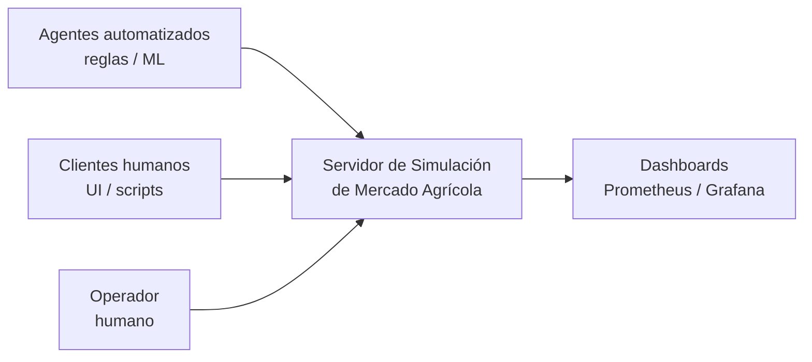
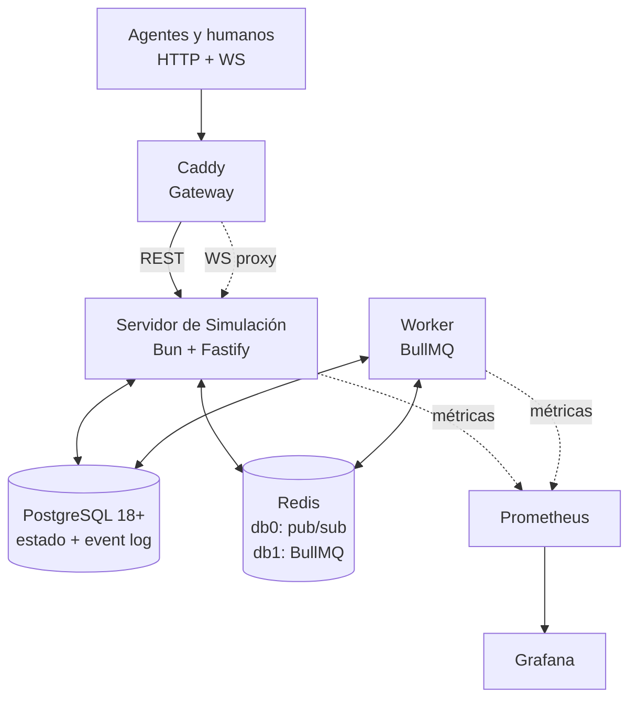
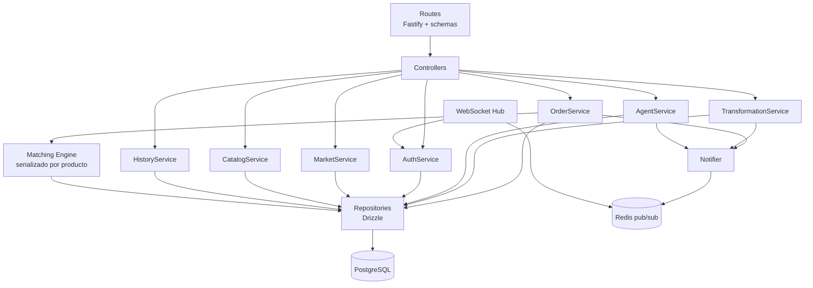
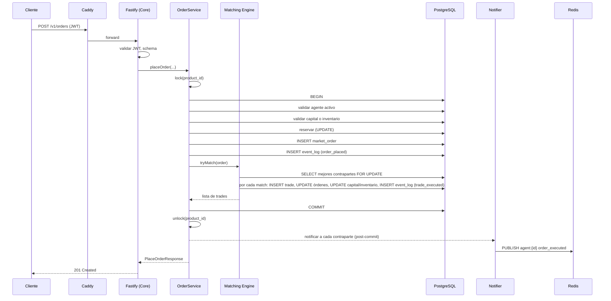
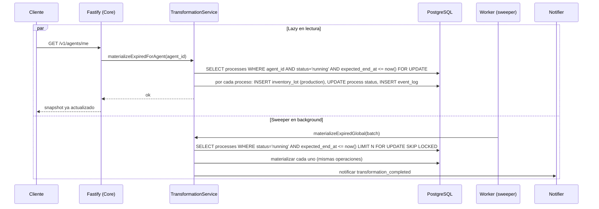

# Arquitectura del Proyecto – Simulación de Mercado Agrícola

## 1. Información General

**Proyecto:** Simulación de Mercado Agrícola

**Versión del Documento:** 0.1.0 (draft inicial post-diseño conceptual)

**Fecha:** 2026-05-26

**Responsables:** Equipo de Simulación de Mercado

**Descripción General**
Este documento describe la arquitectura técnica del proyecto **Simulación de Mercado Agrícola**, un servidor autoritativo de estado que simula un mercado de productos agrícolas con ~100 agentes concurrentes (productores primarios, transformadores, consumidores y traders) operando sobre un libro de órdenes con casado precio-tiempo, procesos de transformación con recetas, y trazabilidad FIFO por lotes de inventario. Recoge las decisiones de diseño, la estructura de componentes, los flujos principales y los estándares de desarrollo. Su propósito es servir como referencia técnica para los equipos de implementación y para auditorías posteriores.

Este documento se apoya en tres artefactos previos que se consideran fuente de verdad de sus respectivos dominios:

- `diseno_mercado_agricola.md` — diseño conceptual del dominio (reglas de negocio, invariantes, ciclos de vida).
- `schema.sql` — DDL canónico de PostgreSQL.
- `openapi.yaml` — contrato REST + descripción del canal WebSocket.

---

## 2. Alcance del Documento

Este documento cubre:

- Arquitectura de software a nivel sistema (C4 niveles 1, 2 y 3).
- Principales decisiones arquitectónicas (registradas como ADRs).
- Estructura del proyecto, convenciones de código y de API.
- Patrones de diseño y principios técnicos aplicados a este sistema en particular (matching engine, materialización lazy, reservas en disponible/reservado, FIFO por lotes).
- Estrategia de testing y observabilidad.

Fuera de alcance:

- Detalles de implementación de bajo nivel (firmas concretas de funciones, esquemas internos de módulos).
- Manuales de operación, runbooks o procedimientos de despliegue paso a paso.
- Diseño detallado de los agentes cliente (humanos o automatizados); este documento solo define el contrato de servidor.
- Diseño del UI humano que pueda construirse sobre la API.

---

## 3. Contexto del Sistema (C4 – Nivel 1)

### 3.1 Descripción

El sistema es un **servidor autoritativo único** que expone una API REST y un canal WebSocket. Sus usuarios son **agentes** —procesos cliente que pueden ser bots con reglas simples, agentes de ML o clientes humanos a través de algún UI— que se conectan al servidor y operan en el mercado simulado. El servidor es la única fuente de verdad sobre capital, inventarios, órdenes, procesos de transformación e historial.

No hay sistemas externos en el sentido tradicional: el sistema es cerrado y autocontenido. Los únicos actores son los agentes que se conectan a la API y un eventual operador humano que arranca la corrida, dispara snapshots manuales y consulta dashboards de observabilidad.

### 3.2 Diagrama de Contexto



Notas:

- Agentes automatizados y humanos consumen **exactamente la misma API**. El sistema no los distingue.
- El operador interactúa con el sistema vía herramientas administrativas (CLI/scripts) y consume métricas en Grafana.
- No hay integraciones con sistemas de terceros (pasarelas de pago, ERPs, etc.).

---

## 4. Contenedores del Sistema (C4 – Nivel 2)

### 4.1 Descripción de Contenedores

| Contenedor | Tecnología | Responsabilidad |
|-----------|------------|-----------------|
| API Gateway | Caddy | TLS termination, ruteo, CORS, load balancing y proxy de WebSocket. Sin lógica de autenticación de dominio. |
| Servidor de Simulación (Core) | Bun + TypeScript + Fastify | Servidor autoritativo: API REST, autenticación JWT, matching engine, ciclo de vida de órdenes y procesos, validación de invariantes, emisión de notificaciones. En v1 corre como **una sola instancia**. |
| Worker de Background Jobs | Bun + TypeScript + BullMQ | Sweeper de procesos de transformación vencidos, expirador de órdenes con TTL vencido, generador de snapshots agregados, limpieza periódica de refresh tokens expirados. |
| Base de Datos | PostgreSQL 18+ | Única fuente de verdad: estado vivo + event log append-only + snapshots agregados. |
| Redis (instancia única, DBs lógicas separadas) | Redis 8+ | DB `0`: pub/sub para notificaciones push WebSocket. DB `1`: cola de jobs y delayed jobs de BullMQ. |
| Stack de Observabilidad | Prometheus + Grafana | Recolección de métricas del Core y del Worker; dashboards de operación. |

### 4.2 Diagrama de Contenedores



### 4.3 Notas sobre cada contenedor

**Caddy (gateway delgado).**
Caddy es la única puerta de entrada externa. Termina TLS, aplica CORS, balanceo (preparado para múltiples instancias del Core en v2) y rutea peticiones HTTP a Fastify. Adicionalmente sirve como proxy WebSocket transparente (`/v1/ws`), sin validar el JWT —la validación del handshake la hace Fastify. Caddy **no** valida JWT de la API REST: esa responsabilidad vive en Fastify, para mantener en un solo lugar la lógica de revocación (quiebra, cambio de contraseña). Esta elección está registrada en ADR-006.

**Servidor de Simulación (Core).**
Un proceso Bun ejecutando Fastify. Contiene todo lo crítico del dominio: matching engine, validación atómica de operaciones, emisión de notificaciones, gestión de tokens. En v1 corre como **una sola instancia** (ADR-004). El matching se serializa por producto mediante locks de aplicación in-process; al haber un único proceso, no se requiere coordinación distribuida.

**Worker de Background Jobs.**
Proceso Bun separado que consume colas de BullMQ. Encapsula tres responsabilidades de fondo:

- *Sweeper de transformaciones:* recorre `transformation_process` con `status = 'running' AND expected_end_at <= now()` y materializa los procesos vencidos. Frecuencia configurable (por defecto cada 30 segundos reales).
- *Expirador de órdenes:* recorre `market_order` con `status IN ('active','partial') AND expires_at <= now()` y las marca como `expired`, liberando reservas. Frecuencia configurable.
- *Generador de snapshots manuales:* cuando el operador encola un job `take_snapshot`, el worker calcula los agregados (capital total, masa monetaria, bid/ask, inventario por producto) y los persiste en `market_snapshot*`.
- *Limpieza de refresh tokens expirados:* job recurrente diario.

El Worker comparte el código de dominio con el Core (mismo monorepo) pero arranca un entrypoint distinto. Esto evita duplicar lógica de materialización y mantiene un único lugar donde se aplican las reglas de negocio.

**PostgreSQL.**
Versión 18+ por `uuidv7()` nativo. Todas las decisiones de modelado y los índices están en `schema.sql` y `documentacion_base_datos.md`. El Core y el Worker se conectan al mismo cluster.

**Redis.**
Una sola instancia con dos bases lógicas (ADR-009): db `0` para el pub/sub de notificaciones WebSocket (canales `agent:{agent_id}` para mensajes personales y un canal global para broadcasts) y db `1` para BullMQ.

**Prometheus + Grafana.**
El Core y el Worker exponen `/metrics` en endpoints internos no proxeados por Caddy. Prometheus hace scraping. Grafana se conecta a Prometheus y queda accesible para el operador.

### 4.4 Tabla resumen puertos

| Servicio | Puerto interno | Expuesto externamente |
|----------|---------------|----------------------|
| Caddy | 9080 (HTTP), 9443 (HTTPS) | Sí (vía Docker) |
| Core (Fastify) | 8000 | No (solo Caddy) |
| Core métricas | 8001 | No |
| Worker métricas | 8002 | No |
| PostgreSQL | 5432 | No |
| Redis | 6379 | No |
| Prometheus | 9090 | Solo a operador |
| Grafana | 3000 | Solo a operador |

---

## 5. Componentes Principales (C4 – Nivel 3)

### 5.1 Organización Lógica del Core

El Core sigue una arquitectura por capas estricta. Cada capa solo conoce a la inmediatamente inferior. La regla es: **toda mutación de estado pasa por un Service, que ejecuta una transacción atómica que valida invariantes, persiste el cambio y registra el evento en el `event_log` antes de hacer commit**.

| Capa | Responsabilidad | Notas específicas |
|------|----------------|-------------------|
| Routes | Definición declarativa de rutas Fastify, validación de schemas de entrada/salida con Zod. | Cada ruta del `openapi.yaml` corresponde a un handler. |
| Controllers | Orquestación: extraer parámetros del request, llamar al Service apropiado, mapear el resultado al schema de respuesta, mapear errores de dominio a Problem+JSON RFC 7807. | Sin lógica de negocio. |
| Services | Lógica de dominio: validación de invariantes, transacciones atómicas, llamadas al matching engine, emisión de eventos al `event_log` y de notificaciones al Notifier. | Cada operación del diseño conceptual tiene su Service: `OrderService`, `TransformationService`, `AgentService`, `AuthService`, `MarketService`, `CatalogService`, `HistoryService`. |
| Matching Engine | Componente especializado del dominio que recibe una orden recién insertada y ejecuta el algoritmo de casado precio-tiempo contra el libro vigente. Aplicado como subcomponente de `OrderService`. | Serializado por producto mediante locks in-process (ADR-005). |
| Repositories | Acceso a datos vía Drizzle. Queries tipadas, transacciones, locking explícito (`FOR UPDATE`) donde sea necesario. | Sin lógica de negocio; solo persistencia. |
| Notifier | Publica mensajes en Redis pub/sub para que el componente WebSocket los entregue a los clientes conectados. | Único punto donde se construye el envelope de notificación. |
| WebSocket Hub | Gestiona conexiones WS de agentes, hace handshake con validación de JWT, se suscribe a Redis y reenvía mensajes al cliente correspondiente. | Misma instancia del Core; sin conexión bidireccional (servidor → cliente only). |
| Integrations | Reservado para futuras integraciones externas. Vacío en v1. | — |

### 5.2 Diagrama de Componentes (Core)



### 5.3 Componentes del Worker

El Worker es un proceso independiente con su propio entrypoint que reutiliza los Services y Repositories del Core. Sus componentes:

| Componente | Responsabilidad |
|-----------|----------------|
| Queue Bootstrap | Inicializa BullMQ workers para cada cola (`transformation-sweep`, `order-expiry-sweep`, `snapshot`, `refresh-token-cleanup`). |
| TransformationSweeper | Job recurrente: invoca `TransformationService.materializeExpired()` que procesa todos los procesos vencidos en batches. |
| OrderExpirySweeper | Job recurrente: invoca `OrderService.expireOverdue()` que marca como `expired` órdenes vencidas y libera reservas. |
| SnapshotRunner | Job on-demand: calcula y persiste un `market_snapshot` y sus tablas hijas. |
| RefreshTokenCleaner | Job recurrente diario: borra refresh tokens con `expires_at < now() - 30d`. |

Las operaciones del Worker emiten los mismos eventos al `event_log` que las operaciones síncronas del Core (p. ej. `order_expired`, `process_completed`).

### 5.4 Flujo crítico: colocación y matching de una orden



Notas críticas:

- El `lock(product_id)` es un mutex in-process (ej. `async-mutex`). Toda la operación de matching para ese producto se serializa en aplicación. Sin esto, dos órdenes que llegan simultáneamente al mismo producto podrían producir ejecuciones inconsistentes.
- La transacción de base de datos abarca **toda** la operación: validación, reservas, inserción de la orden, matching completo, registro en `event_log`. Si algo falla, todo revierte.
- Las notificaciones se publican en Redis **después** del commit. Si la transacción falla, no se notifica nada falso.
- Las contrapartes notificadas pueden estar desconectadas; el mensaje se publica igual, y al reconectarse el agente verá el estado actualizado en `GET /agents/me`.

### 5.5 Flujo crítico: materialización lazy + sweeper



Notas:

- El uso de `FOR UPDATE SKIP LOCKED` en el sweeper permite que el Worker procese en batches sin chocar con materializaciones lazy concurrentes disparadas por el Core. El que llegue primero materializa; el otro hace no-op.
- Tras materializar, se calcula el `unit_cost_cents` del lote producido sumando los costos de los insumos consumidos (registrados al iniciar el proceso en `transformation_lot_consumption`) más el salario pagado, dividido entre la cantidad producida total.

---

## 6. Stack Tecnológico

### 6.1 Tecnologías Principales

- **Runtime:** Bun (última versión LTS al momento del setup).
- **Lenguaje:** TypeScript en modo `strict`.
- **Framework HTTP:** Fastify.
- **Validación de schemas:** Zod. Los schemas Zod son la fuente única en TypeScript para validación de entrada/salida en Fastify y para derivar tipos del dominio expuestos por la API. El mantenimiento del `openapi.yaml` se hace **a mano**: cualquier cambio en un endpoint requiere actualizar tanto el schema Zod (runtime) como el OpenAPI (contrato documental). Se recomienda un test de CI que valide que los ejemplos del OpenAPI pasan por los schemas Zod equivalentes.
- **Acceso a Base de Datos:** Drizzle ORM (query builder tipado).
- **Migraciones:** `drizzle-kit`. El esquema canónico en TypeScript debe reproducir exactamente lo declarado en `schema.sql`; ambos se mantienen como fuentes paralelas, con `schema.sql` como referencia humana y el schema de Drizzle como referencia ejecutable.
- **Persistencia:** PostgreSQL 18+ (requerido por `uuidv7()` nativo, ver `documentacion_base_datos.md`).
- **Cache / Cola / Pub/Sub:** Redis 8+ (una sola instancia, dos DBs lógicas).
- **Background Jobs:** BullMQ.
- **Gateway:** Caddy (configuración declarativa vía Caddyfile).
- **Cliente Redis:** `ioredis` (compatible con BullMQ y con pub/sub directo).
- **WebSocket:** `@fastify/websocket`.
- **JWT:** `@fastify/jwt` para emisión y verificación; `argon2` para hash de contraseñas.

### 6.2 Herramientas de Soporte

- **Testing:**
  - Unitario: `bun test` (runner nativo de Bun).
  - Integración: `bun test` + `testcontainers` para PostgreSQL y Redis efímeros.
  - End-to-end del contrato: tests contra el OpenAPI usando un cliente HTTP real contra el Core levantado en Docker Compose.
- **Linting / Formatting:** ESLint v10 + Prettier. Configuración basada en `@typescript-eslint` para reglas específicas de TypeScript; Prettier para formato. Se integran en pre-commit hooks y en CI.
- **Observabilidad:**
  - Métricas: `prom-client` (Prometheus client para Node/Bun) expuesto en `/metrics`.
  - Logs estructurados: `pino` (integrado con Fastify por defecto), en JSON.
  - Tracing: opcional en v1; se puede instrumentar con OpenTelemetry si se requiere más adelante.
- **Documentación de API:** el `openapi.yaml` se mantiene **a mano** en `docs/` como contrato versionado. **No se monta Swagger UI** ni se genera el OpenAPI desde código. Consecuencia operativa: cualquier cambio en endpoints debe modificar tanto el código (schema Zod, route, controller, service) como el `openapi.yaml`, en el mismo PR. Para consultar el contrato, los desarrolladores y consumidores abren el YAML directamente o lo cargan localmente en cualquier visor de OpenAPI (Stoplight, Redocly, Swagger Editor externo, etc.).
- **Gestión de configuración:** archivos `.env` cargados al arrancar. Validación del shape con Zod al boot; si falta una variable obligatoria, el proceso muere temprano.

### 6.3 Métricas que el Core y el Worker deben exponer

Como guía mínima para Prometheus:

- **Core (Fastify):** latencia y tasa de cada endpoint, conteo de errores por status code, número de conexiones WebSocket activas, tamaño de las colas in-process de matching por producto, duración de transacciones de matching.
- **Worker:** conteo de jobs procesados y fallidos por tipo de cola, latencia de procesamiento, profundidad de cola en Redis, número de procesos de transformación materializados por intervalo, número de órdenes expiradas por intervalo.
- **Negocio (ambos pueden contribuir):** número de agentes activos, masa monetaria total, número de órdenes vivas por producto, número de procesos en curso.

---

## 7. Estructura del Proyecto

Monorepo único con el Core y el Worker compartiendo código de dominio.

```
mercado-agricola/
├── src/
│   ├── routes/                      # rutas Fastify, una por recurso (auth, orders, transformations, ...)
│   ├── controllers/                 # handlers que orquestan y mapean a Problem+JSON
│   ├── services/                    # lógica de dominio (OrderService, TransformationService, ...)
│   │   └── matching/                # matching engine y locks por producto
│   ├── repositories/                # capa Drizzle: queries tipadas, transacciones
│   ├── db/
│   │   ├── schema.ts                # schema Drizzle (espejo de schema.sql)
│   │   └── migrations/              # generadas por drizzle-kit
│   ├── notifier/                    # publicación a Redis pub/sub
│   ├── websocket/                   # handshake JWT, suscripción a Redis, fanout a clientes
│   ├── workers/                     # entrypoints y handlers de BullMQ
│   │   ├── transformation-sweeper.ts
│   │   ├── order-expiry-sweeper.ts
│   │   ├── snapshot-runner.ts
│   │   └── refresh-token-cleaner.ts
│   ├── auth/                        # emisión y verificación de JWT, hashing de password
│   ├── schemas/                     # schemas Zod, tipos derivados del dominio
│   ├── types/                       # tipos compartidos del dominio
│   ├── config/                      # carga y validación de .env con Zod
│   ├── observability/               # prom-client setup, logger pino
│   ├── app.ts                       # arranque del Core (Fastify)
│   └── worker.ts                    # arranque del Worker (BullMQ)
├── tests/
│   ├── unit/
│   ├── integration/                 # con testcontainers
│   └── e2e/                         # contra el stack completo en Docker Compose
├── docs/
│   ├── diseno_mercado_agricola.md
│   ├── schema.sql
│   ├── documentacion_base_datos.md
│   ├── openapi.yaml                 # contrato mantenido a mano; fuente de verdad del API
│   └── arquitectura_mercado_agricola.md   # este documento
├── deploy/
│   ├── docker-compose.yml
│   ├── caddy/                       # configuración de Caddyfile
│   ├── prometheus/
│   └── grafana/
├── .env.example
├── .eslintrc.cjs
├── .prettierrc
├── drizzle.config.ts
├── package.json
└── tsconfig.json
```

Convenciones de archivos:

- Un Service por agregado de dominio. Un Repository por agregado (o por tabla principal del agregado).
- Los schemas Zod viven en `src/schemas/` y se comparten entre routes (validación de entrada/salida) y tests (generación de fixtures). Cuando un schema cambie, el `openapi.yaml` debe actualizarse en el mismo commit.
- Las transacciones siempre se inician en el Service, nunca en el Repository (los Repositories reciben el cliente transaccional como parámetro).

---

## 8. Convenciones de API

### 8.1 Convención de URLs

El prefijo de versión es **`/v1`** (ver `openapi.yaml`).

```
/v1/{recurso}/{id?}
```

Los recursos y sub-recursos siguen la jerarquía definida en el OpenAPI: `/v1/auth/*`, `/v1/catalog/*`, `/v1/agents/*`, `/v1/orders/*`, `/v1/transformations/*`, `/v1/market/*`, `/v1/history/*`, `/v1/ws`.

Reglas adicionales:

- Identificadores en path como UUIDv7 (`product_id`, `order_id`, etc.).
- Filtros y paginación en query string. Cursor opaco basado en el `event_id` o `id` del último resultado (los UUIDv7 son ordenables temporalmente).
- Verbos HTTP: `GET` lectura, `POST` creación de recursos, `DELETE` cancelación. No se usa `PUT` ni `PATCH` en v1 (no hay updates parciales en el dominio externo).

### 8.2 Estructura de Respuestas

El contrato de respuesta está definido en `openapi.yaml` por cada endpoint. A diferencia del wrapper genérico `{ data, meta }` de la plantilla original, este sistema usa **payloads directos** porque:

- Las respuestas tipadas con Zod son más limpias sin wrapper.
- Las páginas usan un objeto con `items` y `next_cursor` (ver `OrderPage`, `TradePage`, `TransformationPage`, `EventPage` en el OpenAPI).

**Respuesta exitosa (ejemplo paginado):**

```json
{
  "items": [ { /* recurso */ } ],
  "next_cursor": "01HV..."
}
```

**Respuesta exitosa (recurso único):**

```json
{ "order_id": "...", "agent_id": "...", "...": "..." }
```

**Respuesta de error:** RFC 7807 `application/problem+json`, con extensión `errors[]` para errores múltiples (típico en validaciones de dominio).

```json
{
  "type": "https://errors.mercado-agricola/insufficient-capital",
  "title": "Capital insuficiente",
  "status": 422,
  "detail": "El agente no tiene capital disponible para reservar la orden.",
  "errors": [
    { "code": "insufficient_capital", "field": "qty_cent", "message": "Se requieren 25000 cents, disponibles 18200." }
  ]
}
```

### 8.3 Idempotencia

`POST /v1/orders` acepta `client_order_id` opcional. Reenvíos con el mismo `client_order_id` dentro de una ventana corta devuelven la orden previamente creada. Se implementa con una tabla (o un cache en Redis con TTL corto) que mapea `(agent_id, client_order_id) → order_id`.

### 8.4 Versionado

Versionado en URL (`/v1/...`). Cambios incompatibles requieren `/v2/...`. Cambios aditivos (nuevos campos opcionales, nuevos endpoints) se hacen en `/v1`.

---

## 9. Seguridad

### 9.1 Autenticación

Esquema: **usuario/contraseña + JWT**.

- Contraseñas hasheadas con **argon2id** (parámetros conservadores: `memoryCost ≥ 19 MiB`, `timeCost ≥ 2`, `parallelism = 1`).
- Tokens JWT firmados con **HS256** o **RS256** (recomendado RS256 para facilitar la rotación de claves sin invalidar tokens vivos).
- Access token: vida corta sugerida 15 minutos, stateless.
- Refresh token: vida sugerida 7 días, persistido en `agent_refresh_token` con hash, **nunca en claro**. Rotación en cada uso.

### 9.2 Autorización

No hay roles administrativos en v1 al nivel del API público: todos los agentes tienen los mismos permisos sobre sus propios recursos. La autorización es de **ownership**: cada endpoint que opera sobre un recurso identificable (`/v1/orders/{order_id}`, `/v1/transformations/{process_id}`) verifica en el Service que el recurso pertenece al `agent_id` del JWT, devolviendo `403` si no.

Endpoints que **no** requieren autenticación: `POST /v1/auth/register`, `POST /v1/auth/login`, `POST /v1/auth/refresh`, y los `GET /v1/catalog/*`. Todo lo demás requiere `Authorization: Bearer <access_token>`.

Reglas adicionales aplicadas en cada operación autenticada:

- Si el agente está en estado `bankrupt`, todas las operaciones de escritura (place_order, cancel_order, start_transformation, cancel_transformation) devuelven `403` con código `agent_bankrupt`.
- Las lecturas siguen permitidas para que el agente pueda inspeccionar su estado final, salvo `POST /v1/auth/login` que también rechaza con `403`.

### 9.3 Revocación

- `POST /v1/auth/logout` revoca el refresh token recibido.
- Cambiar contraseña revoca todos los refresh tokens del agente.
- Marcar un agente como `bankrupt` revoca todos sus refresh tokens activos.

Los access tokens, al ser stateless, siguen válidos hasta su expiración natural; su vida corta limita la ventana de exposición.

### 9.4 WebSocket

El handshake del WS valida el access token JWT. Caddy hace proxy transparente al puerto del Core sin validar; Fastify valida en el upgrade. Si el token es inválido o expirado, el upgrade se rechaza. Durante la vida de la conexión no se re-valida el token; al expirar, el cliente debe reconectar con un token fresco.

### 9.5 Principio de mínimo privilegio

- El usuario de PostgreSQL del Core y del Worker solo tienen permisos sobre el schema `public` del proyecto. No tienen privilegios de superuser.
- Redis no se expone fuera de la red Docker.
- Caddy es el único contenedor con puertos publicados al host.

### 9.6 Rate limiting

En esta configuración de simulación local, Caddy se ejecuta libre de límites de tasa (rate limiting) en el gateway, facilitando la fluidez del tráfico de prueba.

---

## 10. Manejo de Errores

| Código | Significado | Cuándo se devuelve |
|--------|-------------|--------------------|
| 200 | OK | Lectura exitosa o cancelación idempotente sobre recurso ya terminal. |
| 201 | Created | Registro de agente, orden colocada, transformación iniciada. |
| 204 | No Content | Cancelación exitosa, logout exitoso. |
| 400 | Bad Request | JSON inválido, schema de entrada incumplido sintácticamente. |
| 401 | Unauthorized | Falta el token, o el token es inválido, expirado o revocado. |
| 403 | Forbidden | Token válido pero sin permisos: recurso de otro agente, agente en quiebra. |
| 404 | Not Found | Recurso inexistente. |
| 409 | Conflict | Estado del recurso impide la operación (ej. cancelar un proceso ya terminal, username ya en uso). |
| 422 | Unprocessable Entity | Sintaxis válida, semántica rechazada por dominio (capital insuficiente, inventario insuficiente, TTL fuera de rango, capacidad saturada, etc.). |
| 429 | Too Many Requests | Rate limit excedido. |
| 500 | Internal Server Error | Bug del servidor. Se loguea con stack y trace id; se devuelve un Problem+JSON sin detalles internos. |
| 503 | Service Unavailable | Postgres o Redis no disponibles. |

Todos los errores responden con `application/problem+json` siguiendo RFC 7807. Cuando hay múltiples causas (típico en `422`), se enumeran en el array `errors[]` con `code`, `field` opcional y `message`. Los `code` son strings estables documentados (`insufficient_capital`, `insufficient_inventory`, `insufficient_capacity`, `agent_bankrupt`, `ttl_out_of_range`, `unknown_recipe`, `unknown_product`, `unknown_order`, `unknown_process`, `not_owner`, `recipe_capacity_saturated`, `client_order_id_replay`).

Cada respuesta de error incluye un `instance` con el path del request y, en logs internos, un trace id propagado en el header `x-request-id`.

---

## 11. Principios Arquitectónicos

Aplicados a este sistema en particular:

- **Servidor autoritativo único.** Toda decisión de estado se toma en el servidor. Los agentes no mantienen estado autoritativo. Esto elimina problemas de consistencia bajo concurrencia y reconexión.
- **Separación disponible/reservado en capital e inventario.** Invariantes locales baratas: validar capital disponible no requiere escanear órdenes activas. Decisión heredada del diseño conceptual y ratificada aquí.
- **Atomicidad en cada operación de dominio.** Toda mutación se ejecuta en una transacción PostgreSQL que valida invariantes, persiste el cambio y registra el evento en `event_log` antes de hacer commit. Si algo falla, todo revierte.
- **Serialización por producto en el matching.** El matching engine procesa órdenes de un producto en orden estricto, mediante un mutex in-process. Esto evita race conditions sin requerir locks distribuidos en v1.
- **Materialización lazy + sweeper.** Los procesos de transformación se "completan" cuando alguien observa el estado del agente, o cuando el sweeper los procesa. Evita un scheduler complejo y mantiene la consistencia: el estado siempre está actualizado en el momento de la lectura.
- **Inventario por lotes con FIFO.** Cada adquisición o producción crea un lote con costo unitario. Las ventas y consumos descuentan FIFO. Da trazabilidad de COGS por trade y costo real de producción por proceso.
- **Event log append-only.** Toda mutación genera un evento persistido en la misma transacción. El estado es derivable reproduciendo eventos; sirve tanto a análisis post-mortem como a entrenamiento de agentes de ML.
- **Configuración estática por corrida.** La semilla maestra, factor de tiempo, fees y rangos de capital se cargan desde `.env` al arranque y son inmutables durante la corrida. Esto se persiste en el repositorio (con el `.env` versionado del deploy), no en la BD.
- **Mismo contrato para humanos y bots.** La API no distingue entre clientes; cualquier UI humana se construye encima de la misma API.
- **Observabilidad desde el diseño.** Tanto el Core como el Worker exponen `/metrics` desde el día 1; los logs son JSON estructurado; cada request lleva trace id.
- **Seguridad por defecto.** Argon2id para passwords, JWT con vida corta + refresh con rotación, rate limiting en el gateway, ownership checks en cada endpoint protegido.

---

## 12. Architecture Decision Records (ADR)

### 12.1 Formato ADR

| Campo | Descripción |
|-------|-------------|
| ID | ADR-XXX |
| Fecha | YYYY-MM-DD |
| Estado | Propuesto / Aceptado / Deprecado |
| Contexto | Situación que motiva la decisión |
| Decisión | Decisión tomada |
| Consecuencias | Impactos positivos y negativos |

### 12.2 Registro de ADRs

| ID | Fecha | Estado | Decisión |
|----|-------|--------|----------|
| ADR-001 | 2026-05-26 | Aceptado | PostgreSQL 18+ como única fuente de verdad, con event log append-only embebido. |
| ADR-002 | 2026-05-26 | Aceptado | Bun + TypeScript + Fastify como runtime, lenguaje y framework HTTP. |
| ADR-003 | 2026-05-26 | Aceptado | Drizzle + drizzle-kit como capa de acceso a datos y migraciones. |
| ADR-004 | 2026-05-26 | Aceptado | Una sola instancia del Core en v1 (sin replicación ni sharding). |
| ADR-005 | 2026-05-26 | Aceptado | Matching engine directo contra Postgres, serializado por producto con locks in-process. |
| ADR-006 | 2026-05-26 | Aceptado | Caddy como gateway delgado: TLS, ruteo, CORS, load balancing y WS proxy sin autenticación. JWT lo valida Fastify. |
| ADR-007 | 2026-05-26 | Aceptado | BullMQ para todos los jobs de fondo (sweeper, expirador, snapshot, limpieza). |
| ADR-008 | 2026-05-26 | Aceptado | Worker como proceso separado del Core, compartiendo código de dominio en monorepo. |
| ADR-009 | 2026-05-26 | Aceptado | Una sola instancia de Redis con DBs lógicas separadas (db 0 pub/sub, db 1 BullMQ). |
| ADR-010 | 2026-05-26 | Aceptado | JWT (access stateless + refresh persistido con rotación) y argon2id para passwords. |
| ADR-011 | 2026-05-26 | Aceptado | Materialización lazy + sweeper para procesos de transformación. |
| ADR-012 | 2026-05-26 | Aceptado | Errores como RFC 7807 Problem+JSON con extensión `errors[]`. |
| ADR-013 | 2026-05-26 | Aceptado | Docker Compose como plataforma de despliegue en v1. |
| ADR-014 | 2026-05-26 | Aceptado | Prometheus + Grafana para observabilidad; pino para logs estructurados. |
| ADR-015 | 2026-05-26 | Aceptado | `openapi.yaml` se mantiene a mano como contrato; no se genera desde código ni se sirve Swagger UI. |
| ADR-016 | 2026-05-26 | Aceptado | Zod como única librería de validación de schemas (rutas, configuración de `.env`, tests). |

### 12.3 Detalle de ADRs clave

**ADR-004 — Una sola instancia del Core en v1**

- *Contexto:* la simulación corre con ~100 agentes. La carga proyectada (~10K órdenes/día, ~5K trades/día) cabe holgadamente en un proceso Bun bien configurado. Múltiples instancias forzarían a resolver coordinación de matching (lock distribuido o sharding por producto).
- *Decisión:* desplegar el Core como una sola instancia. Caddy se configura para balancing futuro, pero apunta a un único upstream.
- *Consecuencias:*
  - (+) Matching trivialmente serializable con un mutex in-process por producto.
  - (+) Implementación, debugging y razonamiento mucho más simples.
  - (−) Punto único de fallo. Aceptable en v1 (simulación, no producción).
  - (−) Techo de throughput limitado por un solo proceso. Si se rebasa, hay que ir a v2 con sharding por producto.

**ADR-005 — Matching directo contra Postgres**

- *Contexto:* dos diseños posibles: (a) libro de órdenes en memoria con persistencia eventual, (b) matching en cada request con queries directas y locks de fila.
- *Decisión:* (b). Cada `POST /v1/orders` ejecuta una transacción que valida, inserta la orden, busca contrapartes con `SELECT ... FOR UPDATE` siguiendo `idx_orderbook_buy`/`idx_orderbook_sell`, ejecuta los matches y commita todo junto.
- *Consecuencias:*
  - (+) Sin caché de libro que mantener consistente con la BD; el estado vivo es siempre la BD.
  - (+) Implementación más simple, menos bugs sutiles.
  - (+) Recuperación tras crash trivial: no hay estado en RAM que reconstruir.
  - (−) Throughput menor que un libro in-memory. A la escala objetivo (~10K órdenes/día), está holgado.
  - (−) Sensible al rendimiento de Postgres. Los índices parciales del schema están diseñados precisamente para esto.

**ADR-006 — Caddy gateway delgado**

- *Contexto:* Caddy puede asumir responsabilidades amplias pero esto fragmenta la lógica de revocación de tokens y de detección de quiebra, que viven naturalmente en el Core.
- *Decisión:* Caddy hace TLS, ruteo, CORS, balancing y WS proxy. **No** valida JWT. Fastify es el único punto que decide si una request está autorizada.
- *Consecuencias:*
  - (+) Una sola fuente de verdad para autorización.
  - (+) Revocación de tokens (por quiebra, cambio de password, logout) se aplica de inmediato sin sincronizar caches.
  - (−) Cada request hace un JWT decode + verificación en Fastify (costo despreciable con HS256/RS256).

**ADR-009 — Una sola instancia de Redis con DBs lógicas**

- *Contexto:* BullMQ requiere Redis. El sistema también necesita pub/sub para notificaciones WS. Se pueden separar en dos instancias o multiplexar.
- *Decisión:* una sola instancia, db `0` para pub/sub, db `1` para BullMQ.
- *Consecuencias:*
  - (+) Menos componentes que operar y monitorear.
  - (+) Suficiente para la carga proyectada.
  - (−) Un fallo de Redis afecta a ambos usos. Aceptable en v1; mitigable con HA en v2.

**ADR-011 — Materialización lazy + sweeper**

- *Contexto:* los procesos de transformación tienen una duración. ¿Cuándo se "completan"?
- *Decisión:* dos mecanismos complementarios. (a) Lazy: al leer el estado del agente, el Service materializa procesos vencidos del agente antes de devolver el snapshot. (b) Sweeper: un job recurrente en el Worker materializa procesos vencidos cuyos dueños no consultan, para que las notificaciones lleguen oportunamente.
- *Consecuencias:*
  - (+) El estado leído por un agente está siempre actualizado.
  - (+) Las notificaciones de `transformation_completed` se disparan sin depender de polling del agente.
  - (+) Evita un scheduler complejo de timers por proceso.
  - (−) Dos rutas para la misma operación; ambas deben usar `FOR UPDATE SKIP LOCKED` para no chocar.

**ADR-015 — OpenAPI mantenido a mano, sin Swagger UI**

- *Contexto:* hay dos enfoques comunes para gestionar OpenAPI: (a) generarlo desde código (anotaciones, plugins de Fastify), (b) mantenerlo a mano como contrato versionado. Adicionalmente, suele servirse con Swagger UI para exploración interactiva.
- *Decisión:* el `openapi.yaml` se mantiene **a mano** en `docs/openapi.yaml` y es la fuente de verdad del contrato. **No se monta Swagger UI** en el Core. La consulta del contrato se hace abriendo el YAML directamente o cargándolo en visores externos.
- *Consecuencias:*
  - (+) El contrato es legible y revisable como cualquier otro artefacto del repositorio; no depende de regenerar y comparar diffs de archivos generados.
  - (+) Permite documentar decisiones, ejemplos y descripciones largas con cuidado, sin las limitaciones de los decoradores en código.
  - (+) Menos superficie en el Core: sin endpoint `/docs` que proteger y mantener.
  - (−) **Riesgo de divergencia entre código y contrato.** Mitigación: regla de equipo de modificar ambos en el mismo PR, y test de CI que valide los ejemplos del OpenAPI contra los schemas Zod equivalentes.
  - (−) Sin exploración interactiva built-in; los consumidores deben usar herramientas externas.

**ADR-016 — Zod como única librería de validación**

- *Contexto:* el ecosistema TypeScript ofrece varias opciones (TypeBox, Zod, Yup, io-ts). Convivir con más de una fragmenta el código.
- *Decisión:* usar **Zod** en todos los sitios donde se valide o derive un schema en tiempo de ejecución: rutas Fastify, validación del `.env` al boot, fixtures de tests.
- *Consecuencias:*
  - (+) Una sola librería que aprender y mantener.
  - (+) Tipos inferidos por Zod alimentan directamente Controllers y Services.
  - (−) Zod no produce JSON Schema nativo idéntico al que Fastify espera por defecto; se usa el adaptador estándar (`fastify-type-provider-zod` o equivalente) para integrarlos.

---

## 13. Notas y Consideraciones Finales

**Relación con los documentos previos.**
Este documento no reemplaza ni duplica:

- `diseno_mercado_agricola.md` sigue siendo la fuente de verdad para reglas de negocio, invariantes y ciclos de vida.
- `schema.sql` y `documentacion_base_datos.md` son la fuente de verdad para el modelo de datos.
- `openapi.yaml` es el contrato de la API; cualquier discrepancia entre este documento y el OpenAPI debe resolverse a favor del OpenAPI.

Este documento es la **referencia arquitectónica**: cómo se distribuye el sistema, qué tecnologías concretas se usan, cómo se organiza el código y por qué.

**Riesgos y áreas de atención.**

- *Throughput del matching:* la elección de matching directo contra Postgres es la decisión más sensible a la escala. Hay que monitorear la latencia del endpoint `POST /v1/orders` desde el día 1 y la duración de las transacciones de matching. Si supera umbrales razonables (p. ej. p95 > 200 ms), revisitar antes de v2.
- *Crecimiento de `event_log`:* a ~30K eventos/día crece ~5.5 GB/año (estimación de `documentacion_base_datos.md`). En el horizonte de v1 está acotado; la decisión de no particionar en v1 (ADR-001 implícito) debe revisarse antes de que la tabla supere los ~50M de filas.
- *Pausar/reanudar la simulación o cambiar el factor de tiempo mid-run:* no soportado en v1. `expires_at` y `expected_end_at` están calculados en `TIMESTAMPTZ` real aplicando el factor al momento de la creación. Cambiar el factor requeriría recalcular todos los timestamps vivos, lo cual no está implementado.
- *Punto único de fallo:* el Core es una sola instancia. Una caída interrumpe la simulación; el estado en Postgres queda consistente y al reiniciar el Core el sistema puede seguir. Worker y Core son independientes y pueden reiniciarse por separado.
- *Auditoría del paralelismo Core+Worker en operaciones idempotentes:* la materialización lazy en el Core y la del Worker pueden competir por los mismos procesos vencidos. Es crítico que ambos usen `FOR UPDATE SKIP LOCKED` y que la operación sea idempotente (un proceso ya `completed` no se vuelve a materializar).

**Trabajo futuro relevante para v2 (alineado con el alcance v1 del diseño).**

- Expansión de capacidad por inversión de capital → impacto en `AgentService` y en una nueva operación API.
- Sharding o múltiples instancias del Core → requiere coordinar matching por producto (lock distribuido en Redis o partición consistente por hash de producto).
- Particionado de `event_log` por tiempo.
- Tracing distribuido con OpenTelemetry, completando la observabilidad.
- Endpoints administrativos para el operador (disparar snapshot, ajustar config sin reiniciar, exportar event log).
