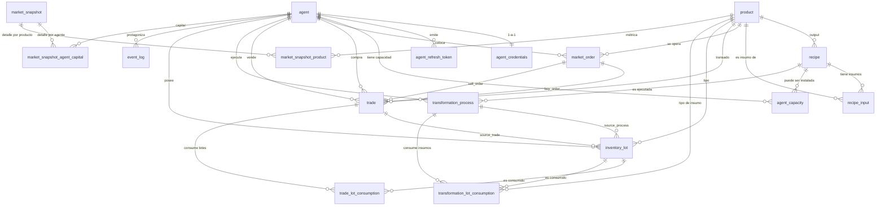

# 📚 Documentación Base de Datos — Simulación de Mercado Agrícola

## Servidor autoritativo de estado que simula un mercado de productos agrícolas con ~100 agentes (productores primarios, transformadores, consumidores y traders) operando concurrentemente sobre un libro de órdenes con casado precio-tiempo, procesos de transformación con recetas, y trazabilidad FIFO por lotes de inventario.

---

## 📋 Información General

### Componentes de Datos

La arquitectura de datos del sistema se compone de:

- **Base de datos principal**: PostgreSQL 18+ — única fuente de verdad sobre capital, inventarios, órdenes, transacciones, procesos de transformación e historial. Mantiene tanto el estado vivo como el event log append-only.
- **Bases de datos auxiliares**: No aplica en v1.
- **Cache / Search / Otros**: Redis — usado exclusivamente como transporte de mensajes para notificaciones WebSocket push hacia los agentes (no persiste estado de dominio).

> **Alcance del documento**: cubre el esquema relacional completo del estado de dominio (catálogo, agentes, órdenes, trades, procesos, inventario por lotes), el event log, los snapshots agregados y la configuración de corrida. **No cubre**: detalles de la capa de transporte WebSocket en Redis, contratos de API REST, lógica de matching engine, ni el formato JWT.

---

### PostgreSQL (base de datos relacional principal)

- **Motor**: PostgreSQL 18+ (requerido para `uuidv7()` nativo)
- **Encoding**: UTF-8
- **Host**: por definir en despliegue
- **Puerto**: 5432
- **Usuario**: por definir en despliegue
- **Schema**: `public`
- **Estrategia de IDs**: UUID v7 nativo (`uuidv7()`) en todas las tablas. Los UUIDv7 son monotónicos por tiempo de creación, por lo que sirven simultáneamente como identificadores únicos y como índices ordenados naturales para órdenes, trades, procesos y eventos.

**Nombre de base de datos**:

- Una sola corrida activa por instancia. La simulación se empieza desde cero; no hay multi-tenancy.

---

### Otras Bases de Datos / Servicios

#### Redis

- **Motor**: Redis (versión por definir en despliegue)
- **Uso**: transporte de mensajes para notificaciones push WebSocket hacia los agentes (`order_executed`, `order_expired`, `order_cancelled`, `transformation_completed`, `bankruptcy_notice`, `agent_joined`, `agent_bankrupt`). No persiste estado de dominio.
- **Colecciones / Índices clave**:
  - Canales pub/sub por agente para notificaciones personales
  - Canal pub/sub global para broadcasts

---

## 🎯 Propósito del Modelo de Datos

El modelo cubre los siguientes dominios:

- ✅ **Catálogo de productos y recetas**: definiciones canónicas contra las que se validan todas las transformaciones.
- ✅ **Agentes y autenticación**: registro dinámico, credenciales (usuario/contraseña + JWT), capacidades productivas instaladas.
- ✅ **Capital e inventario con separación disponible/reservado**: invariantes locales baratas para validar bajo concurrencia.
- ✅ **Libro de órdenes**: órdenes de compra y venta con prioridad precio-tiempo, ejecuciones parciales, TTL absoluto.
- ✅ **Transacciones (trades)**: registro inmutable de ejecuciones con fees, identidades de ambas contrapartes y producto.
- ✅ **Procesos de transformación**: ciclo de vida de producción con ejecuciones secuenciales, salario upfront, y materialización lazy + sweeper.
- ✅ **Inventario por lotes (FIFO)**: trazabilidad de costo por lote, COGS por trade, costo de producción por proceso.
- ✅ **Event log append-only**: registro inmutable de toda mutación de estado para auditoría y derivación de estado.
- ✅ **Snapshots agregados**: materialización periódica de métricas globales (masa monetaria, inventario total, bid/ask).
- ✅ **Configuración de corrida**: semilla maestra y parámetros para reproducibilidad del setup inicial.

---

## 📊 Estadísticas Generales

```
Total de Tablas: 17
Total de Enums: 7
Total de Índices: 17 (excluyendo PKs y UNIQUE de columnas)
Total de Relaciones (FK): 23
```

Desglose por dominio:

- Catálogo: 3 tablas (`product`, `recipe`, `recipe_input`)
- Agentes y auth: 4 tablas (`agent`, `agent_credentials`, `agent_refresh_token`, `agent_capacity`)
- Órdenes y trades: 2 tablas (`market_order`, `trade`)
- Procesos: 1 tabla (`transformation_process`)
- Inventario y trazabilidad: 3 tablas (`inventory_lot`, `trade_lot_consumption`, `transformation_lot_consumption`)
- Event log: 1 tabla (`event_log`)
- Snapshots: 3 tablas (`market_snapshot`, `market_snapshot_agent_capital`, `market_snapshot_product`)
- Configuración: ninguna en BD — cargada desde `.env` al arranque del proceso.

---

## 🗂️ Estructura de Base de Datos

### Fuente de Verdad del Esquema

- **ORM / DDL**: `schema.sql` (DDL canónico en el repositorio del proyecto)
- **Migraciones**: por definir (se recomienda Flyway, sqlx-migrate o alembic según stack de aplicación)
- **Seeds**: por definir; el setup inicial se ejecuta a partir de la semilla maestra leída desde la variable de entorno correspondiente al arranque.
- **Configuración**: archivo `.env` cargado al arrancar el proceso. Incluye semilla maestra, parámetros de fees, factor de tiempo, rangos de capital por rol y demás parámetros operativos. La configuración es estática durante la corrida.

---

## 🌾 Catálogo

### 1. product

**Descripción**: catálogo canónico de productos del mercado. Cada producto tiene una unidad de medida y una categoría informativa (no restrictiva sobre quién puede comprar/vender). Todos los productos son homogéneos en v1 (no hay variantes de calidad).

```sql
-- Enums
CREATE TYPE product_category AS ENUM (
    'raw_primary',
    'intermediate',
    'final_consumption'
);

-- Tabla
CREATE TABLE product (
    product_id      UUID                PRIMARY KEY DEFAULT uuidv7(),
    -- Identificador estable del catálogo (seed-config `key`, ej. 'trigo');
    -- constante entre seeds, a diferencia del UUID. Lo expone la API para que
    -- los clientes anclen su configuración sin depender del product_id.
    key             TEXT                NOT NULL UNIQUE,
    name            TEXT                NOT NULL UNIQUE,
    unit            TEXT                NOT NULL,
    category        product_category    NOT NULL,
    created_at      TIMESTAMPTZ         NOT NULL DEFAULT now()
);
```

#### DDL de Índices y Constraints

```sql
-- Índices automáticos: PK sobre product_id, UNIQUE sobre key y sobre name.
-- No se definen índices adicionales: el catálogo es pequeño y las búsquedas
-- por nombre y por id están cubiertas por los índices implícitos.
```

#### Enums Relacionados

##### product_category

| Valor               | Descripción                                                                 |
| ------------------- | --------------------------------------------------------------------------- |
| `raw_primary`       | Materia prima generada por productores primarios (sin insumos).             |
| `intermediate`      | Producto resultante de transformación intermedia (tiene insumos y salidas). |
| `final_consumption` | Producto destinado al consumo final, retirado del sistema por consumidores. |

#### Diccionario de Campos

| Campo        | Tipo               | Descripción                                                                                  |
| ------------ | ------------------ | -------------------------------------------------------------------------------------------- |
| `product_id` | `UUID`             | Identificador único del producto (UUIDv7).                                                   |
| `name`       | `TEXT`             | Nombre único legible del producto (ej. "trigo", "harina", "pan").                            |
| `unit`       | `TEXT`             | Unidad de medida (ej. "kg", "L", "cabezas").                                                 |
| `category`   | `product_category` | Categoría informativa; no restringe quién puede operar el producto.                          |
| `created_at` | `TIMESTAMPTZ`      | Fecha de registro del producto en el catálogo.                                               |

#### Reglas de Negocio

- El catálogo es estático durante una corrida: los productos se definen en el setup inicial.
- La categoría es **informativa, no restrictiva**: cualquier agente puede comprar o vender cualquier producto según las reglas del libro de órdenes.
- La homogeneidad es estricta: no hay variantes de calidad (diferido a v2).

---

### 2. recipe

**Descripción**: receta canónica que describe una transformación: insumos, producto resultante, cantidad producida, duración del proceso y salario asociado. Las recetas son canónicas del catálogo: todos los agentes ejecutan la misma definición y el sistema valida contra esta tabla, no contra copias del agente. Las recetas de productores primarios se modelan como recetas sin insumos.

```sql
-- Tabla
CREATE TABLE recipe (
    recipe_id                UUID            PRIMARY KEY DEFAULT uuidv7(),
    output_product_id        UUID            NOT NULL REFERENCES product(product_id),
    output_qty               BIGINT          NOT NULL CHECK (output_qty > 0),
    duration                 INTERVAL        NOT NULL CHECK (duration > INTERVAL '0'),
    wage_rate_cents_per_sec  BIGINT          NOT NULL CHECK (wage_rate_cents_per_sec >= 0),
    name                     TEXT            NOT NULL UNIQUE,
    created_at               TIMESTAMPTZ     NOT NULL DEFAULT now()
);
```

#### DDL de Índices y Constraints

```sql
-- Índices automáticos: PK sobre recipe_id, UNIQUE sobre name.

-- Constraints
ALTER TABLE recipe ADD CONSTRAINT recipe_output_qty_positive CHECK (output_qty > 0);
ALTER TABLE recipe ADD CONSTRAINT recipe_duration_positive CHECK (duration > INTERVAL '0');
ALTER TABLE recipe ADD CONSTRAINT recipe_wage_rate_non_negative CHECK (wage_rate_cents_per_sec >= 0);
ALTER TABLE recipe ADD CONSTRAINT recipe_output_product_fk FOREIGN KEY (output_product_id) REFERENCES product(product_id);
```

#### Diccionario de Campos

| Campo                     | Tipo          | Descripción                                                                                                                              |
| ------------------------- | ------------- | ---------------------------------------------------------------------------------------------------------------------------------------- |
| `recipe_id`               | `UUID`        | Identificador único de la receta.                                                                                                        |
| `output_product_id`       | `UUID`        | Producto que resulta de ejecutar la receta. Un solo producto resultante en v1.                                                           |
| `output_qty`              | `BIGINT`      | Cantidad producida por ejecución, en centésimas de la unidad del producto.                                                               |
| `duration`                | `INTERVAL`    | Duración de una ejecución de la receta en tiempo real. Para procesos con N ejecuciones, la duración total es `duration × N`.             |
| `wage_rate_cents_per_sec` | `BIGINT`      | Tasa de salario en centavos por segundo. Salario total upfront = `wage_rate_cents_per_sec × EXTRACT(EPOCH FROM duration) × executions`.  |
| `name`                    | `TEXT`        | Nombre único de la receta (ej. "molienda_trigo", "siembra_maiz").                                                                        |
| `created_at`              | `TIMESTAMPTZ` | Fecha de registro de la receta.                                                                                                          |

#### Reglas de Negocio

- Una receta con `recipe_input` vacío modela **producción primaria desde cero** (siembra, ganadería). La duración representa el ciclo productivo.
- El salario se **calcula en la capa de aplicación al iniciar el proceso** y se persiste en `transformation_process.wage_paid_cents`, para evitar drift si `wage_rate_cents_per_sec` cambia después.
- Las ejecuciones dentro de un proceso son **secuenciales**. El paralelismo lo determina `agent_capacity.installations`.
- El sistema valida toda transformación contra la receta canónica, nunca contra una copia local del agente.

---

### 3. recipe_input

**Descripción**: insumos requeridos por una receta. Cada fila declara que la receta consume cierta cantidad de un producto por ejecución. Las recetas sin filas en esta tabla son recetas de producción primaria.

```sql
-- Tabla
CREATE TABLE recipe_input (
    recipe_id       UUID    NOT NULL REFERENCES recipe(recipe_id) ON DELETE CASCADE,
    product_id      UUID    NOT NULL REFERENCES product(product_id),
    qty_required    BIGINT  NOT NULL CHECK (qty_required > 0),
    PRIMARY KEY (recipe_id, product_id)
);
```

#### DDL de Índices y Constraints

```sql
-- Índice automático por PK compuesto (recipe_id, product_id).

-- Constraints
ALTER TABLE recipe_input ADD CONSTRAINT recipe_input_qty_positive CHECK (qty_required > 0);
ALTER TABLE recipe_input ADD CONSTRAINT recipe_input_recipe_fk FOREIGN KEY (recipe_id) REFERENCES recipe(recipe_id) ON DELETE CASCADE;
ALTER TABLE recipe_input ADD CONSTRAINT recipe_input_product_fk FOREIGN KEY (product_id) REFERENCES product(product_id);
```

#### Diccionario de Campos

| Campo          | Tipo     | Descripción                                                                                |
| -------------- | -------- | ------------------------------------------------------------------------------------------ |
| `recipe_id`    | `UUID`   | Receta a la que pertenece el insumo. `ON DELETE CASCADE` para limpieza al borrar receta.   |
| `product_id`   | `UUID`   | Producto requerido como insumo.                                                            |
| `qty_required` | `BIGINT` | Cantidad requerida por ejecución, en centésimas de la unidad del producto.                 |

#### Reglas de Negocio

- Una misma receta no puede declarar el mismo producto dos veces como insumo (PK compuesto).
- Para `N` ejecuciones del proceso, se consumen `qty_required × N` unidades del producto.
- Los insumos se **descuentan del inventario disponible al iniciar el proceso** (consumo real, no reserva).

---

## 👥 Agentes, Autenticación y Capacidades

### 4. agent

**Descripción**: registro de cada participante del mercado, sea humano o agente automatizado. Mantiene su rol, estado vivo/quebrado, capital con separación disponible/reservado, capital semilla y timestamps clave. Las identidades nunca se reciclan.

```sql
-- Enums
CREATE TYPE agent_role AS ENUM (
    'primary_producer',
    'transformer',
    'consumer',
    'trader'
);

CREATE TYPE agent_status AS ENUM (
    'active',
    'bankrupt'
);

-- Tabla
CREATE TABLE agent (
    agent_id            UUID            PRIMARY KEY DEFAULT uuidv7(),
    username            TEXT            NOT NULL UNIQUE,
    role                agent_role      NOT NULL,
    status              agent_status    NOT NULL DEFAULT 'active',
    capital_available   BIGINT          NOT NULL DEFAULT 0 CHECK (capital_available >= 0),
    capital_reserved    BIGINT          NOT NULL DEFAULT 0 CHECK (capital_reserved >= 0),
    seed_capital        BIGINT          NOT NULL,
    registered_at       TIMESTAMPTZ     NOT NULL DEFAULT now(),
    bankrupt_at         TIMESTAMPTZ
);
```

#### DDL de Índices y Constraints

```sql
-- Índices
CREATE INDEX idx_agent_status_active ON agent(status) WHERE status = 'active';

-- Constraints
ALTER TABLE agent ADD CONSTRAINT agent_capital_available_non_negative CHECK (capital_available >= 0);
ALTER TABLE agent ADD CONSTRAINT agent_capital_reserved_non_negative CHECK (capital_reserved >= 0);
ALTER TABLE agent ADD CONSTRAINT agent_username_unique UNIQUE (username);
```

#### Enums Relacionados

##### agent_role

| Valor              | Descripción                                                                                  |
| ------------------ | -------------------------------------------------------------------------------------------- |
| `primary_producer` | Productor primario: genera materias primas desde cero (recetas sin insumos).                 |
| `transformer`      | Transformador: compra materias primas, las procesa y vende productos de mayor valor.         |
| `consumer`         | Consumidor final: compra productos para consumir, retirándolos del sistema.                  |
| `trader`           | Trader/intermediario: compra y revende buscando arbitraje, sin transformar.                  |

##### agent_status

| Valor      | Descripción                                                                                                                      |
| ---------- | -------------------------------------------------------------------------------------------------------------------------------- |
| `active`   | Agente operativo, puede colocar órdenes, iniciar procesos y recibir notificaciones.                                              |
| `bankrupt` | Agente quebrado: todas sus órdenes activas fueron canceladas, inventario residual congelado, no puede ejecutar más operaciones.  |

#### Diccionario de Campos

| Campo               | Tipo            | Descripción                                                                                                                              |
| ------------------- | --------------- | ---------------------------------------------------------------------------------------------------------------------------------------- |
| `agent_id`          | `UUID`          | Identificador único del agente. Nunca reciclado.                                                                                         |
| `username`          | `TEXT`          | Nombre de usuario único para autenticación.                                                                                              |
| `role`              | `agent_role`    | Rol funcional del agente.                                                                                                                |
| `status`            | `agent_status`  | Estado vivo/quebrado.                                                                                                                    |
| `capital_available` | `BIGINT`        | Capital líquido disponible, en centavos. Disponible para reservar en órdenes de compra o pagar salarios.                                 |
| `capital_reserved`  | `BIGINT`        | Capital reservado en órdenes de compra activas, en centavos. Se libera al cancelar/expirar la orden o se descuenta al ejecutarse.        |
| `seed_capital`      | `BIGINT`        | Capital inicial recibido al registrarse, en centavos. Sirve para analítica histórica.                                                    |
| `registered_at`     | `TIMESTAMPTZ`   | Timestamp de alta del agente.                                                                                                            |
| `bankrupt_at`       | `TIMESTAMPTZ`   | Timestamp de quiebra, `NULL` si está activo.                                                                                             |

#### Reglas de Negocio

- **Invariantes de capital**: `capital_available >= 0` y `capital_reserved >= 0`. La suma de `capital_reserved` debe coincidir con la suma de `qty_pending × limit_price_cents` de las órdenes de compra activas del agente.
- **Capital semilla en registro dinámico**: igual al promedio actual del capital total de agentes activos al momento del registro.
- **Capital semilla en setup inicial**: aleatorio dentro de un rango configurable por rol (productores primarios: bajo-medio; transformadores: medio-alto; consumidores: medio; traders: alto). Determinístico a partir de la semilla maestra.
- **Detección de quiebra**: reactiva. Se evalúa cuando se cancela la última orden, vence la última orden o se completa el último proceso sin recuperar capital. Se requiere: capital total = 0, inventario total vendible = 0, sin procesos en curso y sin órdenes activas.
- **Acciones al quebrar**: cancelar órdenes activas, marcar `status='bankrupt'`, registrar `bankrupt_at`, congelar inventario residual, emitir `bankruptcy_notice` y broadcast `agent_bankrupt`.

---

### 5. agent_credentials

**Descripción**: hash de contraseña separado de la tabla `agent` para mantener material sensible fuera de queries de dominio normales y permitir rotación de credenciales sin tocar la tabla principal.

```sql
-- Tabla
CREATE TABLE agent_credentials (
    agent_id            UUID            PRIMARY KEY REFERENCES agent(agent_id) ON DELETE CASCADE,
    password_hash       TEXT            NOT NULL,
    password_updated_at TIMESTAMPTZ     NOT NULL DEFAULT now()
);
```

#### DDL de Índices y Constraints

```sql
-- Índice automático por PK sobre agent_id.

-- Constraints
ALTER TABLE agent_credentials ADD CONSTRAINT agent_credentials_agent_fk FOREIGN KEY (agent_id) REFERENCES agent(agent_id) ON DELETE CASCADE;
```

#### Diccionario de Campos

| Campo                 | Tipo          | Descripción                                                                                  |
| --------------------- | ------------- | -------------------------------------------------------------------------------------------- |
| `agent_id`            | `UUID`        | FK 1-a-1 con `agent`. `ON DELETE CASCADE` para limpieza al eliminar agente.                  |
| `password_hash`       | `TEXT`        | Hash de contraseña. Algoritmo recomendado: argon2id o bcrypt (decisión de la aplicación).    |
| `password_updated_at` | `TIMESTAMPTZ` | Timestamp del último cambio de contraseña. Usable para forzar rotación.                      |

#### Reglas de Negocio

- **Nunca almacenar contraseñas en claro**. Solo se guarda el hash producido por argon2id/bcrypt.
- Cambiar la contraseña debería revocar los `agent_refresh_token` activos del agente (acción de aplicación, no constraint).

---

### 6. agent_refresh_token

**Descripción**: tokens de refresh persistidos para autenticación JWT. Los access tokens son stateless y no se persisten; los refresh tokens sí se guardan para poder revocarlos (quiebra del agente, cambio de contraseña, logout).

```sql
-- Tabla
CREATE TABLE agent_refresh_token (
    token_id        UUID            PRIMARY KEY DEFAULT uuidv7(),
    agent_id        UUID            NOT NULL REFERENCES agent(agent_id) ON DELETE CASCADE,
    token_hash      TEXT            NOT NULL,
    issued_at       TIMESTAMPTZ     NOT NULL DEFAULT now(),
    expires_at      TIMESTAMPTZ     NOT NULL,
    revoked_at      TIMESTAMPTZ
);
```

#### DDL de Índices y Constraints

```sql
-- Índices
CREATE INDEX idx_refresh_token_agent ON agent_refresh_token(agent_id) WHERE revoked_at IS NULL;
CREATE INDEX idx_refresh_token_hash ON agent_refresh_token(token_hash) WHERE revoked_at IS NULL;

-- Constraints
ALTER TABLE agent_refresh_token ADD CONSTRAINT agent_refresh_token_agent_fk FOREIGN KEY (agent_id) REFERENCES agent(agent_id) ON DELETE CASCADE;
```

#### Diccionario de Campos

| Campo         | Tipo          | Descripción                                                                                |
| ------------- | ------------- | ------------------------------------------------------------------------------------------ |
| `token_id`    | `UUID`        | Identificador único del refresh token.                                                     |
| `agent_id`    | `UUID`        | Agente dueño del token. CASCADE al eliminar agente.                                        |
| `token_hash`  | `TEXT`        | Hash del refresh token. **Nunca se almacena el token en claro.**                           |
| `issued_at`   | `TIMESTAMPTZ` | Timestamp de emisión.                                                                      |
| `expires_at`  | `TIMESTAMPTZ` | Timestamp de expiración natural.                                                           |
| `revoked_at`  | `TIMESTAMPTZ` | Timestamp de revocación explícita. `NULL` si el token sigue vigente.                       |

#### Reglas de Negocio

- Los tokens revocados (`revoked_at IS NOT NULL`) o expirados son inválidos.
- Los índices parciales `WHERE revoked_at IS NULL` aceleran la lookup del subconjunto vigente.
- Al quebrar un agente o cambiar su contraseña, todos sus refresh tokens deben revocarse.

---

### 7. agent_capacity

**Descripción**: capacidad productiva instalada del agente por receta. Cada fila indica cuántos procesos paralelos de esa receta puede correr simultáneamente. Modela conceptualmente campos para productores primarios o líneas de producción para transformadores. **Estática en v1.**

```sql
-- Tabla
CREATE TABLE agent_capacity (
    agent_id        UUID    NOT NULL REFERENCES agent(agent_id),
    recipe_id       UUID    NOT NULL REFERENCES recipe(recipe_id),
    installations   INT     NOT NULL CHECK (installations > 0),
    PRIMARY KEY (agent_id, recipe_id)
);
```

#### DDL de Índices y Constraints

```sql
-- Índice automático por PK compuesto.

-- Constraints
ALTER TABLE agent_capacity ADD CONSTRAINT agent_capacity_installations_positive CHECK (installations > 0);
ALTER TABLE agent_capacity ADD CONSTRAINT agent_capacity_agent_fk FOREIGN KEY (agent_id) REFERENCES agent(agent_id);
ALTER TABLE agent_capacity ADD CONSTRAINT agent_capacity_recipe_fk FOREIGN KEY (recipe_id) REFERENCES recipe(recipe_id);
```

#### Diccionario de Campos

| Campo           | Tipo     | Descripción                                                                                                                            |
| --------------- | -------- | -------------------------------------------------------------------------------------------------------------------------------------- |
| `agent_id`      | `UUID`   | Agente dueño de la capacidad.                                                                                                          |
| `recipe_id`     | `UUID`   | Receta para la cual el agente tiene instalaciones.                                                                                     |
| `installations` | `INT`    | Número de procesos paralelos de esta receta que puede correr el agente simultáneamente.                                                |

#### Reglas de Negocio

- Si un agente tiene `installations = 2` para "molienda_trigo", puede tener simultáneamente 2 `transformation_process` con `status='running'` para esa receta.
- Las ejecuciones secuenciales dentro de un mismo proceso **no** consumen capacidad adicional.
- En v2 se permitirá expandir `installations` mediante inversión de capital; en v1 es estática desde el setup.

---

## 📈 Órdenes y Transacciones

### 8. market_order

**Descripción**: orden de compra o venta colocada por un agente en el libro de un producto. El libro se ordena por prioridad precio-tiempo; las órdenes pueden ejecutarse parcialmente contra múltiples contrapartes. Las cantidades reservadas (capital o inventario) se contabilizan en `agent` y `inventory_lot`.

```sql
-- Enums
CREATE TYPE order_side AS ENUM (
    'buy',
    'sell'
);

CREATE TYPE order_status AS ENUM (
    'active',
    'partial',
    'completed',
    'cancelled',
    'expired'
);

-- Tabla
CREATE TABLE market_order (
    order_id            UUID            PRIMARY KEY DEFAULT uuidv7(),
    agent_id            UUID            NOT NULL REFERENCES agent(agent_id),
    product_id          UUID            NOT NULL REFERENCES product(product_id),
    side                order_side      NOT NULL,
    qty_original        BIGINT          NOT NULL CHECK (qty_original > 0),
    qty_pending         BIGINT          NOT NULL CHECK (qty_pending >= 0),
    limit_price_cents   BIGINT          NOT NULL CHECK (limit_price_cents > 0),
    status              order_status    NOT NULL DEFAULT 'active',
    created_at          TIMESTAMPTZ     NOT NULL DEFAULT now(),
    updated_at          TIMESTAMPTZ     NOT NULL DEFAULT now(),
    expires_at          TIMESTAMPTZ     NOT NULL,
    CHECK (qty_pending <= qty_original),
    CHECK (expires_at > created_at)
);
```

#### DDL de Índices y Constraints

```sql
-- Índices del libro de órdenes: precio-tiempo, parciales WHERE para mantenerlos pequeños.
CREATE INDEX idx_orderbook_buy
    ON market_order (product_id, limit_price_cents DESC, created_at ASC)
    WHERE status IN ('active', 'partial') AND side = 'buy';

CREATE INDEX idx_orderbook_sell
    ON market_order (product_id, limit_price_cents ASC, created_at ASC)
    WHERE status IN ('active', 'partial') AND side = 'sell';

CREATE INDEX idx_order_agent_active
    ON market_order (agent_id)
    WHERE status IN ('active', 'partial');

CREATE INDEX idx_order_expiring
    ON market_order (expires_at)
    WHERE status IN ('active', 'partial');

-- Constraints
ALTER TABLE market_order ADD CONSTRAINT order_qty_original_positive CHECK (qty_original > 0);
ALTER TABLE market_order ADD CONSTRAINT order_qty_pending_non_negative CHECK (qty_pending >= 0);
ALTER TABLE market_order ADD CONSTRAINT order_qty_pending_leq_original CHECK (qty_pending <= qty_original);
ALTER TABLE market_order ADD CONSTRAINT order_limit_price_positive CHECK (limit_price_cents > 0);
ALTER TABLE market_order ADD CONSTRAINT order_expires_after_created CHECK (expires_at > created_at);
ALTER TABLE market_order ADD CONSTRAINT order_agent_fk FOREIGN KEY (agent_id) REFERENCES agent(agent_id);
ALTER TABLE market_order ADD CONSTRAINT order_product_fk FOREIGN KEY (product_id) REFERENCES product(product_id);
```

#### Enums Relacionados

##### order_side

| Valor   | Descripción                                                       |
| ------- | ----------------------------------------------------------------- |
| `buy`   | Orden de compra: el agente quiere adquirir el producto.           |
| `sell`  | Orden de venta: el agente quiere desprenderse del producto.       |

##### order_status

| Valor       | Descripción                                                                                          |
| ----------- | ---------------------------------------------------------------------------------------------------- |
| `active`    | Orden vigente sin ejecuciones aún. `qty_pending == qty_original`.                                    |
| `partial`   | Orden vigente con al menos una ejecución parcial. `0 < qty_pending < qty_original`.                  |
| `completed` | Orden totalmente ejecutada. `qty_pending == 0`. Estado terminal.                                     |
| `cancelled` | Orden cancelada por el agente antes de completar. Reservas residuales liberadas. Estado terminal.    |
| `expired`   | Orden alcanzó su `expires_at` sin completarse. Reservas residuales liberadas. Estado terminal.       |

#### Diccionario de Campos

| Campo               | Tipo            | Descripción                                                                                                                       |
| ------------------- | --------------- | --------------------------------------------------------------------------------------------------------------------------------- |
| `order_id`          | `UUID`          | Identificador único de la orden (UUIDv7, monotónico por creación).                                                                |
| `agent_id`          | `UUID`          | Agente emisor.                                                                                                                    |
| `product_id`        | `UUID`          | Producto sobre el que se opera.                                                                                                   |
| `side`              | `order_side`    | Compra o venta.                                                                                                                   |
| `qty_original`      | `BIGINT`        | Cantidad original solicitada, en centésimas de la unidad del producto.                                                            |
| `qty_pending`       | `BIGINT`        | Cantidad aún por ejecutar. Decrece con cada ejecución parcial.                                                                    |
| `limit_price_cents` | `BIGINT`        | Precio límite por unidad, en centavos. Las órdenes solo casan a precios iguales o mejores que este límite.                        |
| `status`            | `order_status`  | Estado del ciclo de vida.                                                                                                         |
| `created_at`        | `TIMESTAMPTZ`   | Timestamp de creación. Base para la prioridad temporal en el matching.                                                            |
| `updated_at`        | `TIMESTAMPTZ`   | Última modificación (ejecución parcial, cambio de estado).                                                                        |
| `expires_at`        | `TIMESTAMPTZ`   | TTL absoluto desde creación. Mínimo 1 minuto y máximo 1 semana (en tiempo simulado). No se reinicia con ejecuciones parciales.    |

#### Reglas de Negocio

- **Matching precio-tiempo**: el mejor precio (mayor para compras, menor para ventas) tiene prioridad; en empates de precio gana la orden más antigua.
- **Precio efectivo de ejecución**: precio de la orden pasiva (el que ya estaba en el libro). La orden agresora toma ese precio.
- **Ejecuciones parciales permitidas**: una orden puede casarse con múltiples contrapartes a lo largo del tiempo hasta agotar `qty_pending`.
- **Serialización por producto**: el matching engine procesa las órdenes de un producto de forma serializada para evitar condiciones de carrera.
- **Reservas en creación**: al crear una orden de compra se reserva `qty_original × limit_price_cents` del capital del agente; al crear una venta se reservan `qty_original` unidades del inventario.
- **Liberación de reservas**: al cancelar/expirar se liberan las reservas residuales correspondientes a `qty_pending`.
- **TTL en tiempo simulado**: el campo es `TIMESTAMPTZ` real, pero el valor se calcula aplicando el factor de simulación (5× por defecto). Pausar la simulación mid-run no se soporta sin recalcular `expires_at`.

---

### 9. trade

**Descripción**: registro inmutable de una ejecución casada entre dos órdenes. Se desnormalizan las identidades de comprador y vendedor para acelerar consultas por agente y para sobrevivir hipotéticas migraciones del libro de órdenes. Una vez creada, una fila de `trade` jamás se modifica.

```sql
-- Tabla
CREATE TABLE trade (
    trade_id            UUID            PRIMARY KEY DEFAULT uuidv7(),
    buy_order_id        UUID            NOT NULL REFERENCES market_order(order_id),
    sell_order_id       UUID            NOT NULL REFERENCES market_order(order_id),
    buyer_agent_id      UUID            NOT NULL REFERENCES agent(agent_id),
    seller_agent_id     UUID            NOT NULL REFERENCES agent(agent_id),
    product_id          UUID            NOT NULL REFERENCES product(product_id),
    qty_executed        BIGINT          NOT NULL CHECK (qty_executed > 0),
    price_cents         BIGINT          NOT NULL CHECK (price_cents > 0),
    fee_buyer_cents     BIGINT          NOT NULL CHECK (fee_buyer_cents >= 0),
    fee_seller_cents    BIGINT          NOT NULL CHECK (fee_seller_cents >= 0),
    executed_at         TIMESTAMPTZ     NOT NULL DEFAULT now()
);
```

#### DDL de Índices y Constraints

```sql
-- Índices
CREATE INDEX idx_trade_product_time ON trade (product_id, executed_at DESC);
CREATE INDEX idx_trade_buyer        ON trade (buyer_agent_id, executed_at DESC);
CREATE INDEX idx_trade_seller       ON trade (seller_agent_id, executed_at DESC);
CREATE INDEX idx_trade_buy_order    ON trade (buy_order_id);
CREATE INDEX idx_trade_sell_order   ON trade (sell_order_id);

-- Constraints
ALTER TABLE trade ADD CONSTRAINT trade_qty_executed_positive CHECK (qty_executed > 0);
ALTER TABLE trade ADD CONSTRAINT trade_price_positive CHECK (price_cents > 0);
ALTER TABLE trade ADD CONSTRAINT trade_fee_buyer_non_negative CHECK (fee_buyer_cents >= 0);
ALTER TABLE trade ADD CONSTRAINT trade_fee_seller_non_negative CHECK (fee_seller_cents >= 0);
ALTER TABLE trade ADD CONSTRAINT trade_buy_order_fk FOREIGN KEY (buy_order_id) REFERENCES market_order(order_id);
ALTER TABLE trade ADD CONSTRAINT trade_sell_order_fk FOREIGN KEY (sell_order_id) REFERENCES market_order(order_id);
ALTER TABLE trade ADD CONSTRAINT trade_buyer_fk FOREIGN KEY (buyer_agent_id) REFERENCES agent(agent_id);
ALTER TABLE trade ADD CONSTRAINT trade_seller_fk FOREIGN KEY (seller_agent_id) REFERENCES agent(agent_id);
ALTER TABLE trade ADD CONSTRAINT trade_product_fk FOREIGN KEY (product_id) REFERENCES product(product_id);
```

#### Diccionario de Campos

| Campo              | Tipo          | Descripción                                                                            |
| ------------------ | ------------- | -------------------------------------------------------------------------------------- |
| `trade_id`         | `UUID`        | Identificador único del trade.                                                         |
| `buy_order_id`     | `UUID`        | Orden de compra que participó en la ejecución.                                         |
| `sell_order_id`    | `UUID`        | Orden de venta que participó en la ejecución.                                          |
| `buyer_agent_id`   | `UUID`        | Agente comprador (desnormalizado para queries por agente).                             |
| `seller_agent_id`  | `UUID`        | Agente vendedor (desnormalizado).                                                      |
| `product_id`       | `UUID`        | Producto transado (desnormalizado).                                                    |
| `qty_executed`     | `BIGINT`      | Cantidad ejecutada en este match, en centésimas. Mínimo entre las `qty_pending` de ambas órdenes al momento del match. |
| `price_cents`      | `BIGINT`      | Precio efectivo por unidad, en centavos. Es el `limit_price_cents` de la orden pasiva. |
| `fee_buyer_cents`  | `BIGINT`      | Fee cobrado al comprador, en centavos. Componente fijo + proporcional al monto.        |
| `fee_seller_cents` | `BIGINT`      | Fee cobrado al vendedor, en centavos. Mismo modelo mixto.                              |
| `executed_at`      | `TIMESTAMPTZ` | Timestamp de la ejecución.                                                             |

#### Reglas de Negocio

- **Inmutabilidad**: una vez insertado, un trade nunca se actualiza ni se borra.
- **Fee mixto**: componente fijo + componente proporcional al monto (`qty_executed × price_cents`). Parámetros configurables.
- **Salida de fees del circuito**: los fees no se reinyectan; la masa monetaria total entre agentes decrece con el tiempo.
- **Atomicidad de la transacción casada**: la creación del `trade`, la actualización de `qty_pending` y estado de ambas órdenes, los movimientos de capital e inventario, y el registro en `trade_lot_consumption` ocurren en una sola transacción de base de datos.
- **Visibilidad pública**: los trades son consultables por todos los agentes (con identidades visibles) en el historial reciente.

---

## ⚙️ Procesos de Transformación

### 10. transformation_process

**Descripción**: proceso de producción iniciado por un agente que ejecuta una receta `N` veces de forma secuencial. Los insumos se descuentan al iniciar (consumo real); el salario se paga upfront y no se reembolsa. La finalización se materializa con un modelo híbrido lazy + sweeper.

```sql
-- Enums
CREATE TYPE process_status AS ENUM (
    'running',
    'completed',
    'cancelled'
);

-- Tabla
CREATE TABLE transformation_process (
    process_id              UUID            PRIMARY KEY DEFAULT uuidv7(),
    agent_id                UUID            NOT NULL REFERENCES agent(agent_id),
    recipe_id               UUID            NOT NULL REFERENCES recipe(recipe_id),
    executions_planned      INT             NOT NULL CHECK (executions_planned > 0),
    current_execution       INT             NOT NULL DEFAULT 1,
    status                  process_status  NOT NULL DEFAULT 'running',
    wage_paid_cents         BIGINT          NOT NULL CHECK (wage_paid_cents >= 0),
    started_at              TIMESTAMPTZ     NOT NULL DEFAULT now(),
    expected_end_at         TIMESTAMPTZ     NOT NULL,
    actual_end_at           TIMESTAMPTZ,
    CHECK (current_execution <= executions_planned),
    CHECK (expected_end_at > started_at)
);
```

#### DDL de Índices y Constraints

```sql
-- Índices
CREATE INDEX idx_process_running_expired
    ON transformation_process (expected_end_at)
    WHERE status = 'running';

CREATE INDEX idx_process_agent_running
    ON transformation_process (agent_id)
    WHERE status = 'running';

-- Constraints
ALTER TABLE transformation_process ADD CONSTRAINT process_executions_positive CHECK (executions_planned > 0);
ALTER TABLE transformation_process ADD CONSTRAINT process_current_leq_planned CHECK (current_execution <= executions_planned);
ALTER TABLE transformation_process ADD CONSTRAINT process_wage_non_negative CHECK (wage_paid_cents >= 0);
ALTER TABLE transformation_process ADD CONSTRAINT process_end_after_start CHECK (expected_end_at > started_at);
ALTER TABLE transformation_process ADD CONSTRAINT process_agent_fk FOREIGN KEY (agent_id) REFERENCES agent(agent_id);
ALTER TABLE transformation_process ADD CONSTRAINT process_recipe_fk FOREIGN KEY (recipe_id) REFERENCES recipe(recipe_id);
```

#### Enums Relacionados

##### process_status

| Valor       | Descripción                                                                                            |
| ----------- | ------------------------------------------------------------------------------------------------------ |
| `running`   | Proceso en curso. Insumos ya consumidos, salario ya pagado, en espera de materialización al vencer.    |
| `completed` | Proceso finalizado y materializado. Inventario incrementado por la cantidad producida total.           |
| `cancelled` | Proceso cancelado por el agente. **No se reembolsan insumos ni salario.** Estado terminal.             |

#### Diccionario de Campos

| Campo                | Tipo             | Descripción                                                                                                                                |
| -------------------- | ---------------- | ------------------------------------------------------------------------------------------------------------------------------------------ |
| `process_id`         | `UUID`           | Identificador único del proceso.                                                                                                           |
| `agent_id`           | `UUID`           | Agente dueño del proceso.                                                                                                                  |
| `recipe_id`          | `UUID`           | Receta ejecutada.                                                                                                                          |
| `executions_planned` | `INT`            | Número de ejecuciones secuenciales planificadas. La duración total es `recipe.duration × executions_planned`.                              |
| `current_execution`  | `INT`            | Ejecución actual en curso (1 a N). Permite reportar progreso parcial al agente.                                                            |
| `status`             | `process_status` | Estado del ciclo de vida.                                                                                                                  |
| `wage_paid_cents`    | `BIGINT`         | Salario total pagado upfront al iniciar, en centavos. Calculado y persistido al inicio para evitar drift por cambios futuros del rate.     |
| `started_at`         | `TIMESTAMPTZ`    | Timestamp de inicio del proceso.                                                                                                           |
| `expected_end_at`    | `TIMESTAMPTZ`    | Timestamp esperado de finalización (`started_at + recipe.duration × executions_planned`).                                                  |
| `actual_end_at`      | `TIMESTAMPTZ`    | Timestamp real de finalización o cancelación. `NULL` mientras el proceso corre.                                                            |

#### Reglas de Negocio

- **Validación al iniciar**: el agente debe estar activo, tener capacidad disponible (no saturada de procesos paralelos para esa receta), inventario suficiente para los insumos × ejecuciones y capital suficiente para el salario completo.
- **Consumo de insumos**: al iniciar se descuentan del inventario disponible (no es reserva). Cada insumo consumido se registra en `transformation_lot_consumption` con trazabilidad al lote específico.
- **Salario upfront e irreembolsable**: se descuenta del `capital_available` al iniciar; cancelar no devuelve el salario.
- **Materialización lazy**: al leer el estado del agente, los procesos cuyo `expected_end_at <= now()` se materializan antes de devolver el snapshot.
- **Materialización por sweeper**: un proceso de fondo de baja frecuencia recorre `idx_process_running_expired` para materializar procesos vencidos cuyo agente no consulta, garantizando que las notificaciones se disparen oportunamente.
- **Resultado de la materialización**: se crea un `inventory_lot` con `origin='production'` y cantidad `recipe.output_qty × executions_planned`; se marca el proceso como `completed`, se llena `actual_end_at`, se notifica al agente con `transformation_completed`.
- **Paralelismo limitado por capacidad**: el número de procesos `running` por receta y agente está limitado por `agent_capacity.installations`.

---

## 📦 Inventario por Lotes (FIFO)

### 11. inventory_lot

**Descripción**: cada adquisición o producción de producto genera un lote con su precio unitario de adquisición (costo de inventario). Las ventas y consumos de transformación descuentan FIFO: primero los lotes más antiguos. La reserva para órdenes de venta se hace a nivel de lote, lo que permite trazar el costo del producto vendido (COGS) al lote específico.

```sql
-- Enums
CREATE TYPE inventory_lot_origin AS ENUM (
    'initial',
    'production',
    'purchase'
);

-- Tabla
CREATE TABLE inventory_lot (
    lot_id              UUID                    PRIMARY KEY DEFAULT uuidv7(),
    agent_id            UUID                    NOT NULL REFERENCES agent(agent_id),
    product_id          UUID                    NOT NULL REFERENCES product(product_id),
    origin              inventory_lot_origin    NOT NULL,
    qty_original        BIGINT                  NOT NULL CHECK (qty_original > 0),
    qty_available       BIGINT                  NOT NULL CHECK (qty_available >= 0),
    qty_reserved        BIGINT                  NOT NULL DEFAULT 0 CHECK (qty_reserved >= 0),
    unit_cost_cents     BIGINT                  NOT NULL CHECK (unit_cost_cents >= 0),
    acquired_at         TIMESTAMPTZ             NOT NULL DEFAULT now(),
    source_trade_id     UUID                    REFERENCES trade(trade_id),
    source_process_id   UUID                    REFERENCES transformation_process(process_id),
    CHECK (qty_available + qty_reserved <= qty_original),
    CHECK (
        (origin = 'purchase'   AND source_trade_id   IS NOT NULL AND source_process_id IS NULL) OR
        (origin = 'production' AND source_process_id IS NOT NULL AND source_trade_id   IS NULL) OR
        (origin = 'initial'    AND source_trade_id   IS NULL     AND source_process_id IS NULL)
    )
);
```

#### DDL de Índices y Constraints

```sql
-- Índice clave para consumo FIFO. UUIDv7 desempata por tiempo de creación si dos lotes tienen el mismo acquired_at.
CREATE INDEX idx_lot_fifo
    ON inventory_lot (agent_id, product_id, acquired_at, lot_id)
    WHERE qty_available > 0 OR qty_reserved > 0;

CREATE INDEX idx_lot_source_trade   ON inventory_lot(source_trade_id)   WHERE source_trade_id   IS NOT NULL;
CREATE INDEX idx_lot_source_process ON inventory_lot(source_process_id) WHERE source_process_id IS NOT NULL;

-- Constraints
ALTER TABLE inventory_lot ADD CONSTRAINT lot_qty_original_positive CHECK (qty_original > 0);
ALTER TABLE inventory_lot ADD CONSTRAINT lot_qty_available_non_negative CHECK (qty_available >= 0);
ALTER TABLE inventory_lot ADD CONSTRAINT lot_qty_reserved_non_negative CHECK (qty_reserved >= 0);
ALTER TABLE inventory_lot ADD CONSTRAINT lot_qty_sum_leq_original CHECK (qty_available + qty_reserved <= qty_original);
ALTER TABLE inventory_lot ADD CONSTRAINT lot_unit_cost_non_negative CHECK (unit_cost_cents >= 0);
ALTER TABLE inventory_lot ADD CONSTRAINT lot_origin_source_consistency CHECK (
    (origin = 'purchase'   AND source_trade_id   IS NOT NULL AND source_process_id IS NULL) OR
    (origin = 'production' AND source_process_id IS NOT NULL AND source_trade_id   IS NULL) OR
    (origin = 'initial'    AND source_trade_id   IS NULL     AND source_process_id IS NULL)
);
```

#### Enums Relacionados

##### inventory_lot_origin

| Valor        | Descripción                                                                                                  |
| ------------ | ------------------------------------------------------------------------------------------------------------ |
| `initial`    | Lote creado en el setup inicial de la corrida. No tiene trade ni proceso fuente.                             |
| `production` | Lote materializado al completar un `transformation_process`. `source_process_id` apunta al proceso.          |
| `purchase`   | Lote adquirido vía trade. `source_trade_id` apunta al trade que originó la adquisición.                      |

#### Diccionario de Campos

| Campo               | Tipo                   | Descripción                                                                                                                                                  |
| ------------------- | ---------------------- | ------------------------------------------------------------------------------------------------------------------------------------------------------------ |
| `lot_id`            | `UUID`                 | Identificador único del lote.                                                                                                                                |
| `agent_id`          | `UUID`                 | Dueño del lote.                                                                                                                                              |
| `product_id`        | `UUID`                 | Producto del lote.                                                                                                                                           |
| `origin`            | `inventory_lot_origin` | Origen del lote, restringido a uno de tres valores con consistencia chequeada contra los campos fuente.                                                      |
| `qty_original`      | `BIGINT`               | Cantidad original del lote al crearse.                                                                                                                       |
| `qty_available`     | `BIGINT`               | Cantidad disponible (no reservada ni consumida).                                                                                                             |
| `qty_reserved`      | `BIGINT`               | Cantidad reservada para órdenes de venta activas. Se libera al cancelar/expirar la orden o se descuenta al ejecutarse.                                       |
| `unit_cost_cents`   | `BIGINT`               | Costo unitario del lote en centavos. Cálculo: ver "Cálculo de `unit_cost_cents`" abajo.                                                                      |
| `acquired_at`       | `TIMESTAMPTZ`          | Timestamp de adquisición/producción. Base para el ordenamiento FIFO.                                                                                         |
| `source_trade_id`   | `UUID`                 | Trade que originó este lote (solo si `origin='purchase'`). `NULL` en otros casos.                                                                            |
| `source_process_id` | `UUID`                 | Proceso que originó este lote (solo si `origin='production'`). `NULL` en otros casos.                                                                        |

##### Cálculo de `unit_cost_cents`

| Origin       | Fórmula                                                                                                                            |
| ------------ | ---------------------------------------------------------------------------------------------------------------------------------- |
| `purchase`   | `(price_cents × qty + fee_buyer prorrateado) / qty`                                                                                |
| `production` | `(Σ unit_cost_de_insumos_consumidos × qty_consumida + salario_pagado) / qty_producida`                                             |
| `initial`    | `0` o costo nominal de setup                                                                                                       |

#### Reglas de Negocio

- **Consumo FIFO estricto**: ventas y consumos de transformación descuentan primero los lotes más antiguos (`acquired_at` ascendente, desempate por `lot_id` UUIDv7).
- **Invariante de cantidad**: `qty_available + qty_reserved <= qty_original`. La diferencia (`qty_original - qty_available - qty_reserved`) representa cantidad ya consumida/vendida.
- **Consistencia origin-fuente**: el constraint chequea que `purchase` siempre traiga `source_trade_id`, `production` siempre traiga `source_process_id`, e `initial` no traiga ninguno.
- **Reserva por lote**: cuando una orden de venta se crea, las unidades reservadas se distribuyen entre lotes en orden FIFO actualizando `qty_reserved` de cada lote tocado.
- **Inventario congelado de quebrados**: tras la quiebra, los lotes del agente permanecen con sus cantidades intactas pero el agente no puede crear nuevas órdenes ni procesos.

---

## 🔗 Trazabilidad de Consumo de Lotes

### 12. trade_lot_consumption

**Descripción**: trazabilidad lote → trade en ventas. Cuando un trade descuenta lotes FIFO del vendedor, se registra qué lotes y cuánto de cada uno se consumió, junto con el `unit_cost_cents` del lote al momento del consumo (snapshot). Permite reconstruir el COGS por trade y analizar márgenes históricos.

```sql
-- Tabla
CREATE TABLE trade_lot_consumption (
    trade_id            UUID    NOT NULL REFERENCES trade(trade_id) ON DELETE CASCADE,
    lot_id              UUID    NOT NULL REFERENCES inventory_lot(lot_id),
    qty_consumed        BIGINT  NOT NULL CHECK (qty_consumed > 0),
    unit_cost_cents     BIGINT  NOT NULL CHECK (unit_cost_cents >= 0),
    PRIMARY KEY (trade_id, lot_id)
);
```

#### DDL de Índices y Constraints

```sql
-- Índice automático por PK compuesto (trade_id, lot_id).

-- Constraints
ALTER TABLE trade_lot_consumption ADD CONSTRAINT tlc_qty_positive CHECK (qty_consumed > 0);
ALTER TABLE trade_lot_consumption ADD CONSTRAINT tlc_unit_cost_non_negative CHECK (unit_cost_cents >= 0);
ALTER TABLE trade_lot_consumption ADD CONSTRAINT tlc_trade_fk FOREIGN KEY (trade_id) REFERENCES trade(trade_id) ON DELETE CASCADE;
ALTER TABLE trade_lot_consumption ADD CONSTRAINT tlc_lot_fk FOREIGN KEY (lot_id) REFERENCES inventory_lot(lot_id);
```

#### Diccionario de Campos

| Campo             | Tipo     | Descripción                                                                                                       |
| ----------------- | -------- | ----------------------------------------------------------------------------------------------------------------- |
| `trade_id`        | `UUID`   | Trade que originó el consumo. CASCADE al borrar trade (improbable en producción, útil en testing).                |
| `lot_id`          | `UUID`   | Lote consumido.                                                                                                   |
| `qty_consumed`    | `BIGINT` | Cantidad consumida de ese lote en este trade, en centésimas.                                                      |
| `unit_cost_cents` | `BIGINT` | Costo unitario del lote al momento del consumo. Snapshot para evitar drift si el lote se modificara después.      |

#### Reglas de Negocio

- Un trade puede consumir múltiples lotes si la cantidad vendida excede el `qty_available` del lote más antiguo.
- La suma de `qty_consumed` para un `trade_id` debe ser igual al `trade.qty_executed` (regla de aplicación, no constraint SQL).
- COGS del trade = `Σ (qty_consumed × unit_cost_cents)` sobre todas las filas de ese `trade_id`.

---

### 13. transformation_lot_consumption

**Descripción**: insumos consumidos al iniciar un proceso de transformación, con trazabilidad al lote específico. Permite calcular el costo del producto producido (para alimentar `unit_cost_cents` del lote resultante) y auditar el origen de los insumos.

```sql
-- Tabla
CREATE TABLE transformation_lot_consumption (
    process_id          UUID    NOT NULL REFERENCES transformation_process(process_id) ON DELETE CASCADE,
    lot_id              UUID    NOT NULL REFERENCES inventory_lot(lot_id),
    product_id          UUID    NOT NULL REFERENCES product(product_id),
    qty_consumed        BIGINT  NOT NULL CHECK (qty_consumed > 0),
    unit_cost_cents     BIGINT  NOT NULL CHECK (unit_cost_cents >= 0),
    PRIMARY KEY (process_id, lot_id)
);
```

#### DDL de Índices y Constraints

```sql
-- Índice automático por PK compuesto (process_id, lot_id).

-- Constraints
ALTER TABLE transformation_lot_consumption ADD CONSTRAINT tflc_qty_positive CHECK (qty_consumed > 0);
ALTER TABLE transformation_lot_consumption ADD CONSTRAINT tflc_unit_cost_non_negative CHECK (unit_cost_cents >= 0);
ALTER TABLE transformation_lot_consumption ADD CONSTRAINT tflc_process_fk FOREIGN KEY (process_id) REFERENCES transformation_process(process_id) ON DELETE CASCADE;
ALTER TABLE transformation_lot_consumption ADD CONSTRAINT tflc_lot_fk FOREIGN KEY (lot_id) REFERENCES inventory_lot(lot_id);
ALTER TABLE transformation_lot_consumption ADD CONSTRAINT tflc_product_fk FOREIGN KEY (product_id) REFERENCES product(product_id);
```

#### Diccionario de Campos

| Campo             | Tipo     | Descripción                                                                                                |
| ----------------- | -------- | ---------------------------------------------------------------------------------------------------------- |
| `process_id`      | `UUID`   | Proceso que consumió el lote. CASCADE al borrar proceso (improbable en producción).                        |
| `lot_id`          | `UUID`   | Lote consumido.                                                                                            |
| `product_id`      | `UUID`   | Producto del lote consumido (desnormalizado para queries por insumo sin joins).                            |
| `qty_consumed`    | `BIGINT` | Cantidad consumida de ese lote.                                                                            |
| `unit_cost_cents` | `BIGINT` | Costo unitario del lote al momento del consumo (snapshot).                                                 |

#### Reglas de Negocio

- Un proceso puede consumir múltiples lotes por insumo (FIFO entre lotes del mismo producto del agente).
- Para una receta con `executions_planned = N`, la cantidad consumida total por insumo debe ser `recipe_input.qty_required × N`.
- El cálculo de `unit_cost_cents` del lote producido usa la suma ponderada de los `unit_cost_cents` de esta tabla más el salario.

---

## 📜 Event Log

### 14. event_log

**Descripción**: log append-only de toda mutación de estado relevante. Cada evento se persiste **antes** de aplicarse al estado vivo. El estado actual es derivable reproduciendo eventos. Sirve a agentes de ML para entrenamiento histórico y al investigador para análisis post-mortem. **No particionado en v1**; se evaluará cuando crezca.

```sql
-- Enums
CREATE TYPE event_type AS ENUM (
    'agent_registered',
    'agent_bankrupt',
    'order_placed',
    'order_cancelled',
    'order_expired',
    'trade_executed',
    'process_started',
    'process_completed',
    'process_cancelled',
    'snapshot_taken'
);

-- Tabla
CREATE TABLE event_log (
    event_id        UUID            PRIMARY KEY DEFAULT uuidv7(),
    event_type      event_type      NOT NULL,
    agent_id        UUID            REFERENCES agent(agent_id),
    payload         JSONB           NOT NULL,
    occurred_at     TIMESTAMPTZ     NOT NULL DEFAULT now()
);
```

#### DDL de Índices y Constraints

```sql
-- Índices
CREATE INDEX idx_event_log_agent_time
    ON event_log (agent_id, occurred_at DESC)
    WHERE agent_id IS NOT NULL;

CREATE INDEX idx_event_log_type_time
    ON event_log (event_type, occurred_at DESC);

CREATE INDEX idx_event_log_time
    ON event_log (occurred_at DESC);

-- Constraints
ALTER TABLE event_log ADD CONSTRAINT event_log_agent_fk FOREIGN KEY (agent_id) REFERENCES agent(agent_id);
```

#### Enums Relacionados

##### event_type

| Valor               | Descripción                                                                                       |
| ------------------- | ------------------------------------------------------------------------------------------------- |
| `agent_registered`  | Un nuevo agente se registró (inicial o dinámico).                                                 |
| `agent_bankrupt`    | Un agente fue declarado en quiebra por el sistema.                                                |
| `order_placed`      | Se colocó una nueva orden en el libro.                                                            |
| `order_cancelled`   | Una orden fue cancelada por su agente.                                                            |
| `order_expired`     | Una orden alcanzó su TTL y fue expirada.                                                          |
| `trade_executed`    | Se ejecutó un casado entre dos órdenes.                                                           |
| `process_started`   | Se inició un proceso de transformación.                                                           |
| `process_completed` | Un proceso fue materializado (vencido y procesado).                                               |
| `process_cancelled` | Un proceso fue cancelado por su agente.                                                           |
| `snapshot_taken`    | Se disparó un snapshot agregado.                                                                  |

#### Diccionario de Campos

| Campo         | Tipo          | Descripción                                                                                                                       |
| ------------- | ------------- | --------------------------------------------------------------------------------------------------------------------------------- |
| `event_id`    | `UUID`        | Identificador único del evento (UUIDv7, monotónico).                                                                              |
| `event_type`  | `event_type`  | Tipo del evento. Determina el esquema esperado del `payload`.                                                                     |
| `agent_id`    | `UUID`        | Agente protagonista del evento. `NULL` para eventos sistémicos (`snapshot_taken`).                                                |
| `payload`     | `JSONB`       | Payload libre por tipo de evento. Esquema documentado en la capa de aplicación, no enforced por la BD.                            |
| `occurred_at` | `TIMESTAMPTZ` | Timestamp del evento.                                                                                                             |

#### Reglas de Negocio

- **Append-only**: jamás se actualizan ni borran filas. La inserción del evento debe ocurrir en la misma transacción que la mutación de estado vivo.
- **Esquema del payload por `event_type`**: documentado en la aplicación. Recomendación: validar con JSON Schema en la capa de aplicación antes de insertar.
- **Sin particionado en v1**: cuando la tabla crezca significativamente se evaluará particionar por `occurred_at` mensual/semanal.
- El índice parcial `WHERE agent_id IS NOT NULL` acelera consultas tipo "historial del agente X" sin cargar eventos sistémicos.

---

## 📸 Snapshots Agregados

### 15. market_snapshot

**Descripción**: foto agregada del estado global del mercado en un instante. Snapshots disparados manualmente (no se modela frecuencia automática en v1). Sirven para evitar reconstrucción costosa desde `event_log` en análisis.

```sql
-- Tabla
CREATE TABLE market_snapshot (
    snapshot_id             UUID            PRIMARY KEY DEFAULT uuidv7(),
    taken_at                TIMESTAMPTZ     NOT NULL DEFAULT now(),
    active_agents           INT             NOT NULL,
    total_money_cents       BIGINT          NOT NULL,
    fees_collected_cents    BIGINT          NOT NULL,
    note                    TEXT,
    UNIQUE (taken_at)
);
```

#### DDL de Índices y Constraints

```sql
-- Índices
-- PK sobre snapshot_id, UNIQUE sobre taken_at (índice automático).

-- Constraints
ALTER TABLE market_snapshot ADD CONSTRAINT market_snapshot_taken_at_unique UNIQUE (taken_at);
```

#### Diccionario de Campos

| Campo                  | Tipo          | Descripción                                                                                  |
| ---------------------- | ------------- | -------------------------------------------------------------------------------------------- |
| `snapshot_id`          | `UUID`        | Identificador único del snapshot.                                                            |
| `taken_at`             | `TIMESTAMPTZ` | Timestamp del snapshot. UNIQUE para evitar duplicados accidentales.                          |
| `active_agents`        | `INT`         | Número de agentes con `status='active'` al momento del snapshot.                             |
| `total_money_cents`    | `BIGINT`      | Masa monetaria total entre agentes activos (suma de `capital_available + capital_reserved`). |
| `fees_collected_cents` | `BIGINT`      | Fees acumulados desde el inicio de la corrida (no se reinyectan al sistema).                 |
| `note`                 | `TEXT`        | Anotación libre sobre el motivo del snapshot (ej. "post-config-change", "end-of-week").      |

#### Reglas de Negocio

- Los snapshots **no se borran**. Forman parte del historial analítico permanente.
- La masa monetaria total debe decrecer monótonamente entre snapshots (efecto de los fees), salvo registros de nuevos agentes que aportan capital semilla.

---

### 16. market_snapshot_agent_capital

**Descripción**: detalle por agente del capital total al momento del snapshot. Tabla hija de `market_snapshot`.

```sql
-- Tabla
CREATE TABLE market_snapshot_agent_capital (
    snapshot_id     UUID    NOT NULL REFERENCES market_snapshot(snapshot_id) ON DELETE CASCADE,
    agent_id        UUID    NOT NULL REFERENCES agent(agent_id),
    capital_total   BIGINT  NOT NULL,
    PRIMARY KEY (snapshot_id, agent_id)
);
```

#### DDL de Índices y Constraints

```sql
-- Índice automático por PK compuesto.

-- Constraints
ALTER TABLE market_snapshot_agent_capital ADD CONSTRAINT msac_snapshot_fk FOREIGN KEY (snapshot_id) REFERENCES market_snapshot(snapshot_id) ON DELETE CASCADE;
ALTER TABLE market_snapshot_agent_capital ADD CONSTRAINT msac_agent_fk FOREIGN KEY (agent_id) REFERENCES agent(agent_id);
```

#### Diccionario de Campos

| Campo           | Tipo     | Descripción                                                                                            |
| --------------- | -------- | ------------------------------------------------------------------------------------------------------ |
| `snapshot_id`   | `UUID`   | Snapshot al que pertenece la fila. CASCADE al borrar snapshot.                                         |
| `agent_id`      | `UUID`   | Agente.                                                                                                |
| `capital_total` | `BIGINT` | Capital total del agente (`capital_available + capital_reserved`) al momento del snapshot, en centavos. |

#### Reglas de Negocio

- Se incluyen todos los agentes (activos y quebrados) que existían al momento del snapshot.
- La suma de `capital_total` sobre todos los agentes de un snapshot debería coincidir con `market_snapshot.total_money_cents` para ese snapshot.

---

### 17. market_snapshot_product

**Descripción**: detalle por producto del inventario total y mejor bid/ask al momento del snapshot.

```sql
-- Tabla
CREATE TABLE market_snapshot_product (
    snapshot_id     UUID    NOT NULL REFERENCES market_snapshot(snapshot_id) ON DELETE CASCADE,
    product_id      UUID    NOT NULL REFERENCES product(product_id),
    total_inventory BIGINT  NOT NULL,
    best_bid_cents  BIGINT,
    best_ask_cents  BIGINT,
    PRIMARY KEY (snapshot_id, product_id)
);
```

#### DDL de Índices y Constraints

```sql
-- Índice automático por PK compuesto.

-- Constraints
ALTER TABLE market_snapshot_product ADD CONSTRAINT msp_snapshot_fk FOREIGN KEY (snapshot_id) REFERENCES market_snapshot(snapshot_id) ON DELETE CASCADE;
ALTER TABLE market_snapshot_product ADD CONSTRAINT msp_product_fk FOREIGN KEY (product_id) REFERENCES product(product_id);
```

#### Diccionario de Campos

| Campo             | Tipo     | Descripción                                                                                            |
| ----------------- | -------- | ------------------------------------------------------------------------------------------------------ |
| `snapshot_id`     | `UUID`   | Snapshot al que pertenece la fila. CASCADE al borrar snapshot.                                         |
| `product_id`      | `UUID`   | Producto.                                                                                              |
| `total_inventory` | `BIGINT` | Suma del `qty_available + qty_reserved` de todos los lotes de este producto en el sistema.             |
| `best_bid_cents`  | `BIGINT` | Mejor precio de compra en el libro al momento del snapshot. `NULL` si no hay órdenes de compra.        |
| `best_ask_cents`  | `BIGINT` | Mejor precio de venta en el libro al momento del snapshot. `NULL` si no hay órdenes de venta.          |

#### Reglas de Negocio

- `best_bid_cents` y `best_ask_cents` son nullables porque un producto puede no tener órdenes vivas en alguno de los lados.
- En un mercado con liquidez, `best_bid_cents < best_ask_cents` (sin cruce). Un cruce en el snapshot indicaría un bug en el matching engine.

---

## 🧩 Relaciones Entre Tablas



---

## 📈 Métricas y Crecimiento

Estimaciones preliminares para una corrida con ~100 agentes activos a velocidad típica. Estos números son una guía inicial; deberán recalibrarse con datos reales de la corrida v1.

| Tabla                            | Registros/día (simulado) | Retención        | Tamaño estimado por registro | Crecimiento anual estimado |
| -------------------------------- | ------------------------ | ---------------- | ---------------------------- | -------------------------- |
| `product`                        | ~0 (estático)            | permanente       | ~100 B                       | despreciable               |
| `recipe`                         | ~0 (estático)            | permanente       | ~150 B                       | despreciable               |
| `recipe_input`                   | ~0 (estático)            | permanente       | ~50 B                        | despreciable               |
| `agent`                          | bajo (~10/día)           | permanente       | ~200 B                       | ~700 KB                    |
| `agent_credentials`              | bajo                     | permanente       | ~150 B                       | ~500 KB                    |
| `agent_refresh_token`            | medio                    | hasta expiración | ~150 B                       | ~50 MB                     |
| `agent_capacity`                 | bajo                     | permanente       | ~50 B                        | despreciable               |
| `market_order`                   | alto (~10 K/día)         | permanente       | ~250 B                       | ~900 MB                    |
| `trade`                          | medio (~5 K/día)         | permanente       | ~300 B                       | ~550 MB                    |
| `transformation_process`         | medio (~2 K/día)         | permanente       | ~250 B                       | ~180 MB                    |
| `inventory_lot`                  | medio (~5 K/día)         | permanente       | ~250 B                       | ~450 MB                    |
| `trade_lot_consumption`          | alto (~7 K/día)          | permanente       | ~100 B                       | ~250 MB                    |
| `transformation_lot_consumption` | medio (~4 K/día)         | permanente       | ~100 B                       | ~150 MB                    |
| `event_log`                      | muy alto (~30 K/día)     | permanente       | ~500 B                       | ~5.5 GB                    |
| `market_snapshot` y derivadas    | bajo (manual)            | permanente       | ~150 B + detalles            | ~10 MB                     |

**Total aproximado**: ~8 GB/año con la carga estimada. La tabla dominante es `event_log`, candidata principal a particionado cuando supere el umbral de manejo cómodo.

---

## 🚀 Operación y Mantenimiento

### Migraciones

- **Estrategia**: migraciones versionadas con herramienta a elegir según stack (Flyway, sqlx-migrate, alembic, etc.).
- `schema.sql` representa el estado actual; cada cambio futuro debe generar un script de migración independiente.
- Cambios destructivos (drop column, drop table) requieren ventana de mantenimiento; el sistema no tiene replicación en v1.
- Los enums (`product_category`, `agent_role`, etc.) se extienden con `ALTER TYPE ... ADD VALUE` sin downtime, pero remover valores requiere migración compleja.

### Retención / Limpieza

- **Estado vivo**: no se borra nunca en v1. Las órdenes/procesos terminales permanecen para historial.
- **Event log**: append-only sin TTL en v1. Cuando supere un umbral de tamaño manejable, se evaluará:
  - Particionado por `occurred_at` (mensual o semanal).
  - Archivado de particiones antiguas a almacenamiento frío.
- **Refresh tokens expirados**: candidatos a limpieza periódica con `DELETE FROM agent_refresh_token WHERE expires_at < now() - INTERVAL '30 days'`.
- **Snapshots**: nunca se borran (son resúmenes baratos y valiosos para análisis).

### Consideraciones de Performance

- **Índices del libro de órdenes**: los índices parciales `idx_orderbook_buy` e `idx_orderbook_sell` con `WHERE status IN ('active','partial')` son críticos. Mantienen su tamaño acotado al subconjunto vivo y permiten lookup de top-of-book en O(log n).
- **Índice FIFO de lotes**: `idx_lot_fifo` con `WHERE qty_available > 0 OR qty_reserved > 0` mantiene fuera los lotes agotados, acelerando el descuento FIFO.
- **Índices de expiración**: `idx_order_expiring` e `idx_process_running_expired` aceleran los sweepers de fondo.
- **Serialización del matching engine por producto**: para evitar deadlocks, todas las operaciones de matching de un producto se serializan en la aplicación, no en la BD.
- **Transacciones atómicas**: cada operación de dominio (place_order, ejecución de match, start_transformation) debe ejecutarse en una única transacción de Postgres con nivel de aislamiento `READ COMMITTED` o superior según se vea necesario; el matching engine serializado evita la mayoría de los conflictos.
- **JSONB en `event_log` y configuraciones**: usar índices GIN solo si surgen patrones de query frecuentes sobre el contenido del payload.

---

## 📌 Notas y Decisiones de Diseño

- **PostgreSQL 18+ por `uuidv7()` nativo**: los UUIDv7 dan IDs únicos y monotónicos por tiempo simultáneamente, eliminando la necesidad de columnas `created_at` para ordenamiento y de secuencias separadas. Sirven como tiebreaker natural en consumo FIFO y matching precio-tiempo.
- **Centésimas y centavos enteros (`BIGINT`)**: cantidades de producto y dinero se representan internamente como enteros para eliminar errores de punto flotante en validaciones de invariantes. La conversión a/desde decimales ocurre solo en los bordes (API y reportes).
- **TIMESTAMPTZ real, no tiempo simulado virtual**: el tiempo simulado se obtiene aplicando el factor de simulación sobre `now()`. Pausar mid-run o cambiar el factor requeriría recalcular `expires_at` de órdenes vivas y `expected_end_at` de procesos en curso; **se asume factor fijo durante una corrida**.
- **Separación disponible/reservado en capital e inventario**: invariantes locales baratas (no hay que escanear órdenes activas para validar capital disponible). Es la decisión más importante para consistencia bajo concurrencia.
- **Inventario por lotes con FIFO**: alternativa a un modelo agregado tipo "stock total + costo promedio ponderado". Trade-off: más filas en `inventory_lot` y `trade_lot_consumption`, pero trazabilidad exacta de COGS por trade, costos de producción reales, y auditoría completa del flujo de bienes.
- **Trade desnormalizado con identidades**: `buyer_agent_id`, `seller_agent_id` y `product_id` se duplican desde `market_order` para acelerar queries por agente sin joins. Compensación válida en una tabla append-only e inmutable.
- **Event log con `event_type` ENUM y `payload` JSONB**: combina enforcement de taxonomía (ENUM cerrado) con flexibilidad de esquema por tipo (JSONB). El esquema del payload se documenta y valida en la aplicación, no en la BD.
- **Sin particionado en v1**: simplicidad sobre escala anticipada. Se evaluará particionar `event_log` cuando crezca; resto de tablas no lo requieren a la escala proyectada.
- **Configuración vía `.env`, no en la BD**: cada core de simulación es único e instanciado por separado. La semilla maestra, parámetros de fees, factor de tiempo, rangos de capital por rol y demás parámetros se cargan desde variables de entorno al arranque y son estáticos durante la corrida. Esto elimina las tablas `simulation_run` y `config_change` que originalmente se contemplaron. La trazabilidad del setup específico de una corrida vive en el repositorio (archivo `.env` versionado o en el sistema de deploy), no en la BD.
- **Snapshots manuales**: no se modela frecuencia automática en v1 para evitar comprometer una política antes de tener datos reales de uso. La operación es barata y se puede disparar desde scripts.
- **Auth con tabla separada de credenciales y refresh tokens persistidos**: permite revocación granular (al quebrar, al cambiar contraseña) y mantiene material sensible fuera de queries de dominio.
- **Salario persistido por proceso (`wage_paid_cents`)**: se calcula y guarda al iniciar; evita drift si `wage_rate_cents_per_sec` de la receta cambia después.
