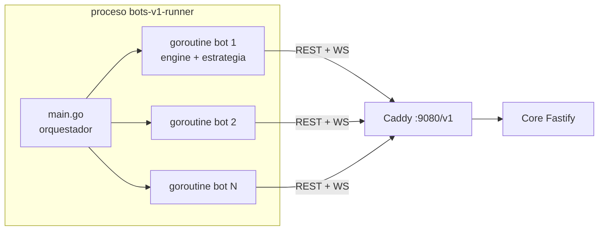

# Funcionamiento de los Bots — `bots-v1` + `bots-ciudad` + `go-sdk`

> **Estado:** documento vivo, refleja el código a 2026-07-20.
> Hay **dos binarios** de bots, ambos sobre **`go-sdk/`** (motor de agente reutilizable):
> **`bots-v1/`** (enjambre de estrategias heurísticas, replicable en varias instancias) y
> **`bots-ciudad/`** (las ciudades-consumidor: conjunto FIJO de capitales, **instancia
> única**). El antiguo `bot-engine/` fue eliminado (commit `b0f4e242`) y no debe
> referenciarse. El cliente Python (`market-client/`) y los ejemplos del SDK son
> herramientas auxiliares, no forman parte del runtime de bots.

---

## 1. Visión general

Los bots son **clientes normales del mercado**: consumen exactamente la misma API REST +
WebSocket que un humano (gateway Caddy, `http://localhost:9080/v1` y
`ws://localhost:9080/v1/ws`). El servidor no los distingue.

Un único binario (`bots-v1/bots-v1-runner`) lanza N agentes concurrentes, cada uno como una
goroutine con su propio `engine.Engine` del SDK. Hay **tres roles** en BD (ADR-022: el rol
productivo es uno solo) y seis estrategias:

| Rol en BD | Estrategia (bot) | Archivo | Qué hace |
|-----------|------------------|---------|----------|
| `transformer` | `aguador` | `producer.go` + `specialties.go` | Pozos de agua: la **raíz** de la cadena. Sin él no arranca nada. |
| `transformer` | `farmer` | `producer.go` + `specialties.go` | Campo, granja y bosque: consume agua, semillas, fertilizante y piensos. |
| `transformer` | `miner` | `producer.go` + `specialties.go` | Mina, cantera y pozo: consume agua; monetiza oro en la ventanilla del banco. |
| `transformer` | `transformer` | `producer.go` + `specialties.go` | Los 9 tipos industriales: compra insumos, ejecuta recetas rentables, vende el output. |
| `consumer` | `consumer` | `consumer.go` | Demanda final: compra productos de consumo con presupuesto y precio de reserva. |
| `trader` | `trader` | `trader.go` | Market maker: cotiza bid/ask alrededor del valor justo; arbitra oro contra el banco. |

Las cuatro primeras son **la misma estrategia** (`ProducerStrategy`) con distinto conjunto de
tipos de instalación: extraer y transformar son el mismo acto económico desde que toda receta
consume insumos salvo la del agua.



---

## 2. Estructura del código

### `bots-v1/` — estrategias y orquestación

| Archivo | Responsabilidad |
|---------|-----------------|
| `main.go` | CLI: parsea flags, lee `config.yaml`, genera bots (modo YAML o modo enjambre) y los lanza en goroutines. Cierre limpio en `SIGINT/SIGTERM`. |
| `config.yaml` | Servidor, `sim_time_factor`, parámetros de MarketView y **precios base de los 155 productos** (ancla de todas las heurísticas). |
| `producer.go` | Estrategia productora ÚNICA: gate de margen, reposición de insumos, compra de instalaciones y venta con suelo de coste. |
| `specialties.go` | Reparto del catálogo por TIPO de instalación: `aguador`, `farmer`, `miner`, `transformer` (los cuatro conjuntos particionan los 16 tipos). |
| `consumer.go` | Estrategia consumidor. |
| `trader.go` | Estrategia market maker. |
| `bank.go` | Cache de la ventanilla del banco (`GET /bank`) y arbitraje de oro (`goldArbActions`). |
| `selling.go` | `sellAtMarket`: venta en tranches con undercut y suelo de coste. |
| `botkit_aliases.go` | Shim: re-exporta con los nombres locales los helpers que ahora viven en `go-sdk/sdk/botkit` (ver abajo). Al tocar un helper, editarlo en `botkit`, no aquí. |

> **`consumer.go`, `market_view.go`, `money.go`, `humanize.go` y `config_helpers.go` ya no
> están en `bots-v1/`**: se movieron a `go-sdk/sdk/botkit` para que `bots-v1` y `bots-ciudad`
> compartan UNA sola fuente de verdad (eran helpers puros usados por todas las estrategias, y
> duplicarlos habría hecho divergir los dos binarios).

### `bots-ciudad/` — las ciudades (demanda urbana)

| Archivo | Responsabilidad |
|---------|-----------------|
| `main.go` | Toma un **flock** de instancia única, lee `config.yaml` + `../infra/cities.json` y lanza una goroutine por ciudad con `botkit.NewConsumerStrategy()`. Sin `-scale` ni rotación. |
| `config.yaml` | Servidor, MarketView, precios base, `cities_path`, `city_password` y jitter de arranque. |

Dos diferencias esenciales con `bots-v1`:

- **Login-only** (`auto_register: false`): las cuentas de ciudad las **siembra el backend**
  (rol `city`, no registrable por humanos) con credenciales; el bot solo hace `POST
  /auth/login`. Si la cuenta no existe o la contraseña no coincide con `CITY_SEED_PASSWORD`,
  el bot no arranca.
- **Instancia única (flock).** `bots-v1` es replicable porque sus usernames se derivan de
  `--runner-id` (dos instancias generan espacios de identidades disjuntos). Las ciudades son
  **usernames literales fijos**, así que dos procesos loguearían las MISMAS cuentas y se
  rotarían mutuamente el refresh token (que es de un solo uso), provocando thrashing de auth.
  El flock sobre `.bots-ciudad.lock` lo impide: la segunda ejecución aborta.

### `go-sdk/sdk/botkit` — estrategia y helpers compartidos

| Archivo | Responsabilidad |
|---------|-----------------|
| `consumer.go` | Estrategia consumidor (`ConsumerStrategy`), usada por los consumidores de `bots-v1` y por TODAS las ciudades. |
| `market_view.go` | Vista de mercado: EMA de "valor justo", cache de top-of-book con TTL, presupuesto REST por tick. |
| `money.go` | Conversión centi-unidades/centavos (`NotionalCents`, `MaxQtyForBudget`, `IsReservable`). |
| `humanize.go` | "Humanización": precios bonitos, cantidades perturbadas, TTL con jitter, cancel/replace (`NicePrice`, `HumanQty`, `TTLJitter`, `CancelStale`, `Chance`, `SampleRange`). |
| `config_helpers.go` | Parseo del contexto de estrategia (`ResolveBasePrices`, `ConfigFloat`, `ConfigInt`). |

### `go-sdk/sdk/` — motor de agente

| Paquete | Responsabilidad |
|---------|-----------------|
| `engine/` | Orquesta todo: auth → catálogo → snapshot → WebSocket → scheduler de ticks → ejecución de acciones. |
| `auth/` | `AuthManager`: login/register/refresh/**re-login**, persistencia de sesión en disco. |
| `client/` | Cliente REST tipado, un archivo por dominio (`orders.go`, `agent.go`, `market.go`, `catalog.go`, `transformations.go`, `bank.go`, `history.go`). |
| `websocket/` | Cliente WS con reconexión (backoff exponencial 1s→30s), heartbeat y re-auth ante 401. |
| `state/` | Estado local del agente (capital, inventario, órdenes, procesos) reconstruido desde el snapshot y mantenido por eventos. |
| `scheduler/` | Programación de ticks periódicos. |
| `strategy/` | Interfaz `Strategy` (`Initialize`, `Tick`, `HandleEvent`). |
| `actions/` | Acciones declarativas que devuelve la estrategia y ejecuta el engine. |
| `botkit/` | Estrategia consumidor + helpers puros compartidos por `bots-v1` y `bots-ciudad` (ver arriba). |

La estrategia nunca llama a la API directamente para mutar estado: **devuelve acciones** y el
engine las ejecuta (`PlaceOrder` → `POST /orders`, `CancelOrder` → `DELETE /orders/{id}`,
`StartTransformation` → `POST /transformations`, `ConvertGold` → `POST /bank/convert`,
`AcquireInstallation` → `POST /agents/me/installations` (comprar/mejorar instalación, ADR-021),
`Sleep` → pausa local).

---

## 3. Cómo se lanzan

Los bots **no corren en Docker**: se compilan y ejecutan en el host como un solo proceso.

```makefile
# Makefile (raíz del repo)
build-bots:        cd bots-v1 && go build -o bots-v1-runner
run-bots:          ./bots-v1-runner -config config.yaml            # los 4 bots del YAML
run-swarm:         ./bots-v1-runner -config config.yaml -scale 10000 -jitter 900

build-bots-ciudad: cd bots-ciudad && go build -o bots-ciudad-runner
run-bots-ciudad:   ./bots-ciudad-runner -config config.yaml        # las ~50 capitales
```

`run-bots-ciudad` **no** lleva `-no-persist`: conviene conservar la sesión (SQLite) para
reutilizar la cadena de refresh tokens de las cuentas fijas entre reinicios. Y no admite
`-scale` ni rotación: las ciudades corren todas, siempre.

Flags de `main.go`:

- `-config` — ruta del YAML (default `config.yaml`).
- `-scale N` — **modo enjambre**: ignora la lista `bots:` del YAML y genera N bots
  programáticamente, repartidos round-robin entre los 4 roles. Los usernames son UUIDs v5 deterministas
  (generados a partir del `-runner-id` y el índice del bot para evitar choques entre máquinas y permitir reanudación de sesiones),
  password compartida de desarrollo, `tick_interval` 5 s, sesión persistida en `./sessions/<username>.json`.
- `-runner-id ID` — Identificador único para el runner/máquina de ejecución (por defecto usa el `hostname` del sistema).
- `-jitter S` — retardo aleatorio de arranque en `[0, S]` segundos por bot, para que 10.000
  registros/logins no golpeen el servidor a la vez.

Detalles de escala dentro del proceso:

- Una goroutine por bot; contexto compartido cancelable para apagado limpio.
- **Transporte HTTP compartido** entre todos los bots (`MaxIdleConns` /
  `MaxIdleConnsPerHost` = 10000) para reutilizar conexiones en el enjambre.
- Presupuesto REST por tick (`rest_budget_per_tick`, default 4) para las consultas de
  top-of-book; el resto se sirve de la cache de MarketView (`top_ttl_seconds: 12`).

---

## 4. Ciclo de vida de un bot

### 4.1 Arranque (`engine.Start`)

1. **Autenticación** (`AuthManager.PerformAuth`, ver 4.2).
2. Descarga el **catálogo** (`GET /catalog/products`, `GET /catalog/recipes`,
   `GET /catalog/installation-types` — para mapear `recipe.installation_type_id` → tipo y precios).
3. Descarga el **snapshot** del agente (`GET /agents/me?events_limit=100`) y reconstruye el
   estado local: capital, inventario, **instalaciones**, órdenes activas, procesos.
4. `strategy.Initialize()` — cada bot **muestrea sus parámetros individuales** (márgenes,
   spreads, probabilidades) para que la población sea heterogénea y no una masa de clones.
5. Conecta el **WebSocket** (token en query string).
6. Arranca el scheduler y programa el **tick periódico** (`tick_interval_seconds`, default 5 s).

### 4.2 Registro, login y re-login

`PerformAuth` intenta, en orden:

1. **Sesión en disco** (`persist_path`): si hay un refresh token no expirado → refresh.
2. **Login** (`POST /auth/login`) con username/password; luego `GET /agents/me` para obtener
   `agent_id` y rol.
3. **Registro** (`POST /auth/register`) si el login falla y `auto_register: true`.
   El agente nace **sin instalaciones** (ADR-021): las estrategias las compran/mejoran por tipo
   con su capital. El capital semilla se financia con **emisión respaldada por oro** (ver
   `docs/diseno_mercado_agricola.md` §11).

**Re-login** (commit `39338f25`): los refresh tokens son de un solo uso (el servidor los rota
y revoca). Si un refresh falla —por ejemplo porque otro proceso/reinicio consumió el token del
fichero de sesión— el `AuthManager` cae automáticamente a un **login completo** con las
credenciales guardadas. Complementos:

- Refresh **proactivo** con buffer 60 s + jitter aleatorio de hasta 30 s por bot (acotado a
  TTL/3), para que miles de bots no golpeen `/auth/refresh` al mismo tiempo.
- Ante un **401 REST** el cliente invalida el access token cacheado y reintenta la request
  una vez con token fresco.
- Ante un **401 en el WebSocket** (dial o close code 4401) invalida el token y reconecta.
- La sesión se persiste en JSON con escritura atómica (temp + rename, modo 0600):
  `sessions/<username>.json` en enjambre, `.session_<rol>_1.json` en modo YAML. Ambos
  patrones están en `.gitignore`.

### 4.3 Tick

Cada `tick_interval` la estrategia recibe el control. Patrón común a los 4 roles:

- Si el agente está `bankrupt`, no hace nada.
- Con probabilidad `skipTickProb` se salta el tick completo (ritmo humano).
- Abre el presupuesto REST del tick (`view.BeginTick(restBudget)`).
- Calcula el **valor justo** (`fair`) por producto: EMA del tape (`trade_printed`) con
  `ema_alpha: 0.25`, acotada a la banda `[0.4×, 2.5×]` del precio base del `config.yaml`.
- Decide y devuelve acciones (órdenes, transformaciones, conversiones de oro).

### 4.4 Eventos WebSocket

El engine parsea: `order_executed`, `order_expired`, `order_cancelled`,
`transformation_completed`, `bankruptcy_notice`, `agent_joined`, `agent_bankrupt`,
`trade_printed`, `gold_converted`, `city_income`, `installation_purchased` (este último
rebasea la instalación local con el estado absoluto del commit; el capital lo cubre el
resync post-compra). Los `trade_printed` alimentan las EMAs de MarketView y
disparan re-cotización event-driven en los traders. Tras una reconexión WS se recarga el
snapshot con jitter de 0–5 s.

**Tape por suscripción (fan-out selectivo):** el servidor solo entrega `trade_printed`
de los productos que la conexión declaró con el mensaje `subscribe_products` (contrato
§12). Las estrategias implementan `strategy.ProductSubscriber` y devuelven su universo
tras `Initialize` (productor: outputs de sus recetas; transformer: insumos+outputs;
consumer: productos de consumo final; trader: su pool fijo muestreado + oro); el engine
lo suscribe automáticamente en cada (re)conexión. Una estrategia que no implemente la
interfaz se suscribe al comodín `"*"` (firehose completo, comportamiento previo). Con
10k bots esto reduce el fan-out del tape ~10–30× (cada bot opera un puñado de los 155
productos); los trades de productos no suscritos se siguen viendo, si hace falta, vía
`GET /market/{id}/trades`.

**Mitigación de Timeouts (`websocket read error: i/o timeout`):**
Para evitar que la goroutine de lectura de WebSocket (`readLoop`) se bloquee cuando la cola pública `eventChan` se llena (debido a alta carga de red o retrasos en el procesamiento del bot al ejecutar llamadas API REST), el cliente del SDK utiliza un **buffer interno dinámico y asíncrono** (`bufferLoop`). Los eventos leídos se envían a un canal interno y se acumulan en un slice dinámico en memoria. Esto asegura que la lectura del socket nunca se bloquee, permitiendo procesar y responder pings a tiempo, lo que previene desconexiones por parte del cliente (read timeout de 60s) o del servidor/proxies intermedios (falta de pong tras 30s).

### 4.5 Capital insuficiente: fees modelados, anticipación y backoff

El matching cobra un **fee por lado** de cada trade (`FEE_FIXED_CENTS` +
`FEE_RATE_BPS`, default 5¢ + 25 bps) desde el capital disponible. El estado
local del SDK lo descuenta al aplicar cada `order_executed` (espejo en
`state.go`); sin ese descuento el capital local quedaba inflado y las
estrategias armaban órdenes que el servidor rechazaba con 422
`insufficient_capital`. Tres capas de defensa en el engine:

1. **Anticipación**: antes de ejecutar un `PlaceOrder` de compra, el engine
   verifica que el nocional (`floor(qty×precio/100)`) quepa en el capital
   disponible local y reserve al menos 1 centavo; si no, descarta la acción
   sin gastar el request.
2. **Backoff**: si el servidor igual responde 422 `insufficient_capital`
   (deriva residual del estado local), el bot **se duerme**
   `insufficient_capital_backoff_seconds` (global en `config.yaml`, default
   60 s en el SDK) y descarta el resto del lote de acciones. Durante el sueño
   no corre ticks ni `HandleEvent` (los eventos WS sí siguen actualizando el
   estado local), con lo que cede API/CPU al resto del enjambre mientras
   recupera capital (fills de ventas, expiración de reservas, procesos que
   terminan).
3. **Resincronización**: al recibir ese 422 se recarga el snapshot con jitter
   de 0–5 s para rebasear el estado local con el servidor.
4. **Cesión del slot en rotación**: el engine expone `LowCapital()`, un canal
   que se cierra la primera vez que el servidor confirma el 422. En modo
   rotación (`max_active`) el runner lo escucha y retira al bot antes de que
   termine su `active_duration`, dejando el lugar al siguiente; el aviso
   `"Sin capital: cede su lugar en la rotación"` se imprime incluso con
   `-quiet`. La anticipación y el backoff loguean solo en `debug` para no
   ensuciar el log del enjambre.

---

## 5. Estrategias por rol

Todos los parámetros por bot se muestrean en `Initialize` con `sampleRange(min, max)`.

### 5.1 Producer (`producer.go`)

Estrategia productora única (ADR-022): cubre desde el pozo de agua hasta la constructora.

- **Economía por ejecución** (`execEconomics`): insumos valorados a `fair` + salario vs.
  ingreso del output. Rentable si `revenue ≥ (insumos + salario) × (1 + minMargin)`. Con
  `inputs: []` (las dos recetas del agua) degenera a coste = puro salario.
- **Coste salarial:** `wage = wage_rate × duration × sim_time_factor` por ejecución (el salario
  se cobra por segundos simulados y `duration_seconds` llega en reales; de ahí el factor).
- **Oferta elástica:** solo produce si el fair cubre coste + margen. Si el producto se
  abarata por debajo del coste, deja de producir. Recorre las recetas producibles en orden
  aleatorio, acotado por `max_recipes_per_tick` (default 8), y no siempre ejecuta a plena
  capacidad.
- **Reposición de insumos:** solo para recetas rentables, hasta un buffer de
  `bufferExecs × nivel × qty`. Compra con bid de descanso bajo el fair, o **cruza el ask** con
  probabilidad `crossProb` si el margen sobrevive pagándolo — esto imprime trades reales a lo
  largo de la cadena (agua → trigo → harina → pan). Presupuesto por insumo =
  `capital / capitalDen`.
- **Instalaciones (ADR-021):** para producir una receta debe haber **comprado** la instalación
  de su tipo. Si una receta es rentable pero no tiene instalación (o está saturada) y hay capital
  de sobra (colchón `capitalReserveFactor×` sobre el precio), emite `AcquireInstallation` para
  comprar/mejorar el tipo (compra ≤ `maxBuysPerTick` por tick, hasta `maxDesiredLevel`). El nivel
  del tipo es el presupuesto de concurrencia compartido por sus recetas.
- **Venta:** `sellAtMarket` por posición de inventario — undercut del mejor ask (1–3%),
  con **suelo de coste** (`coste × (1 + minMargin)`), en tranches del 30–70% del inventario,
  cancelando asks viejos (cancel/replace). Vende **solo lo que produce con instalaciones
  propias y solo el excedente sobre su propio buffer de insumos**: sin esa regla el agricultor
  que compra agua para regar se la revendería, y el que produce sus semillas se quedaría sin
  simiente.
- **Oro:** si produce oro y la ventanilla del banco paga mejor que el mercado, lo vende al
  banco (`sell_gold`, dinero recién acuñado). El gate de producción de oro usa el
  `window_bid` como suelo del fair: minar oro siempre renta mientras el yacimiento dure.
- Parámetros típicos: `minMargin` 0.05–0.15, `targetMargin` 0.25–0.6, `undercut` 0.01–0.03,
  `tranche` 0.3–0.7, `skipTickProb` 0.05–0.2.

#### 5.1.1 Especialidades (`specialties.go`)

Con un único rol productivo, lo que reparte el catálogo entre bots ya no es el rol sino el
**tipo de instalación** que cada uno está dispuesto a comprar. Los cuatro conjuntos particionan
los 16 tipos del seed-config: juntos lo cubren todo y no se solapan, así que el enjambre cubre
la cadena entera sin que ningún bot intente abarcar los 156 procesos.

| Estrategia | Tipos | Por qué |
|------------|-------|---------|
| `aguador` | `pozo_agua` | El agua es la RAÍZ: la consumen 36 recetas y solo dos la producen. Si nadie bombea, la economía se para en el primer eslabón. Sube hasta `maxDesiredLevel` 5 (el resto, 3). |
| `farmer` | `campo`, `granja`, `bosque` | Cultivo, ganadería y tala; consumen agua, semillas, fertilizante y piensos. |
| `miner` | `mina`, `cantera`, `pozo` | Metales, materiales básicos, petróleo y gas; consumen agua. |
| `transformer` | los 9 industriales | De la agroindustria a la constructora. |

En modo enjambre el round-robin reparte las seis estrategias a partes iguales, así que ~1/6 de
la flota se dedica al agua.

### 5.2 Consumer (`consumer.go`)

Demanda final con elasticidad; solo opera productos de categoría `final_consumption`.

- **Precio de reserva** por bot = `precio_base × tolerance` (1.05–1.4), con ruido ±5% por
  producto. Se ancla al precio **base**, no al fair, para que la demanda no persiga burbujas.
- **Presupuesto por tick** = `capital_disponible × spendRate` (2–8%).
- Por producto (3–8 por tick): si el mejor ask cabe en la reserva → **levanta el ask** con
  probabilidad `crossProb` (trade real inmediato); si no, deja un **bid de descanso** bajo el
  fair, sin exceder la reserva ni el techo de cantidad pendiente.
- Los consumers imprimen la mayor parte del tape que alimenta las EMAs del resto de roles.

### 5.3 Trader (`trader.go`)

Market maker sobre un universo acotado (8–16 productos: mercados vivos + su inventario +
relleno aleatorio).

- **Cotización:** `mid = fair × (1 + skew)`; `bid = mid × (1 − halfSpread)`,
  `ask = mid × (1 + halfSpread)` con `halfSpread` 1.5–5%. No cruza el libro: provee liquidez.
- **Sesgo por inventario** (`skew`): largo de inventario → baja ambas puntas para rotar
  posición.
- **Cancel/replace:** re-cotiza si el fair se desvía más de `requoteThresh` de sus órdenes
  vivas; también reacciona a `trade_printed` vía `HandleEvent` con debounce (3–10 s) y
  probabilidad `reactProb`.
- **Arbitraje de oro:** antes de cotizar mantiene el precio de mercado del oro dentro de la
  banda de la ventanilla (los "gold points"), ver §6.

---

## 6. Bots y patrón oro

> Detalle del sistema monetario (paridad, ventanilla, emisión respaldada):
> `patron_oro_sistema_bancario.md`.

En `Initialize`, productores y traders hacen `GET /bank` una vez (`loadBankWindow`). Si la
corrida no tiene patrón oro (409 `no_gold_standard`) operan con la lógica de mercado pura.

`goldArbActions` (`bank.go`) implementa tres patas:

1. **Ask de mercado < window_bid** → comprar oro barato en mercado (para monetizarlo luego).
2. **Oro en inventario y el banco paga mejor que el mercado** → `POST /bank/convert`
   `sell_gold`: el bot entrega oro y recibe **dinero recién acuñado** al `window_bid`.
   Esta es la vía de ingreso garantizado de los productores de oro.
3. **Bid de mercado > window_ask** → `buy_gold` al banco (el pago se **destruye**) y vender
   ese oro al bid de mercado.

El efecto agregado es que el precio de mercado del oro queda anclado a la banda
`[window_bid, window_ask]` (±5% de la paridad), como en un patrón oro clásico.
Consumers y transformers **no** usan la ventanilla.

---

## 7. Humanización y control de carga

Para que 10.000 bots parezcan un mercado y no una estampida sincronizada:

- **Heterogeneidad:** cada bot muestrea sus propios márgenes, spreads, tolerancias y
  probabilidades en `Initialize`.
- **Precios bonitos** (`nicePrice`) y **cantidades perturbadas** (`humanQty`).
- **TTL con jitter** (`ttlJitter`) para que las órdenes no expiren en oleadas.
- **Skip de ticks** (`skipTickProb`) y probabilidad de actuar (`actProb`).
- **Jitter de arranque** (`-jitter`) y jitter en refresh de tokens y recarga de snapshots.
- **Presupuesto REST por tick** + cache de top-of-book con TTL: el grueso de las lecturas de
  mercado se sirve de MarketView, no de la API.

---

## 8. Configuración (`bots-v1/config.yaml`)

```yaml
server:
  base_url: http://localhost:9080/v1
  ws_url:   ws://localhost:9080/v1/ws

sim_time_factor: 5          # DEBE coincidir con SIM_TIME_FACTOR del backend
max_recipes_per_tick: 8

market:                     # parámetros de MarketView
  ema_alpha: 0.25
  fair_band_lo: 0.4
  fair_band_hi: 2.5
  top_ttl_seconds: 12
  rest_budget_per_tick: 4
  recent_window_seconds: 600

prices:                     # precio base (centavos/unidad) de los 155 productos
  trigo: 120
  oro: 720
  # ...

bots:                       # solo en modo YAML (sin -scale): 6 bots de ejemplo
  - username: aguador_1
    role: transformer         # único rol productivo (ADR-022)
    strategy: aguador         # la especialidad la decide `strategy`
    ...
```

`sim_time_factor` es crítico: se usa para estimar el coste salarial real de las recetas
(el salario corre en tiempo real, la duración de la receta en tiempo simulado). Si difiere
del backend, todos los cálculos de margen quedan sesgados.

---

## 9. Operación

```bash
# levantar el backend
make up          # docker compose (postgres, redis, core, worker, seed, caddy, grafana)

# compilar y correr los bots del YAML
make build-bots
make run-bots

# enjambre de 10.000 bots con arranque escalonado en 15 min
make run-swarm
```

- **Apagado:** `Ctrl-C` (SIGINT) cancela el contexto y hace `Stop()` de todos los engines.
- **Estado en disco:** solo los ficheros de sesión (`bots-v1/sessions/`, `.session_*`);
  todo el estado económico vive en el servidor. Borrar las sesiones fuerza re-login (o
  re-registro si el usuario no existe, p. ej. tras un `clean-docker`).
- **Reset de la corrida:** al recrear la BD (`clean-docker` + seed) los usernames de enjambre
  se re-registran solos gracias a `auto_register` y al fallback de re-login.

---

## 10. Historia y piezas descartadas

| Pieza | Estado | Motivo |
|-------|--------|--------|
| `bot-engine/` (FSM/dispatcher en Go) | **Eliminado** (`b0f4e242`) | No se utilizaba; `bots-v1` + `go-sdk` lo reemplazan. |
| Bot Trader RL-PPO | Abandonado (`ced48883`) | Se pivotó a heurísticos reactivos antes de intentar ML (ver plan en memoria del proyecto: heurísticos → recorder → ML). |
| `market-client/` (Python) | Auxiliar | Cliente de pruebas/manual, no parte del runtime de bots. |
| `go-sdk/examples/` | Auxiliar | Ejemplo de uso del SDK. |
