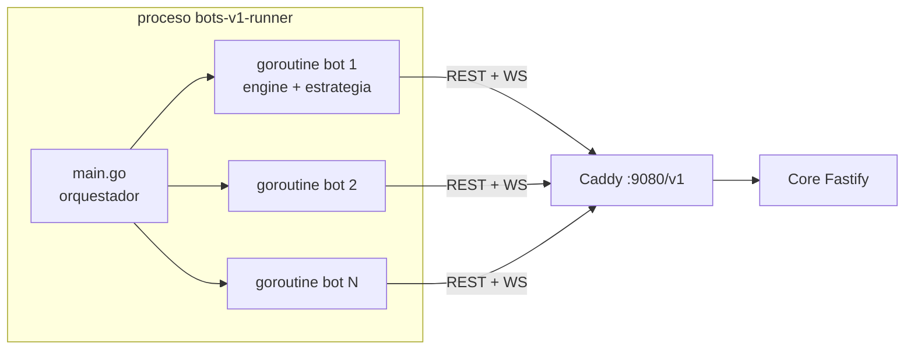

# Funcionamiento de los Bots — `bots-v1` + `go-sdk`

> **Estado:** documento vivo, refleja el código a 2026-07-13 (commits hasta `c9327e56`).
> El sistema de bots vigente es **`bots-v1/`** (estrategias heurísticas en Go) montado sobre
> **`go-sdk/`** (motor de agente reutilizable). El antiguo `bot-engine/` fue eliminado
> (commit `b0f4e242`) y no debe referenciarse. El cliente Python (`market-client/`) y los
> ejemplos del SDK son herramientas auxiliares, no forman parte del runtime de bots.

---

## 1. Visión general

Los bots son **clientes normales del mercado**: consumen exactamente la misma API REST +
WebSocket que un humano (gateway Caddy, `http://localhost:9080/v1` y
`ws://localhost:9080/v1/ws`). El servidor no los distingue.

Un único binario (`bots-v1/bots-v1-runner`) lanza N agentes concurrentes, cada uno como una
goroutine con su propio `engine.Engine` del SDK. Hay cuatro roles, alineados con los
`agent_role` del backend:

| Rol | Estrategia | Qué hace |
|-----|-----------|----------|
| `primary_producer` | `primary_producer.go` | Ejecuta recetas sin insumos y vende lo producido; monetiza oro en la ventanilla del banco. |
| `transformer` | `transformer.go` | Compra insumos, ejecuta recetas con insumos si son rentables, vende el output. |
| `consumer` | `consumer.go` | Demanda final: compra productos de consumo con presupuesto y precio de reserva. |
| `trader` | `trader.go` | Market maker: cotiza bid/ask alrededor del valor justo; arbitra oro contra el banco. |



---

## 2. Estructura del código

### `bots-v1/` — estrategias y orquestación

| Archivo | Responsabilidad |
|---------|-----------------|
| `main.go` | CLI: parsea flags, lee `config.yaml`, genera bots (modo YAML o modo enjambre) y los lanza en goroutines. Cierre limpio en `SIGINT/SIGTERM`. |
| `config.yaml` | Servidor, `sim_time_factor`, parámetros de MarketView y **precios base de los 155 productos** (ancla de todas las heurísticas). |
| `primary_producer.go` | Estrategia productor primario. |
| `transformer.go` | Estrategia transformador. |
| `consumer.go` | Estrategia consumidor. |
| `trader.go` | Estrategia market maker. |
| `bank.go` | Cache de la ventanilla del banco (`GET /bank`) y arbitraje de oro (`goldArbActions`). |
| `market_view.go` | Vista de mercado compartida: EMA de "valor justo", cache de top-of-book con TTL, presupuesto REST por tick. |
| `selling.go` | `sellAtMarket`: venta en tranches con undercut y suelo de coste. |
| `money.go` | Conversión centi-unidades/centavos (`notionalCents`, `maxQtyForBudget`, `isReservable`). |
| `humanize.go` | "Humanización": precios bonitos, cantidades perturbadas, TTL con jitter, cancel/replace, probabilidades (`nicePrice`, `humanQty`, `ttlJitter`, `cancelStale`, `chance`, `sampleRange`). |
| `config_helpers.go` | Parseo del contexto de estrategia (prices, market, etc.). |

### `go-sdk/sdk/` — motor de agente

| Paquete | Responsabilidad |
|---------|-----------------|
| `engine/` | Orquesta todo: auth → catálogo → snapshot → WebSocket → scheduler de ticks → ejecución de acciones. |
| `auth/` | `AuthManager`: login/register/refresh/**re-login**, persistencia de sesión en disco. |
| `client/` | Cliente REST tipado, un archivo por dominio (`orders.go`, `agent.go`, `market.go`, `catalog.go`, `transformations.go`, `bank.go`, `history.go`). |
| `websocket/` | Cliente WS con reconexión (backoff exponencial 1s→30s), heartbeat y re-auth ante 401. |
| `state/` | Estado local del agente (capital, inventario, órdenes, procesos) reconstruido desde el snapshot y mantenido por eventos. |
| `scheduler/` | Programación de ticks periódicos. |
| `strategy/` | Interfaz `Strategy` (`Initialize`, `Tick`, `HandleEvent`). |
| `actions/` | Acciones declarativas que devuelve la estrategia y ejecuta el engine. |

La estrategia nunca llama a la API directamente para mutar estado: **devuelve acciones** y el
engine las ejecuta (`PlaceOrder` → `POST /orders`, `CancelOrder` → `DELETE /orders/{id}`,
`StartTransformation` → `POST /transformations`, `ConvertGold` → `POST /bank/convert`,
`Sleep` → pausa local).

---

## 3. Cómo se lanzan

Los bots **no corren en Docker**: se compilan y ejecutan en el host como un solo proceso.

```makefile
# Makefile (raíz del repo)
build-bots:  cd bots-v1 && go build -o bots-v1-runner
run-bots:    ./bots-v1-runner -config config.yaml                  # los 4 bots del YAML
run-swarm:   ./bots-v1-runner -config config.yaml -scale 10000 -jitter 900
```

Flags de `main.go`:

- `-config` — ruta del YAML (default `config.yaml`).
- `-scale N` — **modo enjambre**: ignora la lista `bots:` del YAML y genera N bots
  programáticamente, repartidos round-robin entre los 4 roles. Usernames `scale_<rol>_<i>`,
  password compartida de desarrollo, `tick_interval` 5 s, sesión persistida en
  `./sessions/<username>.json`.
- `-jitter S` — retardo aleatorio de arranque en `[0, S]` segundos por bot, para que 10.000
  registros/logins no golpeen el servidor a la vez.

Detalles de escala dentro del proceso:

- Una goroutine por bot; contexto compartido cancelable para apagado limpio.
- **Transporte HTTP compartido** entre todos los bots (`MaxIdleConns` /
  `MaxIdleConnsPerHost` = 10000) para reutilizar conexiones en el enjambre.
- Presupuesto REST por tick (`rest_budget_per_tick`, default 4) para las consultas de
  top-of-book; el resto se sirve de la cache de MarketView (`top_ttl_seconds: 12`).

---

## 4. Ciclo de vida de un bot

### 4.1 Arranque (`engine.Start`)

1. **Autenticación** (`AuthManager.PerformAuth`, ver 4.2).
2. Descarga el **catálogo** (`GET /catalog/products`, `GET /catalog/recipes`).
3. Descarga el **snapshot** del agente (`GET /agents/me?events_limit=100`) y reconstruye el
   estado local: capital, inventario, capacidades, órdenes activas, procesos.
4. `strategy.Initialize()` — cada bot **muestrea sus parámetros individuales** (márgenes,
   spreads, probabilidades) para que la población sea heterogénea y no una masa de clones.
5. Conecta el **WebSocket** (token en query string).
6. Arranca el scheduler y programa el **tick periódico** (`tick_interval_seconds`, default 5 s).

### 4.2 Registro, login y re-login

`PerformAuth` intenta, en orden:

1. **Sesión en disco** (`persist_path`): si hay un refresh token no expirado → refresh.
2. **Login** (`POST /auth/login`) con username/password; luego `GET /agents/me` para obtener
   `agent_id` y rol.
3. **Registro** (`POST /auth/register`) si el login falla y `auto_register: true`.
   El backend ignora las capacidades solicitadas: asigna todas las capacidades del rol según
   `infra/seed-config.json`, y el capital semilla se financia con **emisión respaldada por
   oro** (ver `docs/diseno_mercado_agricola.md` §11).

**Re-login** (commit `39338f25`): los refresh tokens son de un solo uso (el servidor los rota
y revoca). Si un refresh falla —por ejemplo porque otro proceso/reinicio consumió el token del
fichero de sesión— el `AuthManager` cae automáticamente a un **login completo** con las
credenciales guardadas. Complementos:

- Refresh **proactivo** con buffer 60 s + jitter aleatorio de hasta 30 s por bot (acotado a
  TTL/3), para que miles de bots no golpeen `/auth/refresh` al mismo tiempo.
- Ante un **401 REST** el cliente invalida el access token cacheado y reintenta la request
  una vez con token fresco.
- Ante un **401 en el WebSocket** (dial o close code 4401) invalida el token y reconecta.
- La sesión se persiste en JSON con escritura atómica (temp + rename, modo 0600):
  `sessions/<username>.json` en enjambre, `.session_<rol>_1.json` en modo YAML. Ambos
  patrones están en `.gitignore`.

### 4.3 Tick

Cada `tick_interval` la estrategia recibe el control. Patrón común a los 4 roles:

- Si el agente está `bankrupt`, no hace nada.
- Con probabilidad `skipTickProb` se salta el tick completo (ritmo humano).
- Abre el presupuesto REST del tick (`view.BeginTick(restBudget)`).
- Calcula el **valor justo** (`fair`) por producto: EMA del tape (`trade_printed`) con
  `ema_alpha: 0.25`, acotada a la banda `[0.4×, 2.5×]` del precio base del `config.yaml`.
- Decide y devuelve acciones (órdenes, transformaciones, conversiones de oro).

### 4.4 Eventos WebSocket

El engine parsea: `order_executed`, `order_expired`, `order_cancelled`,
`transformation_completed`, `bankruptcy_notice`, `agent_joined`, `agent_bankrupt`,
`trade_printed`, `gold_converted`. Los `trade_printed` alimentan las EMAs de MarketView y
disparan re-cotización event-driven en los traders. Tras una reconexión WS se recarga el
snapshot con jitter de 0–5 s.

---

## 5. Estrategias por rol

Todos los parámetros por bot se muestrean en `Initialize` con `sampleRange(min, max)`.

### 5.1 Primary Producer (`primary_producer.go`)

Ejecuta recetas **sin insumos** y vende la producción.

- **Coste unitario:** `unitCost = wage_rate × duration × sim_time_factor / output_qty`
  (el salario se paga en tiempo real, la duración está en tiempo simulado; de ahí el factor).
- **Oferta elástica:** solo produce si `fair ≥ coste × (1 + minMargin)`. Si el producto se
  abarata por debajo del coste, deja de producir. Recorre sus capacidades en orden aleatorio,
  acotado por `max_recipes_per_tick` (default 8), y no siempre ejecuta a plena capacidad.
- **Venta:** `sellAtMarket` por posición de inventario — undercut del mejor ask (1–3%),
  con **suelo de coste** (`coste × (1 + minMargin)`), en tranches del 30–70% del inventario,
  cancelando asks viejos (cancel/replace).
- **Oro:** si produce oro y la ventanilla del banco paga mejor que el mercado, lo vende al
  banco (`sell_gold`, dinero recién acuñado). El gate de producción de oro usa el
  `window_bid` como suelo del fair: minar oro siempre renta mientras el yacimiento dure.
- Parámetros típicos: `minMargin` 0.05–0.15, `targetMargin` 0.25–0.6, `undercut` 0.01–0.03,
  `tranche` 0.3–0.7, `skipTickProb` 0.05–0.2.

### 5.2 Transformer (`transformer.go`)

Ejecuta recetas **con insumos** decidiendo a precios de mercado.

- **Economía por ejecución** (`execEconomics`): insumos valorados a `fair` + salario vs.
  ingreso del output. Rentable si `revenue ≥ (insumos + salario) × (1 + minMargin)`.
- **A. Arranque de procesos:** solo recetas rentables con stock de insumos.
- **B. Reposición de insumos:** solo para recetas rentables, hasta un buffer de
  `bufferExecs × instalaciones × qty`. Compra con bid de descanso bajo el fair, o **cruza el
  ask** con probabilidad `crossProb` si el margen sobrevive pagándolo — esto imprime trades
  reales a lo largo de la cadena (trigo → harina → pan). Presupuesto por insumo =
  `capital / capitalDen`.
- **C. Venta de outputs:** `sellAtMarket` con coste real de producción como suelo. No revende
  las materias primas compradas como insumo.

### 5.3 Consumer (`consumer.go`)

Demanda final con elasticidad; solo opera productos de categoría `final_consumption`.

- **Precio de reserva** por bot = `precio_base × tolerance` (1.05–1.4), con ruido ±5% por
  producto. Se ancla al precio **base**, no al fair, para que la demanda no persiga burbujas.
- **Presupuesto por tick** = `capital_disponible × spendRate` (2–8%).
- Por producto (3–8 por tick): si el mejor ask cabe en la reserva → **levanta el ask** con
  probabilidad `crossProb` (trade real inmediato); si no, deja un **bid de descanso** bajo el
  fair, sin exceder la reserva ni el techo de cantidad pendiente.
- Los consumers imprimen la mayor parte del tape que alimenta las EMAs del resto de roles.

### 5.4 Trader (`trader.go`)

Market maker sobre un universo acotado (8–16 productos: mercados vivos + su inventario +
relleno aleatorio).

- **Cotización:** `mid = fair × (1 + skew)`; `bid = mid × (1 − halfSpread)`,
  `ask = mid × (1 + halfSpread)` con `halfSpread` 1.5–5%. No cruza el libro: provee liquidez.
- **Sesgo por inventario** (`skew`): largo de inventario → baja ambas puntas para rotar
  posición.
- **Cancel/replace:** re-cotiza si el fair se desvía más de `requoteThresh` de sus órdenes
  vivas; también reacciona a `trade_printed` vía `HandleEvent` con debounce (3–10 s) y
  probabilidad `reactProb`.
- **Arbitraje de oro:** antes de cotizar mantiene el precio de mercado del oro dentro de la
  banda de la ventanilla (los "gold points"), ver §6.

---

## 6. Bots y patrón oro

> Detalle del sistema monetario (paridad, ventanilla, emisión respaldada):
> `patron_oro_sistema_bancario.md`.

En `Initialize`, productores y traders hacen `GET /bank` una vez (`loadBankWindow`). Si la
corrida no tiene patrón oro (409 `no_gold_standard`) operan con la lógica de mercado pura.

`goldArbActions` (`bank.go`) implementa tres patas:

1. **Ask de mercado < window_bid** → comprar oro barato en mercado (para monetizarlo luego).
2. **Oro en inventario y el banco paga mejor que el mercado** → `POST /bank/convert`
   `sell_gold`: el bot entrega oro y recibe **dinero recién acuñado** al `window_bid`.
   Esta es la vía de ingreso garantizado de los productores de oro.
3. **Bid de mercado > window_ask** → `buy_gold` al banco (el pago se **destruye**) y vender
   ese oro al bid de mercado.

El efecto agregado es que el precio de mercado del oro queda anclado a la banda
`[window_bid, window_ask]` (±5% de la paridad), como en un patrón oro clásico.
Consumers y transformers **no** usan la ventanilla.

---

## 7. Humanización y control de carga

Para que 10.000 bots parezcan un mercado y no una estampida sincronizada:

- **Heterogeneidad:** cada bot muestrea sus propios márgenes, spreads, tolerancias y
  probabilidades en `Initialize`.
- **Precios bonitos** (`nicePrice`) y **cantidades perturbadas** (`humanQty`).
- **TTL con jitter** (`ttlJitter`) para que las órdenes no expiren en oleadas.
- **Skip de ticks** (`skipTickProb`) y probabilidad de actuar (`actProb`).
- **Jitter de arranque** (`-jitter`) y jitter en refresh de tokens y recarga de snapshots.
- **Presupuesto REST por tick** + cache de top-of-book con TTL: el grueso de las lecturas de
  mercado se sirve de MarketView, no de la API.

---

## 8. Configuración (`bots-v1/config.yaml`)

```yaml
server:
  base_url: http://localhost:9080/v1
  ws_url:   ws://localhost:9080/v1/ws

sim_time_factor: 5          # DEBE coincidir con SIM_TIME_FACTOR del backend
max_recipes_per_tick: 8

market:                     # parámetros de MarketView
  ema_alpha: 0.25
  fair_band_lo: 0.4
  fair_band_hi: 2.5
  top_ttl_seconds: 12
  rest_budget_per_tick: 4
  recent_window_seconds: 600

prices:                     # precio base (centavos/unidad) de los 155 productos
  trigo: 120
  oro: 720
  # ...

bots:                       # solo en modo YAML (sin -scale): 4 bots de ejemplo
  - username: producer_1
    role: primary_producer
    ...
```

`sim_time_factor` es crítico: se usa para estimar el coste salarial real de las recetas
(el salario corre en tiempo real, la duración de la receta en tiempo simulado). Si difiere
del backend, todos los cálculos de margen quedan sesgados.

---

## 9. Operación

```bash
# levantar el backend
make up          # docker compose (postgres, redis, core, worker, seed, caddy, grafana)

# compilar y correr los bots del YAML
make build-bots
make run-bots

# enjambre de 10.000 bots con arranque escalonado en 15 min
make run-swarm
```

- **Apagado:** `Ctrl-C` (SIGINT) cancela el contexto y hace `Stop()` de todos los engines.
- **Estado en disco:** solo los ficheros de sesión (`bots-v1/sessions/`, `.session_*`);
  todo el estado económico vive en el servidor. Borrar las sesiones fuerza re-login (o
  re-registro si el usuario no existe, p. ej. tras un `clean-docker`).
- **Reset de la corrida:** al recrear la BD (`clean-docker` + seed) los usernames de enjambre
  se re-registran solos gracias a `auto_register` y al fallback de re-login.

---

## 10. Historia y piezas descartadas

| Pieza | Estado | Motivo |
|-------|--------|--------|
| `bot-engine/` (FSM/dispatcher en Go) | **Eliminado** (`b0f4e242`) | No se utilizaba; `bots-v1` + `go-sdk` lo reemplazan. |
| Bot Trader RL-PPO | Abandonado (`ced48883`) | Se pivotó a heurísticos reactivos antes de intentar ML (ver plan en memoria del proyecto: heurísticos → recorder → ML). |
| `market-client/` (Python) | Auxiliar | Cliente de pruebas/manual, no parte del runtime de bots. |
| `go-sdk/examples/` | Auxiliar | Ejemplo de uso del SDK. |
