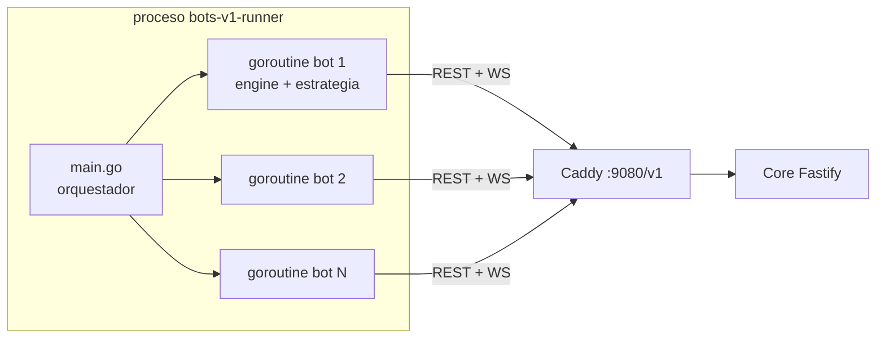

# Funcionamiento de los Bots — `bots-v1` + `bots-v2` + `bots-ciudad` + `bots-hidro` + `go-sdk`

> **Estado:** documento vivo, refleja el código a 2026-07-29.
> Hay **cuatro binarios** de bots, todos sobre **`go-sdk/`** (motor de agente reutilizable):
> **`bots-v1/`** (enjambre de estrategias heurísticas, replicable en varias instancias),
> **`bots-v2/`** (enjambre especializado por **oficio**, ADR-027: sustituye a `bots-v1` +
> `bots-hidro` y puede correr en paralelo con ellos — ver **§11**),
> **`bots-ciudad/`** (las ciudades-consumidor: conjunto FIJO de capitales, **instancia
> única**) y **`bots-hidro/`** (parque de centrales hidroeléctricas dedicadas, replicable
> como `bots-v1` y **sin rotación**; subsumido por el oficio `hidroelectrico` de `bots-v2`).
> Las secciones §1–§10 describen `bots-v1`, que sigue siendo funcional. El antiguo
> `bot-engine/` fue eliminado (commit `b0f4e242`) y no debe referenciarse. El cliente Python
> (`market-client/`) y los ejemplos del SDK son herramientas auxiliares, no forman parte del
> runtime de bots.

---

## 1. Visión general

Los bots son **clientes normales del mercado**: consumen exactamente la misma API REST +
WebSocket que un humano (gateway Caddy, `http://localhost:9080/v1` y
`ws://localhost:9080/v1/ws`). El servidor no los distingue.

Un único binario (`bots-v1/bots-v1-runner`) lanza N agentes concurrentes, cada uno como una
goroutine con su propio `engine.Engine` del SDK. Hay **dos roles** en BD (ADR-022: el rol
productivo es uno solo; ADR-025: `consumer` se retiró y la demanda final es de las ciudades)
y seis estrategias:

| Rol en BD | Estrategia (bot) | Archivo | Qué hace |
|-----------|------------------|---------|----------|
| `transformer` | `aguador` | `producer.go` + `specialties.go` | Pozos de agua: la **raíz** de la cadena. Sin él no arranca nada. |
| `transformer` | `energetico` | `producer.go` + `specialties.go` | Generación eléctrica (ADR-024): hidro y térmicas. Sin él no produce la industria. |
| `transformer` | `farmer` | `producer.go` + `specialties.go` | Campo, granja y bosque: consume agua, semillas, fertilizante y piensos. |
| `transformer` | `miner` | `producer.go` + `specialties.go` | Mina, cantera y pozo: consume agua; monetiza oro en la ventanilla del banco. |
| `transformer` | `transformer` | `producer.go` + `specialties.go` | Los 9 tipos industriales: compra insumos, ejecuta recetas rentables, vende el output. |
| `trader` | `trader` | `trader.go` | Market maker: cotiza bid/ask alrededor del valor justo; arbitra oro contra el banco. |

Las cinco primeras son **la misma estrategia** (`ProducerStrategy`) con distinto conjunto de
tipos de instalación: extraer y transformar son el mismo acto económico desde que toda receta
consume insumos salvo la del agua.

**Aquí no hay demanda final.** La estrategia consumidora existe (`botkit/consumer.go`) pero la
ejecuta el otro binario, `bots-ciudad`, con el rol `city`. Un consumidor en `bots-v1` no tenía
ninguna fuente de ingreso recurrente —solo gastaba su capital semilla hasta quebrar—, así que
ADR-025 retiró el rol.


```mermaid
graph LR
    subgraph proceso bots-v1-runner
        M[main.go<br/>orquestador] --> B1[goroutine bot 1<br/>engine + estrategia]
        M --> B2[goroutine bot 2]
        M --> BN[goroutine bot N]
    end
    B1 -->|REST + WS| Caddy[Caddy :9080/v1]
    B2 -->|REST + WS| Caddy
    BN -->|REST + WS| Caddy
    Caddy --> Core[Core Fastify]
```

---

## 2. Estructura del código

### `bots-v1/` — estrategias y orquestación

| Archivo | Responsabilidad |
|---------|-----------------|
| `main.go` | CLI: parsea flags, lee `config.yaml`, genera bots (modo YAML o modo enjambre) y los lanza en goroutines. Cierre limpio en `SIGINT/SIGTERM`. |
| `config.yaml` | Servidor, `sim_time_factor`, parámetros de MarketView y **precios base de los 135 productos** (ancla de todas las heurísticas). |
| `producer.go` | Estrategia productora ÚNICA: gate de margen, reposición de insumos, compra de instalaciones y venta con suelo de coste. |
| `specialties.go` | Reparto del catálogo por TIPO de instalación: `aguador`, `energetico`, `farmer`, `miner`, `transformer` (los cinco conjuntos particionan los 16 tipos). |
| `trader.go` | Estrategia market maker. |
| `bank.go` | Cache de la ventanilla del banco (`GET /bank`) y arbitraje de oro (`goldArbActions`). |
| `botkit_aliases.go` | Shim: re-exporta con los nombres locales los helpers que ahora viven en `go-sdk/sdk/botkit` (ver abajo). Al tocar un helper, editarlo en `botkit`, no aquí. |

> **`consumer.go`, `market_view.go`, `money.go`, `humanize.go`, `config_helpers.go`,
> `selling.go` e `installations.go` ya no están en `bots-v1/`**: se movieron a
> `go-sdk/sdk/botkit` para que los tres binarios compartan UNA sola fuente de verdad (eran
> helpers puros usados por todas las estrategias, y duplicarlos habría dejado dos suelos de
> venta y dos políticas de capex divergiendo en silencio).

### `bots-ciudad/` — las ciudades (demanda urbana)

| Archivo | Responsabilidad |
|---------|-----------------|
| `main.go` | Toma un **flock** de instancia única, lee `config.yaml` + `../infra/cities.json` y lanza una goroutine por ciudad con `botkit.NewConsumerStrategy()`. Sin `-scale` ni rotación. |
| `config.yaml` | Servidor, MarketView, precios base, `cities_path`, `city_password` y jitter de arranque. |

Dos diferencias esenciales con `bots-v1`:

- **Login-only** (`auto_register: false`): las cuentas de ciudad las **siembra el backend**
  (rol `city`, no registrable por humanos) con credenciales; el bot solo hace `POST
  /auth/login`. Si la cuenta no existe o la contraseña no coincide con `CITY_SEED_PASSWORD`,
  el bot no arranca.
- **Instancia única (flock).** `bots-v1` es replicable porque sus usernames se derivan de
  `--runner-id` (dos instancias generan espacios de identidades disjuntos). Las ciudades son
  **usernames literales fijos**, así que dos procesos loguearían las MISMAS cuentas y se
  rotarían mutuamente el refresh token (que es de un solo uso), provocando thrashing de auth.
  El flock sobre `.bots-ciudad.lock` lo impide: la segunda ejecución aborta.

### `bots-hidro/` — el parque hidroeléctrico (ADR-024)

| Archivo | Responsabilidad |
|---------|-----------------|
| `main.go` | Lee `config.yaml`, deriva N usernames con UUID v5 desde `--runner-id` y lanza una goroutine por central. Autorregistro, jitter, apagado limpio y retirada por quiebra (ADR-026). **Sin rotación.** |
| `hidro.go` | `HidroStrategy`: selección de la receta renovable, capex de la central, compra de agua, generación y venta de electricidad. |
| `config.yaml` | Servidor, MarketView, parámetros propios de la estrategia y el bloque `prices:` **generado** (el mismo que los otros dos binarios). |

**Por qué no es una especialidad más de `bots-v1`.** El `energetico` de `bots-v1` se queda
con el tipo `generacion` **entero** —la hidro y las dos térmicas— y las tres recetas se
disputan el nivel de la instalación, que es un presupuesto de concurrencia compartido
(ADR-021). `prioridadRenovablePrimero` empuja la hidro delante mientras solo hay una línea,
pero a partir del nivel 2 las líneas nuevas se van a las térmicas: son ~1,6× más baratas por
kWh (27 y 31 ¢ contra los ~44 de la hidro) y eso es lo racional para un generalista. **La
capacidad renovable acaba siendo un residuo del arranque, no una decisión.** Importa por
ADR-023: carbón y gas salen de yacimientos finitos, y el día que se agoten la hidro es la
única generación que queda en pie — si nadie construyó centrales hidráulicas, las 95 recetas
industriales que consumen electricidad se paran de golpe.

Las tres diferencias de comportamiento frente al `producer.go` genérico:

- **Solo recetas renovables.** De las recetas del tipo se queda con las que consumen
  exclusivamente insumos de la lista blanca (`insumos_renovables`, por defecto `agua`) y
  ninguno de yacimiento finito. No filtra por nombre (la API no expone la key de la receta).
  La lista blanca **manda** sobre el criterio del yacimiento porque `GET /catalog/deposits`
  puede fallar al arrancar y el engine sigue asumiendo recursos infinitos: con solo ese
  criterio, un fallo de red convertiría a este bot en un generalista que quema carbón.
- **Margen mínimo bajo y apagado tardío.** La hidro es la generadora **marginal** por
  construcción, así que el criterio genérico —parar si alguien vende bajo coste+margen— la
  apagaría casi siempre. Aquí solo para cuando el precio ajeno deja de cubrir el **coste
  variable**. Su propio ask nunca cuenta como competencia.
- **Se apaga por almacén, no por precio.** Si la electricidad se acumula sin venderse
  (`inventario_max_execs` ejecuciones por línea), deja de turbinar en vez de seguir pagando
  salarios. Por lo mismo, `liqCapEfectivo` desactiva de hecho el modo liquidación de
  `SellAtMarket`: el suelo de venta nunca baja del coste de reponer el kWh, porque para esta
  central "coste por encima del fair" no es un episodio de stock sobrecosteado sino su
  estado permanente. Acumular y parar, no rematar.

Como `bots-v1` y a diferencia de `bots-ciudad`, es **replicable**: los usernames se derivan
de `--runner-id` (con un namespace UUID propio, para no colisionar con los de `bots-v1`).

### `go-sdk/sdk/botkit` — estrategia y helpers compartidos

| Archivo | Responsabilidad |
|---------|-----------------|
| `consumer.go` | Estrategia consumidor (`ConsumerStrategy`). Desde ADR-025 la usan **solo las ciudades**: `bots-v1` ya no tiene rol consumidor. |
| `market_view.go` | Vista de mercado: EMA de "valor justo", cache de top-of-book con TTL, presupuesto REST por tick. |
| `money.go` | Conversión centi-unidades/centavos (`NotionalCents`, `MaxQtyForBudget`, `IsReservable`). |
| `humanize.go` | "Humanización": precios bonitos, cantidades perturbadas, TTL con jitter, cancel/replace (`NicePrice`, `HumanQty`, `TTLJitter`, `CancelStale`, `Chance`, `SampleRange`). |
| `config_helpers.go` | Parseo del contexto de estrategia (`ResolveBasePrices`, `ConfigFloat`, `ConfigInt`). |
| `selling.go` | `SellAtMarket`: venta en tranches con undercut y suelo de coste (`SellParams`). |
| `installations.go` | Economía de instalaciones (ADR-021): `InstallationForRecipe`, `InstallationBuyAction` (capex con colchón **y** capital de trabajo), `InsumosCubrenNivelExtra`. |
| `deposits.go` | `EffectiveOutputQtyCent`: output real de una ejecución según el rendimiento del yacimiento (ADR-023). |

### `go-sdk/sdk/` — motor de agente

| Paquete | Responsabilidad |
|---------|-----------------|
| `engine/` | Orquesta todo: auth → catálogo → snapshot → WebSocket → scheduler de ticks → ejecución de acciones. |
| `auth/` | `AuthManager`: login/register/refresh/**re-login**, persistencia de sesión en disco. |
| `client/` | Cliente REST tipado, un archivo por dominio (`orders.go`, `agent.go`, `market.go`, `catalog.go`, `transformations.go`, `bank.go`, `history.go`). |
| `websocket/` | Cliente WS con reconexión (backoff exponencial 1s→30s), heartbeat y re-auth ante 401. |
| `state/` | Estado local del agente (capital, inventario, órdenes, procesos) reconstruido desde el snapshot y mantenido por eventos. |
| `scheduler/` | Programación de ticks periódicos. |
| `strategy/` | Interfaz `Strategy` (`Initialize`, `Tick`, `HandleEvent`). |
| `actions/` | Acciones declarativas que devuelve la estrategia y ejecuta el engine. |
| `botkit/` | Estrategia consumidor (solo la usa `bots-ciudad`) + helpers compartidos por los tres binarios (ver arriba). |

La estrategia nunca llama a la API directamente para mutar estado: **devuelve acciones** y el
engine las ejecuta (`PlaceOrder` → `POST /orders`, `CancelOrder` → `DELETE /orders/{id}`,
`StartTransformation` → `POST /transformations`, `ConvertGold` → `POST /bank/convert`,
`AcquireInstallation` → `POST /agents/me/installations` (comprar/mejorar instalación, ADR-021),
`Sleep` → pausa local).

---

## 3. Cómo se lanzan

Los bots **no corren en Docker**: se compilan y ejecutan en el host como un solo proceso.

```makefile
# Makefile (raíz del repo)
build-bots:        cd bots-v1 && go build -o bots-v1-runner
run-bots:          ./bots-v1-runner -config config.yaml            # los 7 bots del YAML
run-swarm:         ./bots-v1-runner -config config.yaml -scale 10000 -jitter 900

build-bots-ciudad: cd bots-ciudad && go build -o bots-ciudad-runner
run-bots-ciudad:   ./bots-ciudad-runner -config config.yaml        # las ~50 capitales

build-bots-hidro:  cd bots-hidro && go build -o bots-hidro-runner
run-bots-hidro:    ./bots-hidro-runner -config config.yaml -jitter 60   # el parque renovable
```

`run-bots-ciudad` **no** lleva `-no-persist`: conviene conservar la sesión (SQLite) para
reutilizar la cadena de refresh tokens de las cuentas fijas entre reinicios. Y no admite
`-scale` ni rotación: las ciudades corren todas, siempre.

`run-bots-hidro` sí admite `-scale` y `-runner-id` (como `bots-v1`), pero **no** rotación:
la industria consume electricidad de forma continua y una central que se apaga cada pocos
minutos no es una central.

Flags de `main.go`:

- `-config` — ruta del YAML (default `config.yaml`).
- `-scale N` — **modo enjambre**: ignora la lista `bots:` del YAML y genera N bots
  programáticamente, repartidos round-robin entre los 4 roles. Los usernames son UUIDs v5 deterministas
  (generados a partir del `-runner-id` y el índice del bot para evitar choques entre máquinas y permitir reanudación de sesiones),
  password compartida de desarrollo, `tick_interval` 5 s, sesión persistida en `./sessions/<username>.json`.
- `-runner-id ID` — Identificador único para el runner/máquina de ejecución (por defecto usa el `hostname` del sistema).
- `-jitter S` — retardo aleatorio de arranque en `[0, S]` segundos por bot, para que 10.000
  registros/logins no golpeen el servidor a la vez.

Detalles de escala dentro del proceso:

- Una goroutine por bot; contexto compartido cancelable para apagado limpio.
- **Transporte HTTP compartido** entre todos los bots (`MaxIdleConns` /
  `MaxIdleConnsPerHost` = 10000) para reutilizar conexiones en el enjambre.
- Presupuesto REST por tick (`rest_budget_per_tick`, default 4) para las consultas de
  top-of-book; el resto se sirve de la cache de MarketView (`top_ttl_seconds: 12`).

---

## 4. Ciclo de vida de un bot

### 4.1 Arranque (`engine.Start`)

1. **Autenticación** (`AuthManager.PerformAuth`, ver 4.2).
2. Descarga el **catálogo** (`GET /catalog/products`, `GET /catalog/recipes`,
   `GET /catalog/installation-types` — para mapear `recipe.installation_type_id` → tipo y precios)
   y los **yacimientos** (`GET /catalog/deposits`, ADR-023). Estos últimos NO son estáticos: se
   refrescan cada `deposit_refresh_seconds` (default 300 s). Si la descarga falla el bot arranca
   igual, asumiendo recursos inagotables (el comportamiento previo a ADR-023).
3. Descarga el **snapshot** del agente (`GET /agents/me?events_limit=100`) y reconstruye el
   estado local: capital, inventario, **instalaciones**, órdenes activas, procesos.
4. `strategy.Initialize()` — cada bot **muestrea sus parámetros individuales** (márgenes,
   spreads, probabilidades) para que la población sea heterogénea y no una masa de clones.
5. Conecta el **WebSocket** (token en query string).
6. Arranca el scheduler y programa el **tick periódico** (`tick_interval_seconds`, default 5 s).

### 4.2 Registro, login y re-login

`PerformAuth` intenta, en orden:

1. **Sesión en disco** (`persist_path`): si hay un refresh token no expirado → refresh.
2. **Login** (`POST /auth/login`) con username/password; luego `GET /agents/me` para obtener
   `agent_id` y rol.
3. **Registro** (`POST /auth/register`) si el login falla y `auto_register: true`.
   El agente nace **sin instalaciones** (ADR-021): las estrategias las compran/mejoran por tipo
   con su capital. El capital semilla se financia con **emisión respaldada por oro** (ver
   `docs/diseno_mercado_agricola.md` §11).

**Re-login** (commit `39338f25`): los refresh tokens son de un solo uso (el servidor los rota
y revoca). Si un refresh falla —por ejemplo porque otro proceso/reinicio consumió el token del
fichero de sesión— el `AuthManager` cae automáticamente a un **login completo** con las
credenciales guardadas. Complementos:

- Refresh **proactivo** con buffer 60 s + jitter aleatorio de hasta 30 s por bot (acotado a
  TTL/3), para que miles de bots no golpeen `/auth/refresh` al mismo tiempo.
- Ante un **401 REST** el cliente invalida el access token cacheado y reintenta la request
  una vez con token fresco.
- Ante un **401 en el WebSocket** (dial o close code 4401) invalida el token y reconecta.
- La sesión se persiste en JSON con escritura atómica (temp + rename, modo 0600):
  `sessions/<username>.json` en enjambre, `.session_<rol>_1.json` en modo YAML. Ambos
  patrones están en `.gitignore`.

### 4.3 Tick

Cada `tick_interval` la estrategia recibe el control. Patrón común a los 4 roles:

- Si el agente está `bankrupt`, no hace nada.
- Con probabilidad `skipTickProb` se salta el tick completo (ritmo humano).
- Abre el presupuesto REST del tick (`view.BeginTick(restBudget)`).
- Calcula el **valor justo** (`fair`) por producto: EMA del tape (`trade_printed`) con
  `ema_alpha: 0.25`, acotada a la banda `[0.4×, 2.5×]` del precio base del `config.yaml`.
- Decide y devuelve acciones (órdenes, transformaciones, conversiones de oro).

### 4.4 Eventos WebSocket

El engine parsea: `order_executed`, `order_expired`, `order_cancelled`,
`transformation_completed`, `bankruptcy_notice`, `agent_joined`, `agent_bankrupt`,
`trade_printed`, `gold_converted`, `city_income`, `installation_purchased` (este último
rebasea la instalación local con el estado absoluto del commit; el capital lo cubre el
resync post-compra) y `deposit_depleted` (broadcast: deja el yacimiento local a 0 sin esperar
al refresco periódico, y con él muere la receta de ese recurso). Los `trade_printed` alimentan las EMAs de MarketView y
disparan re-cotización event-driven en los traders. Tras una reconexión WS se recarga el
snapshot con jitter de 0–5 s.

**Tape por suscripción (fan-out selectivo):** el servidor solo entrega `trade_printed`
de los productos que la conexión declaró con el mensaje `subscribe_products` (contrato
§12). Las estrategias implementan `strategy.ProductSubscriber` y devuelven su universo
tras `Initialize` (productor: outputs de sus recetas; transformer: insumos+outputs;
ciudad: productos de consumo final; trader: su pool fijo muestreado + oro); el engine
lo suscribe automáticamente en cada (re)conexión. Una estrategia que no implemente la
interfaz se suscribe al comodín `"*"` (firehose completo, comportamiento previo). Con
10k bots esto reduce el fan-out del tape ~10–30× (cada bot opera un puñado de los 149
productos); los trades de productos no suscritos se siguen viendo, si hace falta, vía
`GET /market/{id}/trades`.

**Mitigación de Timeouts (`websocket read error: i/o timeout`):**
Para evitar que la goroutine de lectura de WebSocket (`readLoop`) se bloquee cuando la cola pública `eventChan` se llena (debido a alta carga de red o retrasos en el procesamiento del bot al ejecutar llamadas API REST), el cliente del SDK utiliza un **buffer interno dinámico y asíncrono** (`bufferLoop`). Los eventos leídos se envían a un canal interno y se acumulan en un slice dinámico en memoria. Esto asegura que la lectura del socket nunca se bloquee, permitiendo procesar y responder pings a tiempo, lo que previene desconexiones por parte del cliente (read timeout de 60s) o del servidor/proxies intermedios (falta de pong tras 30s).

### 4.5 Capital insuficiente: fees modelados, anticipación y backoff

El matching cobra un **fee por lado** de cada trade (`FEE_FIXED_CENTS` +
`FEE_RATE_BPS`, default 5¢ + 25 bps) desde el capital disponible. El estado
local del SDK lo descuenta al aplicar cada `order_executed` (espejo en
`state.go`); sin ese descuento el capital local quedaba inflado y las
estrategias armaban órdenes que el servidor rechazaba con 422
`insufficient_capital`. Tres capas de defensa en el engine:

1. **Anticipación**: antes de ejecutar un `PlaceOrder` de compra, el engine
   verifica que el nocional (`floor(qty×precio/100)`) quepa en el capital
   disponible local y reserve al menos 1 centavo; si no, descarta la acción
   sin gastar el request.
2. **Backoff**: si el servidor igual responde 422 `insufficient_capital`
   (deriva residual del estado local), el bot **se duerme**
   `insufficient_capital_backoff_seconds` (global en `config.yaml`, default
   60 s en el SDK) y descarta el resto del lote de acciones. Durante el sueño
   no corre ticks ni `HandleEvent` (los eventos WS sí siguen actualizando el
   estado local), con lo que cede API/CPU al resto del enjambre mientras
   recupera capital (fills de ventas, expiración de reservas, procesos que
   terminan).
3. **Resincronización**: al recibir ese 422 se recarga el snapshot con jitter
   de 0–5 s para rebasear el estado local con el servidor.
4. **Cesión del slot en rotación**: el engine expone `LowCapital()`, un canal
   que se cierra la primera vez que el servidor confirma el 422. En modo
   rotación (`max_active`) el runner lo escucha y retira al bot antes de que
   termine su `active_duration`, dejando el lugar al siguiente; el aviso
   `"Sin capital: cede su lugar en la rotación"` se imprime incluso con
   `-quiet`. La anticipación y el backoff loguean solo en `debug` para no
   ensuciar el log del enjambre.

### 4.6 Quiebra: confirmación con el servidor y apagado (ADR-026)

Quedarse sin capital no es quebrar. La quiebra la decide **solo el servidor**
(condición §10 del diseño: capital total 0, inventario 0, sin órdenes activas y
sin procesos), y hasta ADR-026 podía no llegar a evaluarse nunca: la vía
reactiva se dispara en transiciones terminales, y un bot arruinado que ya no
puede ni colocar órdenes ni producir no atraviesa ninguna. El resultado era un
**bot zombi**: sesión y WebSocket abiertos, un tick cada 5 s devolviendo `nil`,
para siempre. Con 10.000 bots eso es carga pura.

El bot ahora pregunta: `POST /agents/me/bankruptcy-check`. El endpoint **no es
una lectura** — si la condición se cumple, el servidor aplica la quiebra en esa
misma llamada. La respuesta trae `bankrupt` y, cuando es `false`, los `reasons`
que explican qué le queda vivo (`has_capital`, `has_inventory`,
`has_active_orders`, `has_running_processes`, `role_exempt`).

Cuatro disparadores en el engine, todos convergiendo en la misma señal:

1. **422 `insufficient_capital` confirmado**: junto al backoff y la
   resincronización, se lanza el sondeo.
2. **Tick con el estado local a cero**: capital 0 (disponible y reservado), sin
   inventario, sin órdenes activas y sin procesos. Se comprueba **antes** del
   early-return por sueño, porque el bot arruinado vive precisamente dormido
   por el backoff de capital.
3. **`bankruptcy_notice` por WebSocket**: la vía rápida cuando el servidor lo
   detectó por su cuenta. Sin sondeo de por medio.
4. **403 `agent_bankrupt` en cualquier acción**: definitivo, se señala directo.

El sondeo va **throttled** a un mínimo de 60 s por bot (el endpoint muta y el
enjambre es grande) y no se repite una vez confirmada la quiebra.

`Engine.Bankrupt()` es el canal que se cierra al confirmarse, análogo a
`LowCapital()` pero **terminal**: el agente no puede volver a operar ni
re-loguearse (el login de un quebrado devuelve 403). El engine **solo señala**:
llamarse `Stop()` a sí mismo sería un deadlock, porque `Stop` espera al
`eventDispatcher` que estaría emitiendo la señal. Es el runner quien apaga:

- **Modo normal**: la goroutine de cada bot se queda de vigilante tras `Start`;
  al cerrarse el canal hace `Stop()`, contabiliza la baja y, si ya no queda
  ningún bot vivo, cancela el contexto raíz y el proceso termina.
- **Modo rotación**: el bot sale de la rotación **para siempre** (no es ceder el
  turno como con `LowCapital`); el ticker salta a los quebrados al elegir el
  siguiente y termina si no queda ninguno.

El `[RESUMEN]` de `-quiet` incluye el contador `Quebrados`.

`bots-ciudad` no se ve afectado: el rol `city` está exento de quiebra, así que
el endpoint le responde siempre `role_exempt` y la señal nunca se cierra.

### 4.7 La quiebra sobrevive al reinicio del runner

La retirada de §4.6 solo cubre al bot que está **corriendo** cuando se confirma
la quiebra. Faltaban dos huecos, y los dos se manifestaban igual: una tromba de
`auto-registration failed: API error (status 409) ... username_taken` en el log.

- El servidor puede quebrar a un bot **mientras duerme** entre turnos de
  rotación: `checkAndApply` se dispara al expirar una orden o completar un
  proceso, sin que el engine esté conectado para recibir el `bankruptcy_notice`.
- La lista de quebrados vivía solo en la memoria del runner, así que **cada
  reinicio** devolvía a la rotación todas las cuentas muertas de la corrida
  anterior (el enjambre además arranca con `-no-persist`, sin sesión que
  reutilizar).

En ambos casos el bot volvía a arrancar, su login devolvía 403 `agent_bankrupt`
—lo hace para siempre— y `PerformAuth` **auto-registraba ante cualquier fallo de
login**, convirtiendo la causa real en un 409 que la ocultaba. Dos cambios:

1. **El auto-registro depende del motivo** (`go-sdk/sdk/auth/auth.go`). Solo un
   **401 `invalid_credentials`** es compatible con "la cuenta todavía no
   existe" — el backend responde lo mismo para usuario inexistente y contraseña
   mala, a propósito, para no delatar por timing. Un **403 `agent_bankrupt`**
   devuelve `auth.ErrAgentBankrupt` (terminal: el engine cierra `Bankrupt()` y
   el runner retira al bot) y un fallo transitorio (5xx, timeout, red) se
   propaga tal cual, para que lo reintente el runner. Si aun así el registro
   choca con un 409 —carrera con otro runner que acaba de crear la cuenta— se
   reintenta el login una vez en vez de dar el arranque por perdido.
2. **El registro de quebrados se persiste** (`botkit.BankruptStore`): un fichero
   append-only con un username por línea, `./.bots-v1-bankrupt.list` y
   `./.bots-hidro-bankrupt.list` por defecto (`-bankrupt-file`, `""` lo
   desactiva). Se carga al arrancar y esos bots **no llegan a crear engine**.
   No depende de `-no-persist`: ese flag evita los 10.000 ficheros de sesión del
   enjambre, y este es un fichero de unas pocas líneas.

El fichero solo es válido mientras la base de datos lo sea: los usernames son
deterministas (UUID v5 desde `--runner-id`), así que tras un reset los agentes
vuelven a ser registrables y omitirlos sería un error. Por eso `make
clean-docker` borra los dos ficheros.

---

## 5. Estrategias por rol

Todos los parámetros por bot se muestrean en `Initialize` con `sampleRange(min, max)`.

### 5.1 Producer (`producer.go`)

Estrategia productora única (ADR-022): cubre desde el pozo de agua hasta la constructora.

- **Economía por ejecución** (`execEconomics`): insumos valorados a `fair` + salario vs.
  ingreso del output. Rentable si `revenue ≥ (insumos + salario) × (1 + minMargin)`. Con
  `inputs: []` (las dos recetas del agua) degenera a coste = puro salario.
- **Yacimientos (ADR-023):** el ingreso NO se calcula con el `output_qty_cent` de la receta sino
  con el **output efectivo**, `effectiveOutputQtyCent` = nominal × `yield_bps` / 10000. Es la
  corrección que impide minar a pérdida: el salario y los insumos se pagan enteros produzca lo
  que produzca la mina, así que con el yacimiento al 50% valorar la receta por su output nominal
  hace creer que se gana el doble de lo que se gana. El mismo output efectivo alimenta el suelo
  de venta (`costPU`), de modo que la escasez sube el precio pedido. Con `yield_bps == 0` la
  receta se salta entera: ni se produce (el servidor responde 422 `resource_depleted`) ni se
  compra instalación para ella, pero **sí se sigue vendiendo** el stock extraído antes.
- **Coste salarial:** `wage = wage_rate × duration × sim_time_factor` por ejecución (el salario
  se cobra por segundos simulados y `duration_seconds` llega en reales; de ahí el factor).
- **Oferta elástica:** solo produce si el fair cubre coste + margen. Si el producto se
  abarata por debajo del coste, deja de producir. Cuando no hay margen a precios de mercado
  todavía produce si **nadie más** lo está ofreciendo más barato que su coste: el productor
  marginal es el que descubre el precio. El *nadie más* es literal — el mejor ask del libro
  trae su `agent_id`, y si es el nuestro no cuenta como competencia. Sin ese filtro el bot se
  apagaba solo: listaba su producción, leía su propio ask al tick siguiente y concluía que
  alguien vendía por debajo de su coste.
- **Orden de las recetas:** aleatorio dentro de cada nivel de prioridad (ver 5.1.1), acotado por
  `max_recipes_per_tick` (default 8), y no siempre ejecuta a plena capacidad. El orden decide de
  verdad quién produce, porque el nivel de la instalación es un presupuesto de concurrencia
  **compartido** por todas las recetas de su tipo (ADR-021).
- **Reposición de insumos:** solo para recetas rentables y solo para **tantas recetas por tipo
  como líneas tenga la instalación**, repartidas por orden de prioridad — una sola línea no
  puede alimentar tres recetas a la vez, y repartir el capital entre las tres deja bids vivos
  en mercados que nadie surte. Hasta un buffer de `bufferExecs × nivel × qty`. Compra con bid
  de descanso bajo el fair, o **cruza el ask** con probabilidad `crossProb` si el margen
  sobrevive pagándolo — esto imprime trades reales a lo largo de la cadena
  (agua → trigo → harina → pan). Presupuesto por insumo = `capital / capitalDen`.
- **Instalaciones (ADR-021):** para producir una receta debe haber **comprado** la instalación
  de su tipo. Si una receta es rentable pero no tiene instalación (o está saturada) y hay capital
  de sobra (colchón `capitalReserveFactor×` sobre el precio), emite `AcquireInstallation` para
  comprar/mejorar el tipo (compra ≤ `maxBuysPerTick` por tick, hasta `maxDesiredLevel`). El nivel
  del tipo es el presupuesto de concurrencia compartido por sus recetas.
- **Venta:** `sellAtMarket` por posición de inventario — undercut del mejor ask (1–3%),
  con **suelo de coste** (`coste × (1 + minMargin)`) calculado con la receta **más barata** de
  las que el bot sabe hacer ese producto (su coste marginal de reposición; varias recetas
  pueden producir el mismo output, como las tres de `generacion`), en tranches del 30–70% del inventario,
  cancelando asks viejos (cancel/replace). Vende **solo lo que produce con instalaciones
  propias y solo el excedente sobre su propio buffer de insumos**: sin esa regla el agricultor
  que compra agua para regar se la revendería, y el que produce sus semillas se quedaría sin
  simiente.
- **Oro:** si produce oro y la ventanilla del banco paga mejor que el mercado, lo vende al
  banco (`sell_gold`, dinero recién acuñado). El gate de producción de oro usa el
  `window_bid` como suelo del fair: minar oro siempre renta mientras el yacimiento dure.
- Parámetros típicos: `minMargin` 0.05–0.15, `targetMargin` 0.25–0.6, `undercut` 0.01–0.03,
  `tranche` 0.3–0.7, `skipTickProb` 0.05–0.2.

#### 5.1.1 Especialidades (`specialties.go`)

Con un único rol productivo, lo que reparte el catálogo entre bots ya no es el rol sino el
**tipo de instalación** que cada uno está dispuesto a comprar. Los cinco conjuntos particionan
los 16 tipos del seed-config: juntos lo cubren todo y no se solapan, así que el enjambre cubre
la cadena entera sin que ningún bot intente abarcar los 138 procesos.

| Estrategia | Tipos | Por qué |
|------------|-------|---------|
| `aguador` | `pozo_agua` | El agua es la RAÍZ: la consumen 43 recetas y solo dos la producen. Si nadie bombea, la economía se para en el primer eslabón. Sube hasta `maxDesiredLevel` 5 (el resto, 3). |
| `energetico` | `generacion` | La electricidad (ADR-024) es insumo de las 95 recetas industriales y solo `generacion` la produce. Mismo razonamiento que el aguador un eslabón más arriba. Sube hasta `maxDesiredLevel` 4. **Prioriza la hidro** (ver abajo). |
| `farmer` | `campo`, `granja`, `bosque` | Cultivo, ganadería y tala; consumen agua, semillas, fertilizante y piensos. |
| `miner` | `mina`, `cantera`, `pozo` | Metales, materiales básicos, petróleo y gas; consumen agua. |
| `transformer` | los 8 industriales | De la agroindustria al ensamblaje final. |

En modo enjambre el round-robin reparte las seis estrategias a partes iguales, así que ~1/6 de
la flota se dedica al agua y otro tanto a la generación eléctrica.

**Prioridad de recetas dentro de un tipo.** Una especialidad puede fijar `recipePriority`, que
ordena las recetas de un mismo tipo cuando el nivel de la instalación no da para todas. Solo lo
usa el `energetico` (`prioridadRenovablePrimero`): la **hidro antes que las térmicas**. Las tres
recetas de `generacion` comparten el mismo presupuesto de concurrencia, así que con nivel 1 solo
corre una; la hidro es la única que cuelga solo del agua (la raíz, ADR-022), mientras las
térmicas queman carbón o gas natural, recursos de **yacimiento finito** (ADR-023) que alguien
tiene que estar minando ya — y ese es justo el criterio con que se distingue, porque la API no
expone la `key` de catálogo de la receta. Sin esta prioridad el energético repartía su capital
entre los tres insumos, se quedaba con bids de carbón y de gas que nadie surte, sin agua para la
hidro y sin producir un solo kWh. No es un parche de arranque: cuando los yacimientos se vacíen,
su rendimiento decreciente encarecerá las térmicas hasta que la hidro sea la marginal, que es la
transición energética que describe ADR-024.

### 5.2 Consumer (`botkit/consumer.go`) — solo ciudades

Demanda final con elasticidad; solo opera productos de categoría `final_consumption`. Desde
ADR-025 la ejecutan **exclusivamente las ~50 ciudades** de `bots-ciudad`: son las únicas con
ingreso recurrente (salarios reciclados + tasa de consumo, ADR-020) y por tanto la única
demanda que no se agota.

- **Precio de reserva** por bot = `precio_base × tolerance` (1.05–1.4), con ruido ±5% por
  producto. Se ancla al precio **base**, no al fair, para que la demanda no persiga burbujas.
- **Presupuesto por tick** = `capital_disponible × spendRate` (2–8%).
- Por producto (3–8 por tick): si el mejor ask cabe en la reserva → **levanta el ask** con
  probabilidad `crossProb` (trade real inmediato); si no, deja un **bid de descanso** bajo el
  fair, sin exceder la reserva ni el techo de cantidad pendiente.
- Las ciudades imprimen la mayor parte del tape que alimenta las EMAs del resto de roles. Son
  pocas (~50) pero con mucho capital; tras ADR-025 no hay otra demanda final que las respalde,
  así que el volumen de `final_consumption` depende enteramente de su tick.

### 5.3 Trader (`trader.go`)

Market maker sobre un universo acotado (8–16 productos: mercados vivos + su inventario +
relleno aleatorio).

- **Cotización:** `mid = fair × (1 + skew)`; `bid = mid × (1 − halfSpread)`,
  `ask = mid × (1 + halfSpread)` con `halfSpread` 1.5–5%. No cruza el libro: provee liquidez.
- **Sesgo por inventario** (`skew`): largo de inventario → baja ambas puntas para rotar
  posición.
- **Cancel/replace:** re-cotiza si el fair se desvía más de `requoteThresh` de sus órdenes
  vivas; también reacciona a `trade_printed` vía `HandleEvent` con debounce (3–10 s) y
  probabilidad `reactProb`.
- **Arbitraje de oro:** antes de cotizar mantiene el precio de mercado del oro dentro de la
  banda de la ventanilla (los "gold points"), ver §6.

### 5.4 Hidro (`bots-hidro/hidro.go`) — parque renovable dedicado

Generador hidroeléctrico puro: compra agua, la turbina y vende electricidad. Vive en su
propio binario, no en `bots-v1`. El razonamiento económico completo (por qué el `energetico`
generalista no construye parque renovable, y por qué eso rompe la economía cuando se agoten
los yacimientos de carbón y gas) está en §2, `bots-hidro/`. En resumen, tres reglas propias:

| Regla | Contra qué protege |
|-------|--------------------|
| Solo recetas de `generacion` con insumos de la lista blanca (`agua`) y sin yacimiento | Que el bot derive a térmicas, que es lo que hace el generalista al escalar de nivel |
| Apagado por **coste variable**, no por coste+margen | Que la marginal se apague en cuanto hay una térmica en el libro, o sea, casi siempre |
| Freno por almacén (`inventario_max_execs`) + suelo de venta que nunca baja del coste | Que, al no apagarse por precio, siga pagando salarios contra stock invendible o lo remate a pérdida |

Comparte con `producer.go` todo lo demás vía `botkit`: vista de mercado, humanización,
compra de instalaciones (ADR-021), rendimiento de yacimientos (ADR-023) y venta a mercado.

---

## 6. Bots y patrón oro

> Detalle del sistema monetario (paridad, ventanilla, emisión respaldada):
> `patron_oro_sistema_bancario.md`.

En `Initialize`, productores y traders hacen `GET /bank` una vez (`loadBankWindow`). Si la
corrida no tiene patrón oro (409 `no_gold_standard`) operan con la lógica de mercado pura.

`goldArbActions` (`bank.go`) implementa tres patas:

1. **Ask de mercado < window_bid** → comprar oro barato en mercado (para monetizarlo luego).
2. **Oro en inventario y el banco paga mejor que el mercado** → `POST /bank/convert`
   `sell_gold`: el bot entrega oro y recibe **dinero recién acuñado** al `window_bid`.
   Esta es la vía de ingreso garantizado de los productores de oro.
3. **Bid de mercado > window_ask** → `buy_gold` al banco (el pago se **destruye**) y vender
   ese oro al bid de mercado.

El efecto agregado es que el precio de mercado del oro queda anclado a la banda
`[window_bid, window_ask]` (±5% de la paridad), como en un patrón oro clásico.
Las ciudades **no** usan la ventanilla.

---

## 7. Humanización y control de carga

Para que 10.000 bots parezcan un mercado y no una estampida sincronizada:

- **Heterogeneidad:** cada bot muestrea sus propios márgenes, spreads, tolerancias y
  probabilidades en `Initialize`.
- **Precios bonitos** (`nicePrice`) y **cantidades perturbadas** (`humanQty`).
- **TTL con jitter** (`ttlJitter`) para que las órdenes no expiren en oleadas.
- **Skip de ticks** (`skipTickProb`) y probabilidad de actuar (`actProb`).
- **Jitter de arranque** (`-jitter`) y jitter en refresh de tokens y recarga de snapshots.
- **Presupuesto REST por tick** + cache de top-of-book con TTL: el grueso de las lecturas de
  mercado se sirve de MarketView, no de la API.

---

## 8. Configuración (`bots-v1/config.yaml`)

```yaml
server:
  base_url: http://localhost:9080/v1
  ws_url:   ws://localhost:9080/v1/ws

sim_time_factor: 5          # DEBE coincidir con SIM_TIME_FACTOR del backend
max_recipes_per_tick: 8
deposit_refresh_seconds: 300  # relectura de GET /catalog/deposits (ADR-023)

market:                     # parámetros de MarketView
  ema_alpha: 0.25
  fair_band_lo: 0.4
  fair_band_hi: 2.5
  top_ttl_seconds: 12
  rest_budget_per_tick: 4
  recent_window_seconds: 600

prices:                     # precio base (centavos/unidad) de los 135 productos
  trigo: 120
  oro: 720
  # ...

bots:                       # solo en modo YAML (sin -scale): 7 bots de ejemplo
  - username: aguador_1
    role: transformer         # único rol productivo (ADR-022)
    strategy: aguador         # la especialidad la decide `strategy`
    ...
```

`sim_time_factor` es crítico: se usa para estimar el coste salarial real de las recetas
(el salario corre en tiempo real, la duración de la receta en tiempo simulado). Si difiere
del backend, todos los cálculos de margen quedan sesgados.

---

## 9. Operación

```bash
# levantar el backend
make up          # docker compose (postgres, redis, core, worker, seed, caddy, grafana)

# compilar y correr los bots del YAML
make build-bots
make run-bots

# enjambre de 10.000 bots con arranque escalonado en 15 min
make run-swarm
```

- **Apagado:** `Ctrl-C` (SIGINT) cancela el contexto y hace `Stop()` de todos los engines.
  Un bot concreto también se apaga solo al confirmarse su quiebra (§4.6), y el proceso
  termina por su cuenta cuando **todos** sus bots han quebrado.
- **Estado en disco:** solo los ficheros de sesión (`bots-v1/sessions/`, `.session_*`);
  todo el estado económico vive en el servidor. Borrar las sesiones fuerza re-login (o
  re-registro si el usuario no existe, p. ej. tras un `clean-docker`).
- **Reset de la corrida:** al recrear la BD (`clean-docker` + seed) los usernames de enjambre
  se re-registran solos gracias a `auto_register` y al fallback de re-login.

---

## 10. Historia y piezas descartadas

| Pieza | Estado | Motivo |
|-------|--------|--------|
| `bot-engine/` (FSM/dispatcher en Go) | **Eliminado** (`b0f4e242`) | No se utilizaba; `bots-v1` + `go-sdk` lo reemplazan. |
| Bot Trader RL-PPO | Abandonado (`ced48883`) | Se pivotó a heurísticos reactivos antes de intentar ML (ver plan en memoria del proyecto: heurísticos → recorder → ML). |
| `market-client/` (Python) | Auxiliar | Cliente de pruebas/manual, no parte del runtime de bots. |
| `go-sdk/examples/` | Auxiliar | Ejemplo de uso del SDK. |

---

## 11. `bots-v2` — especialización por oficio (ADR-027)

Enjambre de segunda generación. Mismo SDK, misma API y la misma economía por ejecución
que `bots-v1`; lo que cambia es **quién produce qué**. Detalle completo en
`bots-v2/README.md`; aquí lo esencial.

### 11.1 Por qué

La unidad de especialización de `bots-v1` es el **tipo de instalación**, y el catálogo no
está repartido así. Con `-scale 10000` y round-robin entre 6 estrategias:

| Especialidad v1 | Recetas | Bots  | Bots/receta |
| --------------- | ------- | ----- | ----------- |
| `aguador`       | 2       | 1.667 | 833         |
| `energetico`    | 3       | 1.667 | 556         |
| `farmer`        | 17      | 1.667 | 98          |
| `miner`         | 17      | 1.667 | 98          |
| `transformer`   | **113** | 1.667 | **14,7**    |

Y dentro de un tipo la cobertura tampoco está garantizada: el nivel de la instalación es
un presupuesto de concurrencia **compartido** (ADR-021) y la reposición de insumos está
acotada a `cuota[tipo] < nivel`, así que un bot con nivel 3 en `componentes` cubre 3 de
sus 20 recetas — y cuáles lo decide el `rnd.Perm` de cada tick. Un eslabón sin productor
real para toda la corrida todo lo que cuelga de él.

`bots-hidro` es el síntoma: una especialización *dentro* de `generacion` que no cabía en
el modelo y se resolvió duplicando un binario.

### 11.2 El oficio

Un conjunto de **recetas concretas**, escrito a mano en `bots-v2/oficios.yaml` (63
oficios, 138 recetas, sin solapes) y nombrado por `recipe.key` — la clave estable del
catálogo que ADR-027 añadió como espejo de `product.key`. Sin ella el cliente no puede
nombrar una receta (`recipe_id` se regenera en cada seed, `name` es texto de display), y
por eso `prioridadRenovablePrimero` tenía que distinguir la hidro por la presencia de
yacimiento en sus insumos.

```yaml
- key: hidroelectrico
  tipos: [generacion]
  recetas: [generacion_hidro]
  capa: 1
  peso: 45
  insumos_permitidos: [agua]
  exigir_sin_yacimiento: true
  apagado: coste_variable # no coste+margen: es la generadora marginal
  freno: almacen # no por precio: acumular y parar, no rematar
```

Esos campos son **todo** `bots-hidro` (§5.4): el binario queda subsumido.

Si el servidor no expone `recipe.key` (es anterior al backfill), cada oficio degrada a
"todas las recetas de mis tipos" —el comportamiento de v1— y avisa por log.

### 11.3 Diferencias de comportamiento frente a `bots-v1`

| Aspecto            | `bots-v1`                              | `bots-v2`                                                                     |
| ------------------ | -------------------------------------- | ----------------------------------------------------------------------------- |
| Reparto de flota   | round-robin, 1/6 por estrategia        | cobertura mínima por oficio + reparto por `peso`; determinista e inspeccionable con `-dry-run` |
| Varios runners     | cada uno replica la flota entera       | `--shard i/N`: la unión de los shards **es** la flota                          |
| Arranque           | jitter uniforme en `[0, S]`            | `capa × segundos_por_capa` + jitter intra-capa (agua → … → industria pesada)   |
| Orden de recetas   | `rnd.Perm` + prioridad ad hoc          | por **margen esperado**, desempate aleatorio                                   |
| Parámetros         | sorteados en `Initialize`, fijos       | margen y undercut se **adaptan** según se acumule o se coloque el stock        |
| Nicho inviable     | el bot espera a quebrar (ADR-026)      | **pivota** a otro oficio de una instalación ya pagada                          |
| Rotación           | ciega                                  | el productor deja de arrancar procesos en los últimos 90 s del turno           |

### 11.4 Operación

```bash
make build-bots-v2
make plan-swarm-v2     # composición de la flota, sin tocar el servidor
make run-bots-v2       # los 6 bots de ejemplo del config.yaml
make run-swarm-v2      # 10.000 bots
```

`bots-v2` tiene namespace UUID propio: puede correr **a la vez** que `bots-v1` contra la
misma economía sin robarle las cuentas, que es la forma de comparar las dos flotas. Lo
que no conviene es lanzarlo junto a `bots-hidro`, porque el oficio `hidroelectrico` ya
cubre ese papel.

### 11.5 Hallazgo: recetas que no llegan a ningún consumo final

Los tests de cobertura destaparon que **30 de las 152 recetas no llegaban a ningún consumo
final** siguiendo el grafo hacia adelante. Como las ciudades son la única demanda final y
solo compran `final_consumption` (ADR-025), no hay forma de venderlas.

El test es **transitivo** a propósito. Preguntar solo "¿lo compra alguien?" da falsos
vivos: al ganado bovino lo compra `procesado_carne`, así que parecía tener demanda, pero
la carne procesada no la compra nadie y la cadena cárnica entera solo puede quemar capital.

**Poda aplicada** (catálogo v3.2). Se eliminaron las ramas de lubricantes
(`refino_lubricantes`, `produccion_lubricante_ind`) y de papel (`produccion_celulosa`,
`produccion_papel`, `produccion_carton`), más `ensamble_panel_pref`; y los tres genéricos
sin salida —`frutas`, `verduras` y `lacteos`— se desglosaron en nueve productos concretos
de consumo final (manzana, naranja, plátano, lechuga, zanahoria, cebolla, leche
pasteurizada, crema y helado). `conservas` pasó a consumo final y su receta ahora enlata
tomate y sal. El catálogo mantiene 152 recetas y 149 productos, y el consumo final sube de
38 a 48 productos.

**Retirada de la construcción** (catálogo v3.3). Los 14 «productos» del tipo `construccion`
—plantas industriales, refinerías, astilleros, puertos, edificios, almacenes— eran
**edificios**, no bienes que se fabriquen, se guarden en un almacén FIFO y se transporten al
mercado: obligaban a las ciudades a comprar aeropuertos. Se eliminaron junto con sus 14
recetas `constr_*` y el tipo de instalación entero (17 → 16). El catálogo baja a 138 recetas
y 135 productos, y el consumo final de 48 a 34.

La poda tiene una cascada, porque la construcción era el único destino de tres ramas: el
cemento (`caliza` → `cemento` → `hormigon`), la madera (`troncos` → `tablas` →
`madera_tratada` / `contrachapado`) y la carpintería metálica (`ventana`,
`puerta_industrial`). Esas recetas **siguen en el catálogo** —se decidió no encadenar la
poda— y lo que se marcó es el oficio.

Quedan **30 recetas muertas** y **11 oficios** marcados `sin_demanda: true` con peso 0
—`refinador_combustibles`, `ceramista`, `ganadero_carne`, `carnico`, `bebidas`,
`ganadero_lana`, y desde v3.3 `cantero`, `maderero`, `cementero`, `aserrador` y
`cerrajero`—, que reciben solo la cobertura mínima. Los combustibles son deliberados
(ADR-022 pospone el combustible en las extractivas para no cerrar ciclos en el grafo); el
resto sigue siendo un hueco del catálogo, no de los bots. El test falla si la marca deja de
ser cierta en cualquiera de los dos sentidos.
