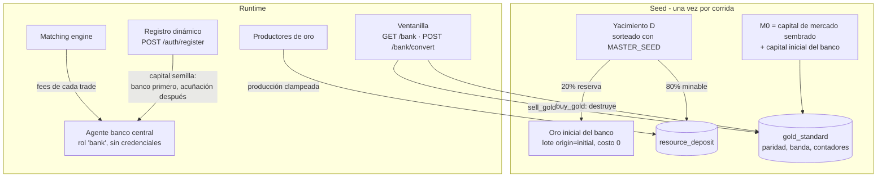

# Patrón Oro y Sistema Bancario

> **Estado:** documento vivo, refleja el código a 2026-07-13 (commits `564aba90` "Se implemento el patron oro" y `c9327e56` "Capital para 10000 agentes").
> Implementación: `backend/src/lib/gold.ts` (aritmética pura), `backend/src/services/bank-service.ts`
> (ventanilla), `backend/src/services/agent-service.ts` (emisión en registros),
> `backend/src/seed.ts` (`buildGoldPlan`), tablas en `documentacion_base_datos.md` §15–17.
> Vista económica conceptual: `diseno_mercado_agricola.md` §18. Uso por los bots: `funcionamiento_bots.md` §6.

---

## 1. Motivación

El diseño original tenía dos fugas monetarias sin gobernar:

1. **Deflación estructural:** los fees de trading se evaporaban ("iban al sistema"), así que la
   masa monetaria solo podía decrecer.
2. **Inflación sin respaldo:** cada registro dinámico acuñaba de la nada un capital semilla
   igual al promedio del mercado. Con ~100 agentes era tolerable; con un enjambre de
   ~10.000 bots registrándose, la emisión sin contrapartida rompía cualquier análisis económico.

El patrón oro cierra ambas fugas: los fees se **reciclan** al banco central, y todo dinero
nuevo debe estar **respaldado por oro** en poder del banco. La masa monetaria queda acotada,
gobernada y auditable.

---

## 2. Componentes



### 2.1 El banco central (rol `bank`)

Agente único creado por el seed (`BANK_USERNAME`, default `central_bank`):

- **Sin credenciales**: no es logueable ni registrable por `/auth/register`.
- **Sin capacidades**: no produce ni coloca órdenes; no participa en el mercado.
- **Excluido de los agregados de mercado** (junto con el rol `admin` de solo-monitoreo;
  ver `NON_MARKET_ROLES` en `backend/src/types/contracts.ts`). En particular, su capital
  **no** entra en el promedio que fija el capital semilla de los registros dinámicos.
- Recibe: el **capital inicial** (`GOLD_BANK_INITIAL_CAPITAL_CENTS`, 13 M$ por defecto),
  la **reserva inicial de oro** y, en runtime, **todos los fees de trading**.

### 2.2 El yacimiento finito (`resource_deposit`)

El tamaño total de oro de la corrida `D` se sortea determinísticamente con
`rngFor(MASTER_SEED, "gold_deposit")` en `[GOLD_DEPOSIT_MIN_QTY_CENT, GOLD_DEPOSIT_MAX_QTY_CENT]`
(700.000–1.300.000 kg por defecto). El seed lo reparte (`splitDeposit`):

- **Reserva inicial del banco** = `floor(D × GOLD_BANK_INITIAL_RESERVE_BPS / 10000)`
  (20% por defecto), materializada como un lote normal `origin='initial'` con costo 0.
- **Remanente minable** = el resto, registrado en `resource_deposit`
  (`qty_initial_cent = qty_remaining_cent = minable`).

Cada materialización de un proceso que produce oro se **clampea** contra el yacimiento
(`clampMint`): `minted = min(remaining, output_qty × ejecuciones)`. Cuando `remaining` llega
a 0 se emite el evento `deposit_depleted` y ya no se puede minar más. El yacimiento finito es
el techo duro de la expansión monetaria.

### 2.3 La política monetaria (`gold_standard`)

Singleton escrito por el seed; en runtime solo mutan los contadores `money_issued_cents` /
`money_burned_cents`. Fórmulas (`lib/gold.ts`, todas con BigInt y redondeo `floor`,
sesgo siempre conservador — menos valor de oro ⇒ menos emisión):

| Magnitud | Fórmula |
|----------|---------|
| Masa inicial `M0` | capital de mercado ya sembrado + capital inicial del banco. La masa inicial queda respaldada **por construcción**. |
| Paridad | `parity = floor(M0 × coverage_bps / (100 × D))` — centavos por kg de oro tal que el yacimiento completo a paridad respalda `M0` al ratio de cobertura. Con los defaults: ~1.000–1.900 c/kg. |
| Banda (gold points) | `half = floor(parity × spread_bps / 10000)`; `window_bid = parity − half` (el banco **compra** oro), `window_ask = parity + half` (el banco **vende**). ±5% por defecto. |
| Capacidad de emisión | `capacity = floor(floor(oro_del_banco × parity / 100) × 10000 / coverage_bps)`. |
| Invariante de respaldo | `money_issued − money_burned ≤ capacity` en todo momento. |
| Masa monetaria actual | `M0 + money_issued − money_burned` (auditable contra el singleton). |

El seed hace **fail-fast** si la configuración produce `parity < 1` o `window_bid < 1`.

---

## 3. La ventanilla de convertibilidad

Endpoints: `GET /v1/bank` (info) y `POST /v1/bank/convert` (ejecución síncrona, sin fees).
Semántica **acuñadora** clásica — la clave es que el capital del banco **no** interviene en
las conversiones:

### 3.1 `sell_gold` — el agente vende oro al banco (acuñación)

1. Se descuentan `qty_cent` de oro de los lotes del agente (**FIFO**, registrado en
   `conversion_lot_consumption`); si no alcanza → `insufficient_inventory`.
2. El oro pasa al banco como lote nuevo `origin='conversion'` (costo = `window_bid`).
3. El agente cobra `total = floor(qty × window_bid / 100)` en **dinero recién acuñado**:
   `money_issued += total`. El capital del banco no se toca.
4. Como `window_bid ≤ parity`, cada venta añade al banco oro que respalda **más** de lo que
   se acuñó: la cobertura nunca empeora.

### 3.2 `buy_gold` — el agente compra oro al banco (destrucción)

1. El banco entrega oro de sus lotes FIFO; si no tiene → `bank_insufficient_gold`.
2. El agente paga `total = floor(qty × window_ask / 100)` y ese dinero **se destruye**
   (débito sin contrapartida): `money_burned += total`. Si no le alcanza →
   `insufficient_capital`.
3. El agente recibe un lote `origin='conversion'` con costo unitario = `window_ask`.
4. Como `window_ask ≥ parity`, la cobertura tampoco empeora.

### 3.3 Reglas y errores

| Regla | Error |
|-------|-------|
| La corrida debe tener patrón oro sembrado | `409 no_gold_standard` |
| El banco y los administradores no operan la ventanilla | `forbidden` |
| Agente en quiebra no opera | `agent_bankrupt` |
| El nocional no puede redondear a 0 centavos (regalaría oro o dinero) | `conversion_below_minimum` |
| El agente debe tener el oro (`sell_gold`) | `insufficient_inventory` |
| El banco debe tener el oro (`buy_gold`) | `bank_insufficient_gold` |
| El agente debe tener el dinero (`buy_gold`) | `insufficient_capital` |

Cada conversión inserta una fila inmutable en `gold_conversion`, emite el evento
`gold_converted` en la misma transacción y publica la notificación personal `gold_converted`
por WebSocket **solo post-commit** (best-effort).

### 3.4 `GET /bank` (`BankInfoDto`)

Devuelve la política y el estado vivo: paridad, `window_bid/ask`, ratio de cobertura,
`initial/issued/burned`, **capacidad de emisión actual**, oro disponible del banco, capital
disponible del banco y remanente del yacimiento. Es la llamada que los bots hacen una vez en
`Initialize` para cachear la banda.

---

## 4. Flujos monetarios en runtime

Solo existen cuatro operaciones que cambian la masa monetaria o el capital del banco:

| Flujo | Efecto | Dónde |
|-------|--------|-------|
| **Fees de trading** | Se acreditan al capital del banco en la misma transacción del matching. No cambian la masa (el dinero sigue en el circuito). | `order-service.ts` (post-matching) |
| **`sell_gold`** | `money_issued += total`; el agente cobra dinero nuevo. | `bank-service.ts` |
| **`buy_gold`** | `money_burned += total`; el pago del agente desaparece. | `bank-service.ts` |
| **Registro dinámico** | Capital semilla financiado con capital del banco + acuñación respaldada (ver §5). | `agent-service.ts` |

Todo lo demás (trades, salarios, transformaciones) solo **mueve** dinero entre agentes; los
salarios se pagan upfront y quedan fuera del circuito de agentes pero no alteran los
contadores del patrón oro.

---

## 5. Emisión respaldada en el registro dinámico

Cuando un agente se registra vía `POST /auth/register` (lo que hace cada bot del enjambre la
primera vez), su capital semilla se financia así (`agent-service.ts`, `createAgent`):

```
target   = promedio del capital total de los agentes activos de mercado
           (o DEFAULT_SEED_CAPITAL_CENTS = 1.000$ si no hay ninguno)

capacity = issuanceCapacity(oro_del_banco, parity, coverage)
headroom = max(0, capacity − (money_issued − money_burned))
grant    = min(target, capital_del_banco + headroom)

si grant < GOLD_MIN_REGISTRATION_CAPITAL_CENTS (default 10.000 = $100):
    → 422 insufficient_gold_backing (el registro se rechaza)

fromBank = min(grant, capital_del_banco)      # primero fees reciclados
minted   = grant − fromBank                   # el resto se acuña
```

- `fromBank` se **debita del banco** (transferencia conservadora: dinero que ya existía).
- `minted` incrementa `money_issued` y emite el evento **`money_issued`**.
- Todo ocurre bajo el mutex de `gold_standard FOR UPDATE`, así que la emisión de miles de
  registros concurrentes queda serializada y nunca puede rebasar la capacidad.
- Fallback legado: si la corrida no tiene `gold_standard` (BD antigua), se acuña `target`
  sin contrapartida, como antes del patrón oro.

**Dimensionamiento para 10.000 agentes** (commit `c9327e56`): el capital inicial del banco se
fijó en 13 M$ (mínimo teórico ~11,9 M$) y el yacimiento se multiplicó (~×900) justamente para
que `capital_del_banco + headroom` cubra 10.000 grants promedio sin rechazar registros.
Si aparecen errores `insufficient_gold_backing` en un despliegue masivo, los diales son
`GOLD_BANK_INITIAL_CAPITAL_CENTS` y `GOLD_DEPOSIT_MIN/MAX_QTY_CENT`.

---

## 6. Concurrencia: orden global de locks

Regla única en todo el backend:

```
gold_standard FOR UPDATE   (primero, si la operación toca dinero del sistema)
  → fila del agente caller (FOR UPDATE)
    → lotes FIFO
```

- La fila de `gold_standard` es el **mutex de la ventanilla y de la emisión de registros**.
- La fila del agente banco **nunca** se escribe dentro de la ventanilla (la acuñación no toca
  su capital). El único escritor concurrente del capital del banco es el **matching** (crédito
  de fees, como último lock de su transacción) — por eso el débito condicional del banco en la
  emisión de registros no puede fallar bajo el mutex: los créditos solo suman.
- El matching engine jamás toca `gold_standard`: el trading normal no compite con la
  ventanilla.

---

## 7. Efecto económico: los gold points

El arbitraje mantiene el precio de mercado del oro dentro de la banda de la ventanilla:

- Si el **ask de mercado < window_bid**: comprar oro en mercado y venderlo al banco es
  ganancia inmediata (y acuña dinero) → el ask sube hacia la banda.
- Si el **bid de mercado > window_ask**: comprar oro al banco y venderlo en mercado es
  ganancia inmediata (y destruye dinero) → el bid baja hacia la banda.
- Para los **productores de oro**, `window_bid` es un precio de venta garantizado: minar
  siempre renta mientras el yacimiento dure.

Los bots `primary_producer` y `trader` implementan exactamente estas tres patas
(`bots-v1/bank.go`, `goldArbActions`); consumers y transformers no usan la ventanilla.
Ver `funcionamiento_bots.md` §6.

---

## 8. Configuración

Variables en `infra/.env.docker` (validadas con Zod al boot; `backend/src/config/index.ts`):

| Variable | Default | Significado |
|----------|---------|-------------|
| `BANK_USERNAME` | `central_bank` | Username del agente banco (rol `bank`). |
| `GOLD_PRODUCT_KEY` | `oro` | Key del producto patrón (debe existir en `seed-config.json`). |
| `GOLD_DEPOSIT_MIN_QTY_CENT` / `MAX` | 70.000.000 / 130.000.000 | Rango del sorteo del yacimiento `D` (700K–1,3M kg). |
| `GOLD_COVERAGE_RATIO_BPS` | 10000 | Cobertura de la emisión (10000 = 100%: cada centavo acuñado respaldado a paridad). |
| `GOLD_WINDOW_SPREAD_BPS` | 500 | Semiancho de la banda de la ventanilla (±5%). |
| `GOLD_BANK_INITIAL_RESERVE_BPS` | 2000 | Fracción del yacimiento que nace como reserva del banco (20%); el resto es minable. Máximo 10000. |
| `GOLD_BANK_INITIAL_CAPITAL_CENTS` | 1.300.000.000 | Capital inicial del banco (13 M$) para financiar registros antes de acumular fees. |
| `GOLD_MIN_REGISTRATION_CAPITAL_CENTS` | 10000 | Grant mínimo aceptable en un registro dinámico; por debajo → `insufficient_gold_backing`. (Sin entrada en `.env.docker`; aplica el default.) |

Como toda la configuración, es **estática durante la corrida**; cambiarla implica recrear la
BD (`make clean-docker` + re-seed, ADR-018) y con ello re-sortear el yacimiento y recalcular
la paridad.

---

## 9. Auditoría

- **Masa monetaria**: `SELECT initial_money_cents + money_issued_cents - money_burned_cents FROM gold_standard` debe coincidir con la suma de capital (disponible + reservado) de todos los agentes, incluido el banco.
- **Respaldo**: `money_issued − money_burned ≤ issuanceCapacity(oro_del_banco)` en todo momento (expuesto en `GET /bank` como `issuance_capacity_cents`).
- **Trazabilidad**: cada movimiento tiene evento (`gold_converted`, `money_issued`, `deposit_depleted`) en `event_log`, y cada conversión tiene trazabilidad FIFO por lote en `conversion_lot_consumption`.
